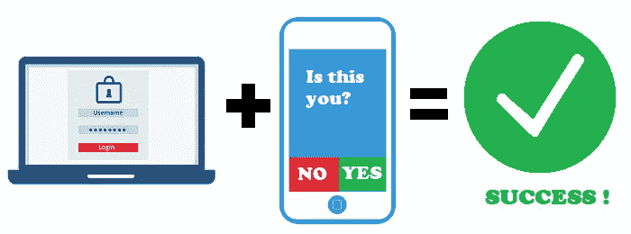

# 网络版#22 多因素认证

> 原文：<https://medium.com/coinmonks/cybered-22-multi-factor-authentication-c8c18842c894?source=collection_archive---------44----------------------->

MFA 是一种身份验证，在这种身份验证中，用户必须提供两个或更多验证因素才能获得对资源(如应用程序、在线帐户或 VPN)的访问权限。MFA 是有效的身份和访问管理(IAM)策略的重要组成部分。MFA 需要一个或多个额外的验证因素以及用户名和密码，这降低了网络攻击成功的可能性。