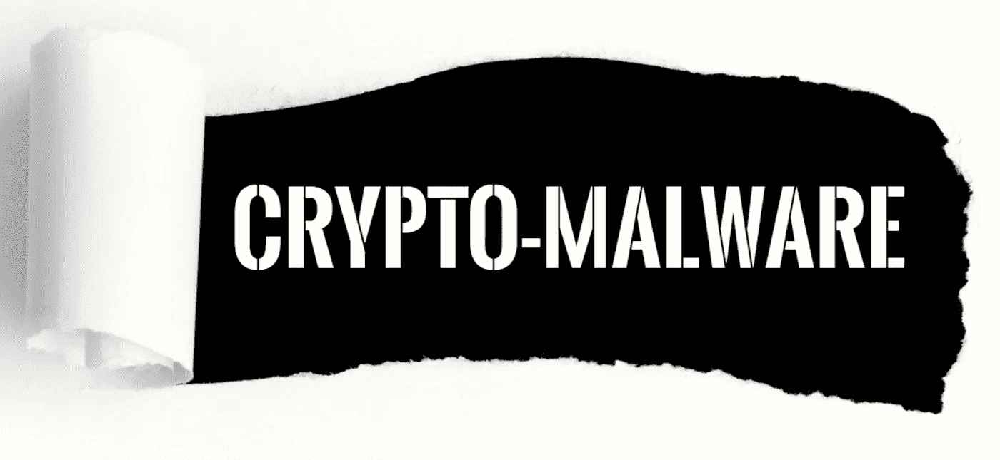

# 24 号加密恶意软件=加密挖掘+加密劫持

> 原文：<https://medium.com/coinmonks/cybered-24-crypto-malware-crypto-mining-crypto-jacking-99a98113a642?source=collection_archive---------29----------------------->

加密恶意软件是一种恶意软件，它允许威胁参与者在他人的计算机或服务器上挖掘加密货币。自 2017 年以来，它已成为最常见的恶意软件类型之一。加密恶意软件的流行很可能是因为加密挖掘是一个资源密集型过程，它增加了用户的电费并消耗了他们的处理能力…