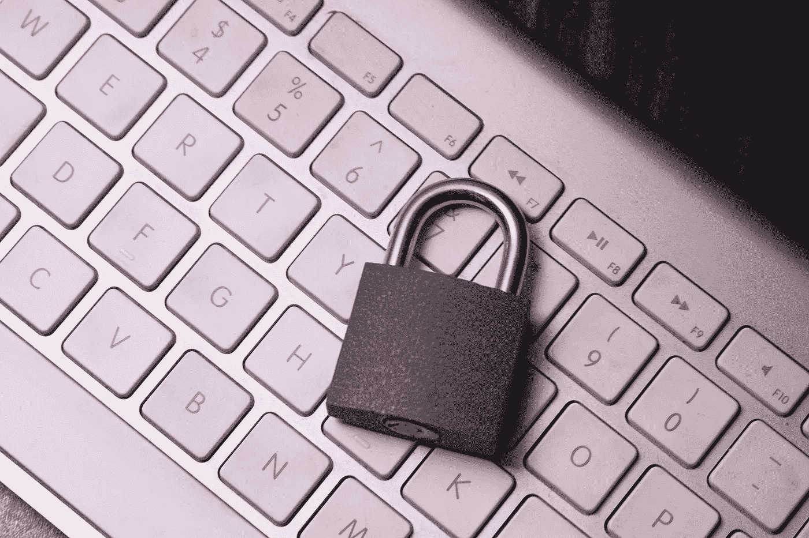

# 给任何试图保证网络安全的人的八条建议

> 原文：<https://medium.com/coinmonks/cybered-4-eight-tips-for-anyone-attempting-to-be-cyber-safe-505118e23d17?source=collection_archive---------47----------------------->

> 如果你意识到自己的行为及其可能的风险，大多数网络攻击在很大程度上是可以预防的。下面是一些可以融入他们网上行为的小技巧

## ***警惕***

留意陌生/未知的链接、附件、网站、电子邮件和电话。对某人摆出的姿势表示怀疑是合理的