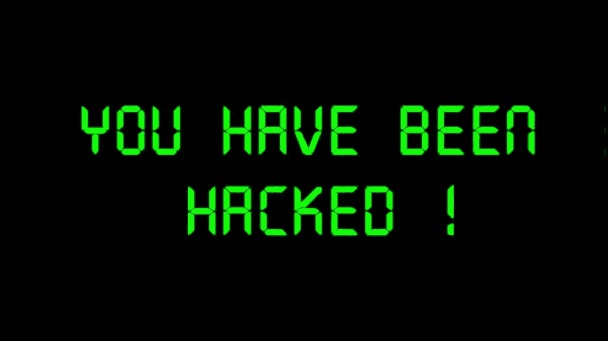

# 所以，你被黑了。现在怎么办？

> 原文：<https://medium.com/coinmonks/cybered-5-so-youve-been-hacked-now-what-7e252731b63c?source=collection_archive---------36----------------------->

许多事情可以提醒你，有人正在访问你的帐户，无论是你的电子邮件、社交媒体还是其他类型的在线服务。被锁定在你的账户之外是一个明显的迹象，表明出了问题，但这些迹象也可能是隐晦的。登录或试图登录从特殊的位置或在奇数时间是要保持警惕的事情。对您的安全设置的更改…