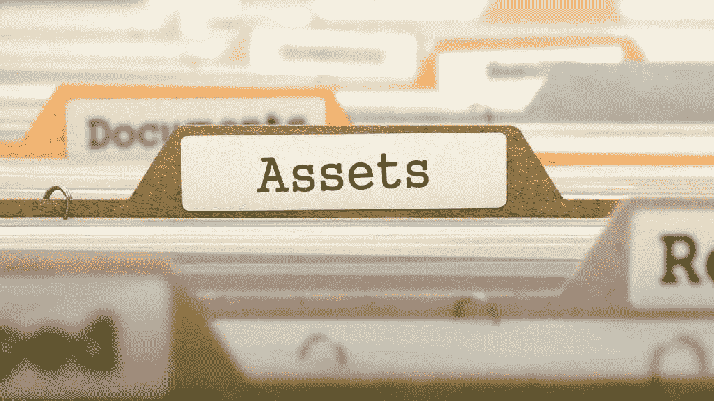

# 对资产管理感兴趣吗？

> 原文：<https://medium.com/coinmonks/cybered-6-curious-about-asset-management-2117bc79138f?source=collection_archive---------48----------------------->

# 什么是资产？

资产被定义为用来为你的公司创造价值的东西。这包括知识产权或客户信息等数据。它还拥有许多不同类型的技术，包括 It 和 OT、硬件和软件、物理位置和金融资本。它还包括你的人，他们的知识和技能。