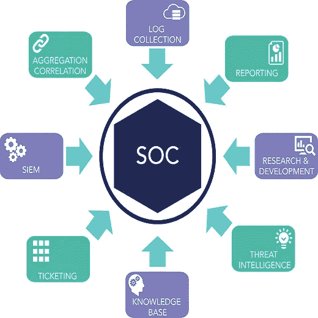

# CyberEd #7 安全运营中心(SOC)的类型

> 原文：<https://medium.com/coinmonks/cybered-7-types-of-security-operation-centers-soc-d15fe1b81c1f?source=collection_archive---------11----------------------->

## 什么是安全运营中心？

安全运营中心(SOC)是一个集中管理的支持功能，它使用人员、流程和技术来持续监控和改善组织的安全状况。安全运营中心的主要目标是预防、识别、分析和应对网络安全事件。一个…