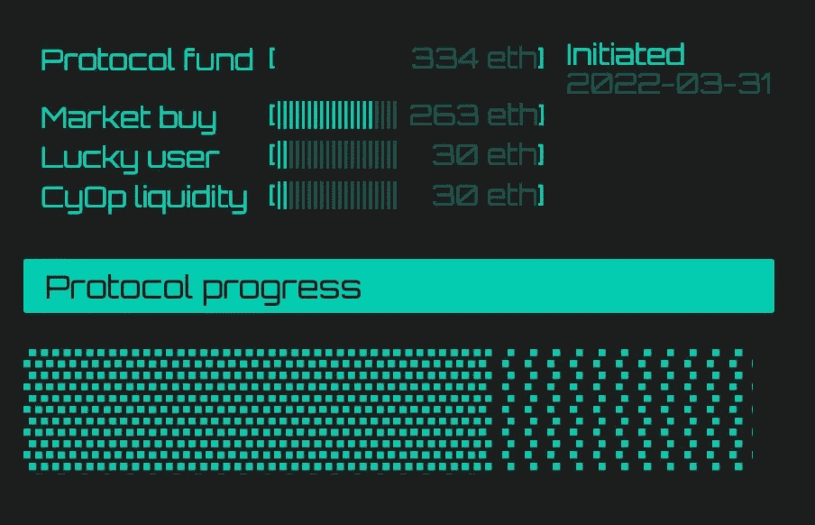

# CyOp 协议|书中的中断 1

> 原文：<https://medium.com/coinmonks/cyop-protocol-disruption-1-in-the-books-7416077529ff?source=collection_archive---------12----------------------->

# 颠覆|

**众所周知** [**$ARC**](https://arc.market/) **获得了第一个$CyOp 协议中断**。

280 以太坊花了买$ARC 瞬间抽 100%以上。如您所知，CyOp 协议会烧掉它购买的一半令牌，另一半令牌会被置于休眠状态。

一个细目:
9803930 美元 ARC 买了 280 美元 ETH
4900000 美元 ARC 在[虚空](https://etherscan.io/address/0x790f14341EEbF0BC8a59752a202BD2544CBF1691)4903930 美元 ARC 睡在[虚空](https://etherscan.io/address/0x423f849951584fc693026a1e77d30431b87627b5)

# 毛刺|

当 CyOp 协议启动时，有一个矩阵故障，将授予单个道成员 10%的基金。在许多社区成员建议拆分故障后，举行了投票，如果基金超过 100 ETH，故障将在 3 个随机选择的钱包之间拆分。

*11.666 $ETH 转让给 3 名幸运用户*

[0x e 2 f 31 CD a56 c 51 a9 c 789511 f 85 c 88559 fff 12 f 6 aa](https://etherscan.io/tx/0x262b263360311c0467a4f3a075194af8b4d933f28925c8c8d7c65e016c62333d)
[0x 268 bfd 6 e 524680059 fdf 3343 b5 e 5895 e 313 Fe 74 c](https://etherscan.io/tx/0x7d1c1c02bf15502af9e6fd422b79ee568c4efc52fe0d342a429869956715dd1f)
[0x de 01 b 4831 e 88809 b 9 ad 4 Fe 03 f 40705 ce C5 cc 9 e 04](https://etherscan.io/tx/0xff3f5f6210af9a703ff6cf910e8185380629e515ab28cfc0915a324fd2d00785)

# 旅程|

CyOp 在 3 月 20 日发布了第一篇 twitter 帖子，其中包括了将由社区投票决定的项目名单。然而，这个入围名单的旅程始于 ARC 还被称为 DePo 的时候。3 月 20 日$ARC 价格为 0.042 美元。
(需要注意的是，后续中断事件的项目列表将完全由机构群体通过 CyOp 协议网站中的提名流程进行选择。)

CyOp 礼宾团队使用了大量的 twitter 投票和参与/投票来决定谁将进入第一个入围名单。一些项目试图使用机器人进行投票，但他们被团队识别出来，这些投票被删除。民意调查于 2 月 28 日开始，当时$ARC 被称为$DePo。2 月 28 日，DePo 的交易价格为 0.05 美元

4 月 11 日， [$ARC](https://twitter.com/DeFi_ARC) 和 [$CULT](https://twitter.com/wearecultdao) 显然是票数最高的两个，并且已经多次取代对方成为第一名。$ARC 的交易价格在 0.05 美元到 0.045 美元之间

Example from the website with percentage of votes

许多投机者和投资者在采取行动前都在观望，等待投票结果得到更有力的确认。你最不想做的事就是购买你认为会赢得头名的代币，在最后一刻被偷走。CyOp 协议网站有一个完成跟踪系统，社区都在密切关注着。

Example from the website of the time left to vote(Protocol Progress)

由于$ARC 社区努力争夺第一的位置，twitter 上有很多活动。其他社区也对$CyOp 钱包及其行为进行了大量监控。$ARC 社区将事情掌握在自己手中，许多成员购买了$CyOp，下注并投票支持$ARC。当然，有些$ARC 持有者只是想回到$ARC 的话题上，忘掉$CyOp 的投票，但当 280 $ETH 岌岌可危时，这几乎是不可能的。

4 月 15 日，Gulch Capital 发表声明，表示将购买价值 100 美元的$ARC ETH，完全是因为$ ARC 赢得了$CyOp 协议中断事件。一些挖掘显示，Gulch 之前进行了一些购买，但他们现在表示，他们将在$CyOp Protocol 出售其持有的 490 万个令牌后购买。也许 Gulch 试图用谎言操纵市场情绪。

不管怎样，ARC 的价格从 14 日的 0.039 美元攀升至 15 日晚的 0.07 美元。根据 [CoinGecko](https://www.coingecko.com/en/coins/arc) 的数据，在 CyOp Protocol buys 开始进入并将价格推高至 0.122 美元之前，价格曾一度跌至 0.048 美元，后来又回升至 0.062 美元。

CyOp 协议对市场购买的执行完美无缺。交易分三批进行。
50 ETH

没有一个是由机器人运行的，在我看来这是$CyOp Protocol 社区的胜利。

$ARC 目前的交易价格为 0.043 美元，相当于所有人都知道他们赢得了中断事件之前的价格。所发生的变化是，他们现在流通中的代币减少了，这对他们来说是一个很好的中长期目标，同时用户/曝光率也增加了。

# 社区|

中断后来自$ARC 电报的一些引文。

*“Cyop 完全是为了 arc 的宣传，对我来说，获胜将是一个声明，并让 arc 得到更多的关注”*

来自新投资者的大量投资。40 Eth 被购买和“烧毁”——基本上永远持有，从而减少供应。一群 CYOP 人第一次从 Arc 购买了该产品，现在他们将使用该产品。”

*“不要认为短期价格是我们的目标…我们的目标是曝光并让新的人了解 ARC …我想说，任务完成了”*

# 投票行为|

关于投票，我们看到 CyOp 持有者在投票之前尽可能地等待。这可能是因为你在投票时希望获得尽可能多的信息。因为你的投票被锁定了，你不会想提前投票，结果你的选择被黑客攻击/利用，或者一天后可能发生的一长串坏事中的任何一件。

# 结束语|

没有被烧毁的现在处于休眠状态的$ARC 代币将会在稍后被唤醒并出售，但是我们还没有被告知这将会在何时或者如何发生。我们不知道如果当时的流动性可以处理，这将是一个缓慢出售还是即时出售。我们不知道$ARC 是否会联系$CyOp，请求进行场外交易，如果这是一种选择的话。

作为一个社区，我们可以回顾$ARC 并思考下一次颠覆。

导致中断的原因是$ARC 的大量购买被抛售。在以 5 百万为增量的$弧形图中，我们可以看到它们。也许这是一个迹象，表明 ARC 社区更有兴趣走出去，而不是持有。

我们还可以看看这样一个事实:我们从$DePo 进行了品牌重塑，有传言说团队剥削，还有传言说他们的 launchpad 合作伙伴在出售代币并压低价格。

所有这些都需要被考虑在内，并且不带偏见地看待，我相信$CyOp 社区已经从这次破坏中学到了很多。

随着第二次破坏的开始，我们看到社区参与进来，这一直是 CyOp 团队的目标。

现在，CyOp 协议已经确认该协议的功能符合市场需求，我们将看到更少的怀疑者和更多的社区参与到暴露和潜在破坏中来！

[网站](https://cyop.io/) | [推特](https://twitter.com/CyOpProtocol) | [电报](https://t.me/CyOpProtocol) | [币壁虎](https://www.coingecko.com/en/coins/cyop-protocol) | [币市帽](https://coinmarketcap.com/currencies/cyop-protocol/)

> 加入 Coinmonks [电报频道](https://t.me/coincodecap)和 [Youtube 频道](https://www.youtube.com/c/coinmonks/videos)了解加密交易和投资

# 另外，阅读

*   [印度最佳 P2P 加密交易所](https://coincodecap.com/p2p-crypto-exchanges-in-india) | [柴犬钱包](https://coincodecap.com/baby-shiba-inu-wallets)
*   [8 大加密附属计划](https://coincodecap.com/crypto-affiliate-programs) | [eToro vs 比特币基地](https://coincodecap.com/etoro-vs-coinbase)
*   [最佳以太坊钱包](https://coincodecap.com/best-ethereum-wallets) | [电报上的加密货币机器人](https://coincodecap.com/telegram-crypto-bots)
*   [交易杠杆代币的最佳交易所](https://coincodecap.com/leveraged-token-exchanges) | [购买 Floki](https://coincodecap.com/buy-floki-inu-token)
*   [3Commas 对 Pionex 对 Cryptohopper](https://coincodecap.com/3commas-vs-pionex-vs-cryptohopper)|[Bingbon Review](https://coincodecap.com/bingbon-review)
*   [加密复制交易平台](/coinmonks/top-10-crypto-copy-trading-platforms-for-beginners-d0c37c7d698c) | [如何在 WazirX 上购买比特币](/coinmonks/buy-bitcoin-on-wazirx-2d12b7989af1)