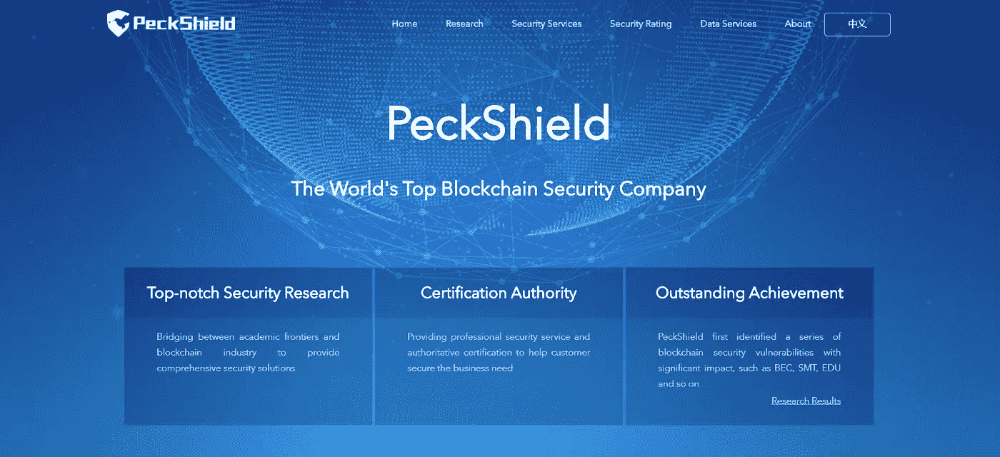

# D/Bond 选择顶级以太坊赏金计划安全公司 Peckshield 进行智能合同审计

> 原文：<https://medium.com/coinmonks/d-bond-chooses-top-ethereum-bounty-programme-security-firm-peckshield-for-smart-contract-audit-f49e342a28b1?source=collection_archive---------17----------------------->

D/Bond 项目已选择与 Peckshield 合作，对其做市商分散融资(DeFi)平台进行安全审计。

被以太坊的数据块浏览器和分析平台 Etherscan 列为为整个区块链生态系统的可用性提供[顶级安全服务](https://etherscan.io/directory/Smart_Contracts/Services?q=PeckShield)的公司，Peckshield 之前已经审核了 AAVE、PancakeSwap 和 SushiSwap 等协议。该公司还被列为以太坊奖金计划的[前十名，该计划有助于识别协议和客户项目中的漏洞。](https://bounty.ethereum.org/)

它将对 D/Bond 平台进行智能合约审计，该平台旨在利用首创的 [ERC/3475](https://eips.ethereum.org/EIPS/eip-3475) 令牌标准在区块链创建一种新的资产类别，来发行分散债券，并在 2022 年 5 月底前发布其调查结果。

[Peckshield](https://www.peckshield.com/) 提供区块链、智能合约、DeFi exchange、数字钱包安全审计服务。根据具体情况，它评估区块链基础设施实施中的潜在安全问题，暴露设计中每一个可能的语义不一致，并提出或推荐改善项目技术系统整体状况的方法。除其他外，它还提供实时区块链交易监控，包括基于区块链完整节点的数据传输的大额转账、黑名单地址移动和交换地址移动。

“Peckshield 的安全审计非常及时，因为我们展示了 D/Bond 的独特功能，以帮助解决 DeFi 的新颖性、波动性和形象问题，这些问题可能会阻止许多潜在客户使用整个新兴金融系统及其生态系统并将其提升到下一个级别，”D/Bond 首席执行官 Yunan Liu 说。“我们相信审计将有助于改善我们的证券化创新方法，因为我们解决了 DeFi 的固有问题，并提高了我们运营的透明度和信任度。随着 D/Bond 在 TradFi 和 DeFi 之间搭建桥梁，我们期待着 Peckshield 审计结果的发布。”

安全编辑与 D/Bond 作为 DeFi 项目的进展相关，该项目旨在打破进入最可靠的 TradFi 资产类别之一债券的壁垒。它将通过让几乎所有人——包括没有银行账户的人——都能购买债券来实现这一目标，而不仅仅是投资费用低廉的大公司和政府。其平台的多层流动性池使得几乎任何类型的数字资产(stablecoins，ERC-20 token，NFT 等)的证券化成为可能。)有担保的固定利率支付和主要债券的本金偿还。

平台上的内部测试已经开始(参见此处的演示:[https://debondapp.web.app/](https://debondapp.web.app/)(在 HECO 链中使用测试乙醚进行选择操作)和相应的文档在此处[https://debond-protocol.github.io/](https://debond-protocol.github.io/))，随后将进行外部用户测试，然后于 2022 年 6 月下旬在加拿大多伦多的碰撞大会上公开发布该平台。

**关于 D/BOND**

D/Bond 平台使用户能够设计和发行分散的债券和其他衍生品，以便在二级市场上交易，并根据自己的偏好拆分或捆绑投资工具。通过这样做，它为风险偏好较低的用户投资 DeFi 开辟了一种全新、更稳定、更可靠的方式，并有助于使整个生态系统在全球范围内实现财务自由的承诺。

**项目文件的最新版本:**

*球场甲板:*[*https://shorturl.at/ozBT1*](https://shorturl.at/ozBT1)

*白皮书:*[*https://shorturl.at/yWZ03*](https://shorturl.at/yWZ03)

*一页:*[*https://shorturl.at/lqHQ2*](https://shorturl.at/lqHQ2)

*问&答:*[*https://shorturl.at/bBDE4*](https://shorturl.at/bBDE4)

**关于 PECKSHIELD**

PeckShield Inc .是一家行业领先的区块链安全公司，目标是提升当前区块链生态系统的安全性、隐私性和可用性。对于任何业务或媒体查询(包括智能合同审计的需要)。

> 加入 Coinmonks [电报频道](https://t.me/coincodecap)和 [Youtube 频道](https://www.youtube.com/c/coinmonks/videos)了解加密交易和投资

# 另外，阅读

*   [Bookmap 点评](https://coincodecap.com/bookmap-review-2021-best-trading-software) | [美国 5 大最佳加密交易所](https://coincodecap.com/crypto-exchange-usa)
*   最佳加密[硬件钱包](/coinmonks/hardware-wallets-dfa1211730c6) | [Bitbns 评论](/coinmonks/bitbns-review-38256a07e161)
*   [新加坡十大最佳加密交易所](https://coincodecap.com/crypto-exchange-in-singapore) | [购买 AXS](https://coincodecap.com/buy-axs-token)
*   [红狗赌场评论](https://coincodecap.com/red-dog-casino-review) | [Swyftx 评论](https://coincodecap.com/swyftx-review) | [CoinGate 评论](https://coincodecap.com/coingate-review)
*   [投资印度的最佳密码](https://coincodecap.com/best-crypto-to-invest-in-india-in-2021)|[WazirX P2P](https://coincodecap.com/wazirx-p2p)|[Hi Dollar Review](https://coincodecap.com/hi-dollar-review)