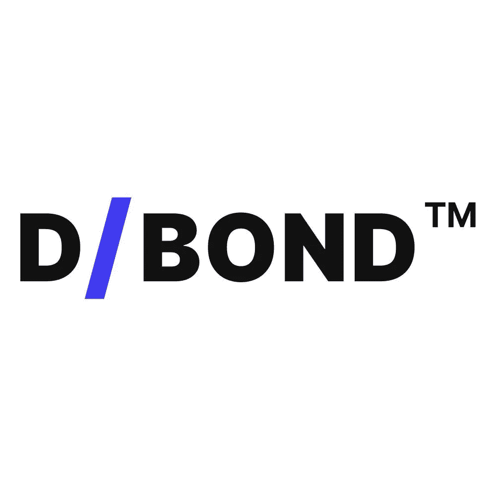

# D/Bond 一直专注于财务自由的承诺

> 原文：<https://medium.com/coinmonks/d-bond-keeps-focusing-on-the-promise-of-financial-freedom-398b4355232f?source=collection_archive---------12----------------------->

在 D/Bond，我们的做市商分散融资(DeFi)平台即使面对 UST/露娜(Terra)的崩溃也不会动摇。我们将继续坚定不移地专注于我们的开创性项目，为测试和验证服务做出贡献，以证明它建立在坚实的基础之上。

作为 TradFi 和 DeFi 之间的桥梁，它正在努力实现 DeFi 在全球范围内实现财务自由的承诺，因为它为风险偏好较低的用户投资 DeFi 开辟了一种新的可信赖的方式。

这一目标将通过在区块链为个人和机构创造一种新的资产类别来实现。使用 ERC/3475 标准，D/Bond 将发行可在二级市场交易的分散债券和衍生品。

尽管出现了像 USD 卢纳问题这样的情况，其中最大的稳定债券之一在 5 月 11 日从美元平价下跌了 70%以上，D/Bond 项目意识到了 DeFi 的高波动性、频繁的欺诈、诈骗和繁琐的分散申请(dApps ),以及进入最可靠的 TradFi 资产类别之一:债券的高壁垒。

**UST/露娜惨败**

UST 具有独特的功能。这是一种算法稳定币，将价格风险传递给另一个令牌，在这种情况下，是 LUNA (Terra)。有点不常用，算法稳定的硬币不同于他们的抵押作为模型依赖的价格决定。它们基于[两种代币](https://www.coindesk.com/learn/algorithmic-stablecoins-what-they-are-and-how-they-can-go-terribly-wrong/)运行——一种稳定币和另一种支持稳定币的加密货币——同时算法管理它们之间的关系。

他们没有独立的储备资产来支持其稳定货币的价值，他们确保平价的能力高度依赖于模型背后的假设。

随着 UST 的崩溃，几个问题必然会出现。有一个问题是，UST 崩溃会带来什么后果。很明显，监管机构将在接下来的几周内对加密市场进行彻底搜查。虽然他们中的一些人迄今反应强烈，但普遍的观点是，随着时间的推移，预计会有更多针对稳定密码的监管措施，以及更大程度上针对整个密码市场的监管措施。

到目前为止，这一失败已经在加密市场引起了连锁反应，并引发了包括英国政府和欧盟委员会在内的各方面监管者的反应，欧盟委员会计划 T2 很快发布命令。

就施加的压力而言，不受监管的稳定资本市场应该做好最坏的打算。它们可能不得不被迫由法定存款或低风险资产提供 100%的支持，并接受全面监管，以便被视为符合新监管框架要求的金融工具。

UST 崩溃引发的另一个问题，结合整个加密市场的长期熊市，是 DeFi，尽管有其所有的缺陷，可能如何支持备受谈论的 Web 3.0 和[元宇宙](https://www.polygon.com/22959860/metaverse-explained-video-games)的建设、增长和可持续性。

这是指黑客攻击，DeFi 中锁定的总价值从峰值下跌了约 56%，DeFi 令牌今年下跌了 71%，超过了基础以太坊令牌 43%的跌幅。然而，Web 3.0 和元宇宙有望在 DeFi 上蓬勃发展。

事实是，Web 3.0 和元宇宙的基础仍然不明确。Web 3.0 依赖于区块链技术的力量。作为互联网的一种去中心化形式，Web 3.0 只能在实现其所有人自由的理念并遏制脸书和谷歌等主导互联网的集中式平台的过度行为方面繁荣发展。

DeFi 促进了创造力的发展，这一点从 NFT 产业的发展中可以明显看出，在那里，数字版权所有权第一次成为可能。DeFi 提供了金融交易所需的基础设施，支持了 NFTs 的发展，同时随着元宇宙的繁荣扩大了环境。

**我们不被关注的焦点**

我们在 D/Bond 仍然认同这样一种观点，即尽管存在各种可能的缺陷，但去中心化的系统比中央化的系统更优越，而且将永远如此。我们知道 DeFi 仍然“不存在”,但我们相信，有了像我们这样的解决方案，市场将比许多人预期的更快成熟。

即使像欧洲投资银行、[法国兴业银行和汽车巨头、](https://www.societegenerale.com/en/news/press-release/first-structured-product-public-blockchain)[梅赛德斯-奔驰集团](https://group-media.mercedes-benz.com/marsMediaSite/en/instance/ko/Daimler-and-LBBW-successfully-utilize-blockchain-technology-for-launch-of-corporate-Schuldschein.xhtml?oid=22744703)这样的大实体都明确要求在区块链发行债券，但只有大公司和政府才能够继续发行债券——而投资者通常为他们的投资支付高额费用。

D/Bond 的使命是让这一令人垂涎的、可靠的资产类别为几乎所有人所用，包括全球没有银行账户的人。D/Bond 的 [ERC/3475](https://eips.ethereum.org/EIPS/eip-3475) 升级了 ERC-20 令牌标准，以存储发行债券的额外元数据，如利率、到期日等。我们相信，它将在全世界释放出无与伦比的金融潜力。这正是我们工作的核心:为所有人带来更多财务自由。

> 加入 Coinmonks [电报频道](https://t.me/coincodecap)和 [Youtube 频道](https://www.youtube.com/c/coinmonks/videos)了解加密交易和投资

# 另外，阅读

*   [Bookmap 评论](https://coincodecap.com/bookmap-review-2021-best-trading-software) | [美国 5 大最佳加密交易所](https://coincodecap.com/crypto-exchange-usa)
*   最佳加密[硬件钱包](/coinmonks/hardware-wallets-dfa1211730c6) | [Bitbns 评论](/coinmonks/bitbns-review-38256a07e161)
*   [新加坡十大最佳加密交易所](https://coincodecap.com/crypto-exchange-in-singapore) | [购买 AXS](https://coincodecap.com/buy-axs-token)
*   [红狗赌场评论](https://coincodecap.com/red-dog-casino-review) | [Swyftx 评论](https://coincodecap.com/swyftx-review) | [CoinGate 评论](https://coincodecap.com/coingate-review)
*   [投资印度的最佳密码](https://coincodecap.com/best-crypto-to-invest-in-india-in-2021)|[WazirX P2P](https://coincodecap.com/wazirx-p2p)|[Hi Dollar Review](https://coincodecap.com/hi-dollar-review)