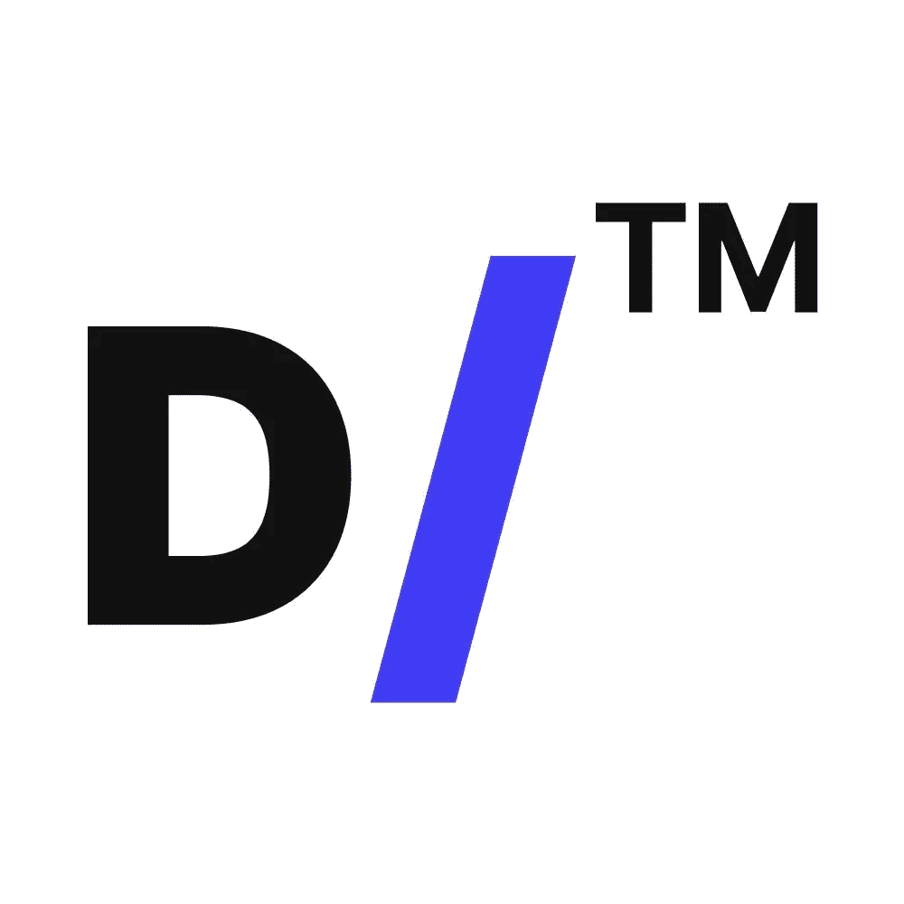

# D/Bond 与 Blockpit 合作——随着我们的 D/Airdrop 活动的开展！

> 原文：<https://medium.com/coinmonks/d-bond-partners-with-blockpit-as-our-airdrop-runs-bbfd601a6121?source=collection_archive---------14----------------------->

在这里的 [D/Bond](http://debond.org) ，我们即将推出我们的系统。因此，我们认为您可能会感兴趣，我们已经与 Blockpit 合作，该公司提供用于加密资产税务报告的合规软件。

我们与 [Blockpit](http://blockpit.io) 建立了互惠互利的合作伙伴关系，使注册 D/Bond 用户能够访问他们的软件即服务产品 [Cryptotax](https://blockpit.io/cryptotax/) ，通过网络和移动应用程序进行自动化和优化的加密资产纳税申报。纳税申报软件是内部开发的，并由四大审计公司定期审计。

**合适的合作关系**

D/Bond 和 Blockpit 是很好的搭配。这个想法是为了减轻你为所有加密货币交易提交纳税申报的繁琐任务。

我们的系统是将任何数字资产证券化，并通过我们的多层池降低高昂的交易费用和滑点。我们让每个人都有机会按照自己的意愿进行交易、投资、借贷——所有这一切都是以去中心化的 P2P 方式进行的，没有大银行从中获利。

作为欧洲领先的加密报税服务提供商之一，Blockpit 使加密货币交易的报税更加容易。它只要求您能够通过 API 导入功能或只导入一个 CSV 文件来同步您的帐户。

**仅供参考，债券空投活动将于**开始

如前所述，我们的空投活动将在我们备受关注的平台发布之前进行。空投活动于 6 月 13 日星期一开始。它告诉你，我们正在推出 D/Bond，你将能够在这里交易和投资，因为我们引入了一种新的资产类别:区块链的分散债券。

[空投](https://debond.org/airdrop)——持续到 8 月 8 日——是我们如何启动我们的全面启动模式的，这是一种奖励我们社区忠诚成员的方式，并让我们的协议的一些本地资产 DBIT 在流通中。

我们的发布日期临近，因此我们必须为您提供一个简化的解决方案，帮助您跟踪、监控、报告和计算加密交易的风险评分。

**D/Bond 合作的意义**

我们的目标是成为传统金融(TradFi)和分散金融(DeFi)之间的桥梁。在这个过程中，我们将降低进入最可靠的 TradFi 资产类别之一债券的门槛，因为我们使用我们的 [ERC-3475](/coinmonks/as-web-3-0-grows-debond-takes-derivatives-to-defi-with-erc-3475-token-18e88461ae6c) 标准在区块链创建这一新的资产类别。因此，在某个时候，我们的平台上会出现一系列的交易。

与 Blockpit 的合作将服务于报税目的，并强调对加密用户无缝报税的持续教育，从而节省时间和金钱。它还触及了另一个层次的透明度和信心，这是这家初创公司试图为 D/Bond 正在开发的独特的区块链金融结构带来的。

只需通过 D/Bond 注册您的新 Blockpit 帐户。他们的软件将允许您直接从我们的平台导入和同步您的加密交易数据。请在 Telegram 和 Twitter 上关注我们，了解我们空投和平台发布的最新动态。

**关于 D/Bond**

D/Bond 使用户能够为 DeFi 的全球财务自由使命做出贡献。它的平台被用来设计和发行分散债券和其他衍生品，以便在二级市场上交易。用户还可以根据自己的偏好拆分或捆绑投资工具，因为 D/Bond 为风险偏好较低的用户投资 DeFi 提供了一种全新的、更稳定、更可靠的方式。

> 加入 Coinmonks [电报频道](https://t.me/coincodecap)和 [Youtube 频道](https://www.youtube.com/c/coinmonks/videos)了解加密交易和投资

# 另外，阅读

*   [Bitsgap 审查](/coinmonks/bitsgap-review-a-crypto-trading-bot-that-makes-easy-money-a5d88a336df2) | [Quadency 审查](/coinmonks/quadency-review-a-crypto-trading-automation-platform-3068eaa374e1) | [Bitbns 审查](/coinmonks/bitbns-review-38256a07e161)
*   [密码本交易平台](/coinmonks/top-10-crypto-copy-trading-platforms-for-beginners-d0c37c7d698c) | [Coinmama 审核](/coinmonks/coinmama-review-ace5641bde6e)
*   [印度的加密交易所](/coinmonks/bitcoin-exchange-in-india-7f1fe79715c9) | [比特币储蓄账户](/coinmonks/bitcoin-savings-account-e65b13f92451)
*   [OKEx vs KuCoin](https://coincodecap.com/okex-kucoin) | [摄氏替代度](https://coincodecap.com/celsius-alternatives) | [如何购买 VeChain](https://coincodecap.com/buy-vechain)
*   [币安期货交易](https://coincodecap.com/binance-futures-trading)|[3 commas vs Mudrex vs eToro](https://coincodecap.com/mudrex-3commas-etoro)