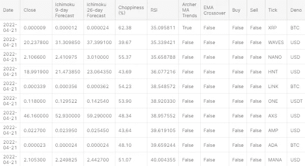
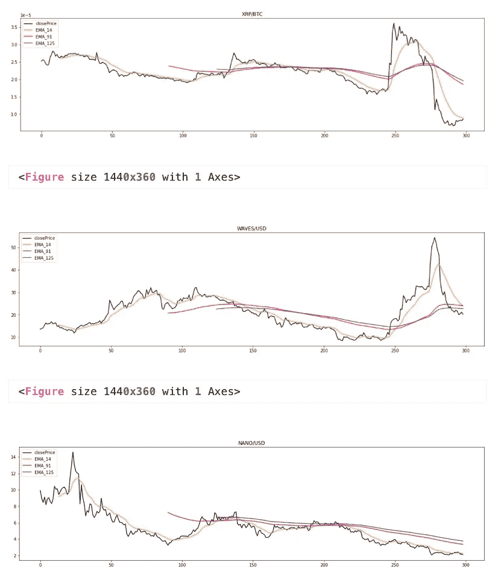
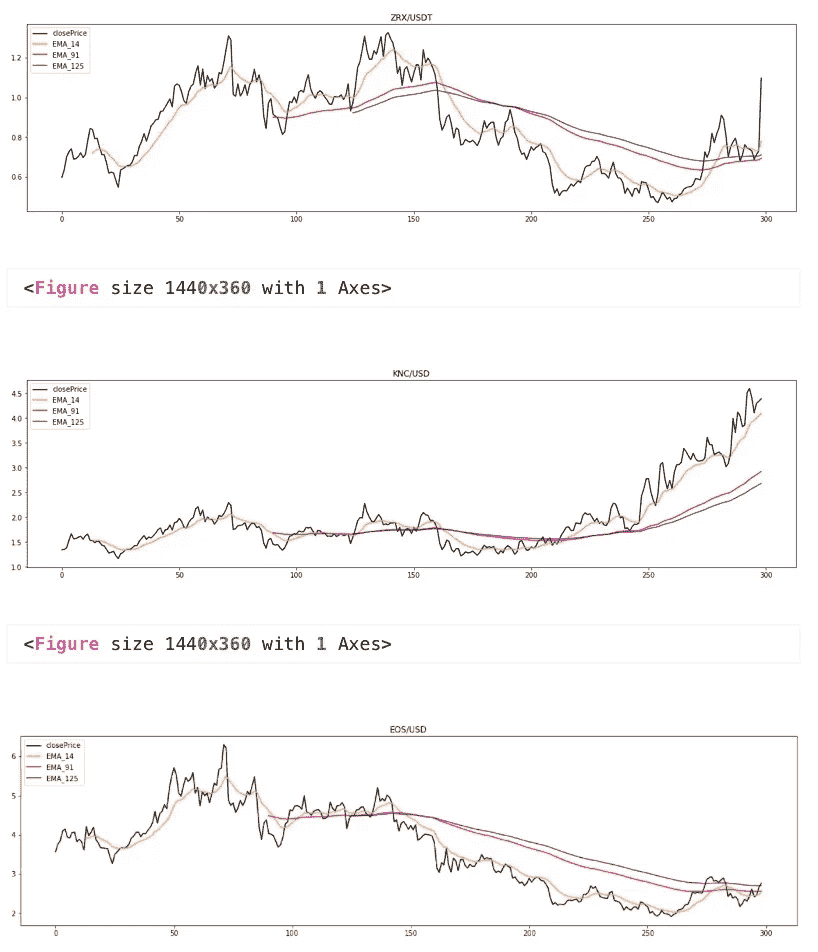
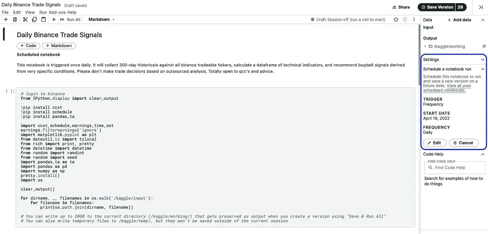

# 每日币安加密交易信号

> 原文：<https://medium.com/coinmonks/daily-binance-us-crypto-trade-signals-fda4e8a205c8?source=collection_archive---------3----------------------->

下面是我如何使用 Kaggle 的日程安排功能来构建每日加密货币交易信号网页。

(在这里看我的 Kaggle 代码:[每日币安交易信号](https://www.kaggle.com/code/dascient/daily-binance-trade-signals))

这里要解的东西很多，但必不可少的是:ccxt，pandas_ta，& Kaggle 的触发特性。CCXT(【https://github.com/ccxt/ccxt】T4)是一个交换 API 包装器，它支持大量的代理，并且非常容易使用。熊猫技术分析库([https://github.com/twopirllc/pandas-ta](https://github.com/twopirllc/pandas-ta))是我们预测算法的指标库。Kaggle 笔记本内核中的时间表特性支持每天、每周或每月执行代码，这将是我们实现日常自动化的工具。



**安装&导入包**

```
*# login to binance*
from IPython.display import clear_output

!pip install ccxt
!pip install schedule
!pip install pandas_ta

import ccxt,schedule,warnings,time,ast
warnings.filterwarnings('ignore')
import matplotlib.pyplot as plt
from dateutil.tz import tzlocal
from rich import print, pretty
from datetime import datetime
from random import randint
from random import seed
import pandas_ta as ta
import pandas as pd
import numpy as np
pretty.install()
```

**登录 Binance.us**

以下是 ccxt 对 binance . us([https://docs.ccxt.com/en/latest/exchange-markets.html](https://docs.ccxt.com/en/latest/exchange-markets.html))的登录协议

```
*# Instructions on retrieving your own API key pair: 
# https://youtu.be/Q4Lt1KulkOQ*

ccxt.binanceus({ 'options':{ 'adjustForTimeDifference':True}})
exchange = ccxt.binanceus({
"apiKey": Binance_key,
"secret": Binance_secret,
'enableRateLimit**': True})**
```

**计算指标**

我发现这个模型最有价值的地方是，我可以很容易地定制和微调我的买入/卖出交易信号参数。我决定使用以下技术指标和预测算法，以便“推荐”(即辨别)做多或做空:卡尔曼滤波预测模型，14 天布林带下/上轨，9 & 26 天寇森跨度 Ichimoku，阿彻移动平均线趋势(AMAT)，以及相对强弱指数(RSI)。虽然计算了 14/91/125 日指数移动平均线(EMA)和波动指数，但它们目前不被用作以下输出的决策参数

```
# indicators + trade signals
def calculate_indicator(symbol):

    bars = exchange.fetch_ohlcv(symbol, timeframe='1d', limit=300)
    df = pd.DataFrame(bars[:-1], columns=['timestamp', 'open', 'high', 'low', 'close', 'volume'])
    df['timestamp'] = pd.to_datetime(df['timestamp'], unit='ms').dt.tz_localize(None)

    close = df['close'][len(df)-1]
    low = df['low'][len(df)-1]

    # Construct a Kalman filter
    kf = KalmanFilter(transition_matrices = [1],    # The value for At. It is a random walk so is set to 1.0
                      observation_matrices = [1],   # The value for Ht.
                      initial_state_mean = 0,       # Any initial value. It will converge to the true state value.
                      initial_state_covariance = 1, # Sigma value for the Qt in Equation (1) the Gaussian distribution
                      observation_covariance=1,     # Sigma value for the Rt in Equation (2) the Gaussian distribution
                      transition_covariance=.01)    # A small turbulence in the random walk parameter 1.0
    # Get the Kalman smoothing
    state_means, _ = kf.filter(df['close'].values)
    # Call it kf_mean
    df['kf_mean'] = np.array(state_means)
    kalman = df.kf_mean[len(df)-1]
    aboveKalman = low > kalman

    # exponential moving averages 
    ema_14 = df.ta.ema(14, append=True)[-1:].reset_index(drop=True)[0]
    ema_91 = df.ta.ema(91, append=True)[-1:].reset_index(drop=True)[0]
    ema_125 = df.ta.ema(125, append=True)[-1:].reset_index(drop=True)[0]
    ema_crossover = ema_14 > ema_91

    # lower/upper 14-day bollinger bands for mean reversion
    bbl_14 = df.ta.bbands(length=14, append=True)[['BBL_14_2.0']].tail(1).values[0][0]
    bbu_14 = df.ta.bbands(length=14, append=True)[['BBU_14_2.0']].tail(1).values[0][0]
    bband_buy = close < bbl_14
    bband_sell = close > bbu_14

    # ichimoku 9 & 26-day forecasts 
    # https://technical-analysis-library-in-python.readthedocs.io/en/latest/ta.html#ta.trend.IchimokuIndicator
    isa_9 = df.ta.ichimoku()[1]['ISA_9'].tail(1).values[0] # help(ta.ichimoku)
    isb_26 = df.ta.ichimoku()[1]['ISB_26'].tail(1).values[0]

    # archer ma 
    # https://github.com/twopirllc/pandas-ta#general
    amat = (df.ta.amat()['AMATe_LR_8_21_2'].tail(1).values[0] == 1)

    # rsi
    rsi = df.ta.rsi()[len(df)-1]
    rsi_buy = rsi < 30
    rsi_sell = rsi > 70

    # choppy
    # https://github.com/twopirllc/pandas-ta#trend-18
    try: 
        chop = "{:.2f}".format(df.ta.chop()[len(df.ta.chop())-1]) 
    except RunTimeWarning:
        chop = 0

    # ~~~~~~~~~~~~~~~~~~~~~~~~~~~~~~~~~~~ #
    # signal
    #buy = (close < isa_9) & (close < isb_26) & amat & rsi_buy & bband_buy & aboveKalman
    buy = amat & ema_crossover & aboveKalman

    #sell = (close > isa_9) & (close > isb_26) & ~amat & rsi_sell & bband_sell & ~aboveKalman
    sell = ~amat & ~ema_crossover & ~aboveKalman

    # ~~~~~~~~~~~~~~~~~~~~~~~~~~~~~~~~~~~ #

    return df, symbol, close, isa_9, isb_26, chop, rsi, amat, ema_crossover, buy, sell, aboveKalman
```


Output Dataframe

**绘图仪**

这里有一个简单的绘图模型来考虑 EMAs 在给定的时间范围内与我们的收盘价的对比。在本例中，我们将 OHLC 限制设置为收集 300 天的数据。

```
*# plotter*
def plot(symbol):    *# sample*
    fig, ax = plt.subplots(figsize=(20, 5))

    df = calculate_indicator(symbol)[0]

    ax.plot(df.close, color = 'black', label = 'closePrice')
    ax.plot(df.EMA_14, color = 'orange', label = f'EMA_14')
    ax.plot(df.EMA_91, color = 'red', label = f'EMA_91')
    ax.plot(df.EMA_125, color = 'purple', label = f'EMA_125')

    plt.title(f"**{**symbol**}**")
    ax.legend(loc = 'upper left')
    return plt.show()
```

**数据准备**

下面的单元格将收集所有币安可交易的符号，然后对每个符号迭代 calculate_indicator(symbol ),以产生最终的数据帧输出，其中包括我们需要的所有指标和预测。

```
*# load symbols + initiate dataframe*
results = []
symbols = exchange.fetchTickers().keys()

*# iteration*
for symbol **in** symbols:
    try:
        output = calculate_indicator(symbol)
        results.append({'Ticker':output[1],
                        'Date':today,
                        'Close':output[2],
                        'Ichimoku 9-day Forecast':output[3],
                        'Ichimoku 26-day Forecast':output[4],
                        'Choppiness (%)':output[5],
                        'RSI':output[6],
                        'Archer MA Trends':output[7],
                        'EMA Crossover':output[8],
                        'Buy':output[9],
                        'Sell':output[10]
                        })
    except:
        pass

*# frame & clean*
results = pd.DataFrame(results)
results['Tick'] = [v.split('/')[0] for i,v **in** results.Ticker.items()]
results['Deno'] = [v.split('/')[1] for i,v **in** results.Ticker.items()]

*# set pandas display to respect number of symbols in results*
size = len(results)
pd.set_option('display.max_rows', size)
```

**顶部&底部 10s**

```
*# top 10 recommended buys*
top10 = results.sort_values(['Buy','EMA Crossover','Archer MA Trends'],ascending=False).sort_values(['RSI'],ascending=True).drop_duplicates('Tick').head(10).reset_index(drop=True)

*# top 10 recommended sells*
bottom10 = results.sort_values(['Sell','Archer MA Trends','RSI'],ascending=False).drop_duplicates('Tick').head(10).reset_index(drop=True)
print("Prepped.")
```

**通知**

如果我们的 10 大搜索结果中有推荐购买的，我想先看看。但如果每个结果都是假的，那么就没有推荐的多头头寸。

```
if any(results.Buy == True): 
    print("These are recommended long positions, then sorted by crossover, trend, & rsi values.")
if all(results.Buy == False): 
    print("No recommended long positions. Showing results sorted by crossover, trend, & rsi values.")
```

我对销售也有同样的想法:

```
if any(results.Sell == True): 
    print("These are recommended short positions, then sorted by crossover, trend, & rsi values.")
if all(results.Sell == False): 
    print("No recommended short positions. Showing results sorted by trend & rsi values.")
```

# **建议**

```
*# plots for top3*
[plot(symbol) for i,symbol **in** top3.Ticker.items()]
```

**买入前三名**



```
*# plots for bottom3*
[plot(symbol) for i,symbol **in** bottom3.Ticker.items()]
```

**垫底 3 卖**



**调度器**

位于 Kaggle 的笔记本面板>设置的最右边，你会发现一个触发特性，允许每天、每周或每月执行内核。这为我提供了所有我需要的数据，以便了解当前的市场趋势。



老实说，我更兴奋的是，我每天都有东西可以看，可以狂欢。只有找到谬误，更有效的方法，或者简单的改变，才能让我在一些空闲的周六早晨做些有趣的事情。

**关键要点**

也就是说，重要的是要注意(甚至对我自己来说)，所提供的信号将完全取决于我在 calculate_indicator()协议中设置的条件。随着我不断了解加密市场的波动，这给了我频繁的机会来更好地调整我的预测模型，清除一些低效的东西，或者添加更多的指标。

**正在进行的&未来的努力**

如果能使用 Kaggle 的日程安排功能来进行实际交易，那就太好了。实施更复杂的指标、稳健的预测、安全的限价单和止损阈值，也许有一天会成为自动交易的舒适工具。当然，这个协议可以被编写成在其他交易所上运行，比如 TD Ameritrade & Robinhood，它们都有开源 API。这个项目将继续进行，我希望继续调整笔记本的建议。换句话说，它永远不会完美。

https://linkedin.com/in/dontadaya

[](https://github.com/dascient) [## DaScient -概述

### 此时您不能执行该操作。您已使用另一个标签页或窗口登录。您已在另一个选项卡中注销，或者…

github.com](https://github.com/dascient) [](https://www.kaggle.com/dascient) [## Don D.M. Tadaya |撰稿人

### 只是一个简单的数学家在打理他的数字、方程和公式的农场...为那个甜甜工作…

www.kaggle.com](https://www.kaggle.com/dascient) [](https://dascient.com) [## DaScient 有限责任公司

### 快速服务-行业和地面水平分析，可视化和企业介绍，软件开发和人工智能…

dascient.com](https://dascient.com) [](https://DaScientCapital.us) [## DaScient 资本集团

### Don D.M. Tadaya 是公认的获奖数学家、首席数据科学家和统计研究分析师…

dascientcapital.us](https://DaScientCapital.us) 

> 谢谢大家！
> 
> 加入 Coinmonk 的电报频道和 Youtube 频道，了解加密交易和投资

# 另外，阅读

*   [最佳卡达诺钱包](https://coincodecap.com/best-cardano-wallets) | [Bingbon 副本交易](https://coincodecap.com/bingbon-copy-trading)
*   [印度最佳 P2P 加密交易所](https://coincodecap.com/p2p-crypto-exchanges-in-india) | [柴犬钱包](https://coincodecap.com/baby-shiba-inu-wallets)
*   [8 大加密联盟项目](https://coincodecap.com/crypto-affiliate-programs) | [eToro vs 比特币基地](https://coincodecap.com/etoro-vs-coinbase)
*   [最佳以太坊钱包](https://coincodecap.com/best-ethereum-wallets) | [电报上的加密货币机器人](https://coincodecap.com/telegram-crypto-bots)
*   [交易杠杆代币的最佳交易所](https://coincodecap.com/leveraged-token-exchanges) | [购买 Floki](https://coincodecap.com/buy-floki-inu-token)
*   [3Commas 诉 Pionex 诉 crypto hopper](https://coincodecap.com/3commas-vs-pionex-vs-cryptohopper)|[Bingbon Review](https://coincodecap.com/bingbon-review)