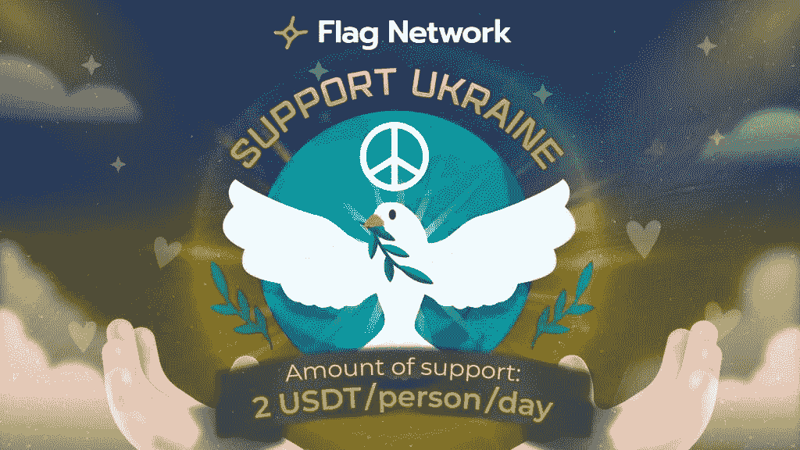

# 旗帜网络每天向乌克兰人捐赠 2 000 USDT

> 原文：<https://medium.com/coinmonks/daily-donation-of-2-000-usdt-to-ukrainians-by-flag-network-cfc9921c81d8?source=collection_archive---------45----------------------->

**Visit our website:-** [**https://bitcoinsupports.com/**](https://bitcoinsupports.com/)

旗帜团队将这种拓展称为来自人类内心的支持运动。

**乌克兰危机**

旗网对乌克兰正在上演的骇人事件感到痛心。经过几个月的积累，俄罗斯军队在弗拉基米尔·普京的命令下开始了一次特殊的军事行动。由于装甲师和导弹袭击，乌克兰目前陷入恐慌和混乱。虽然许多外国领导人谴责了俄罗斯的行为，但数百万乌克兰公民的处境非常严峻。伴随着炮击和火箭弹袭击，人们遭受了严重的食物、水和供给短缺。许多人正在逃离该地区，他们在寻找安全时将需要避难和援助。

**向乌克兰捐赠加密货币**

自 2022 年 2 月 24 日以来，世界各地的乌克兰筹款人收到了大量在线捐款，以响应乌克兰政府在推特上征集比特币、以太坊、系绳和波尔卡多的捐款。加密货币捐赠的数量令人震惊。这很可能是有史以来最大的一笔加密货币捐赠。乌克兰政府及其支持团队的技术实力使得各种货币的官方加密贡献网页的创建速度相当快。

帮助乌克兰政府和军队的加密货币捐款从比特币、以太坊、系绳等来源持续涌入。根据 CoinDesk 发布的一份报告，乌克兰政府已经收到了大约 1 亿美元的加密货币捐款。此外，援助乌克兰军方的乌克兰非政府组织“活着回来”也收到了捐款。

**捐款的有效性**

虽然捐款支持乌克兰人民是一种体面的行为，但许多人担心这些钱是否会到达乌克兰人民手中，或者会被政府机构挪用于购买军事装备以延长战争。此外，他们还担心未知网站的募捐骗局。

**Visit our website:-** [**https://bitcoinsupports.com/**](https://bitcoinsupports.com/)

在目前向乌克兰捐赠的众多加密货币平台中，有一个平台声称可以解决上述所有问题 Flag Network 的“帮助支持乌克兰”活动。旗帜网络慈善基金会发起了一项运动，直接用自己的现金支持乌克兰人民，而不依赖外部捐助。

**活动详情**

旗网每天从自己的财政中出资 1000 USDT 到本次支持活动中，根据参与人数可达 2000 USDT。每天，一名乌克兰人可以申请 2 USDT 的援助，并且可以继续这样做，直到世界协调时第二天+06:00。

乌克兰人可以直接申请援助，绕过任何政府机构或慈善中介，确保资金到达有需要的个人手中。乌克兰人只需要验证他们的电话号码，并进行 KYC 验证他们的身份，就可以收到钱。一旦申请被允许接受帮助，所有关于他们的信息将从系统中删除。

Flag Network 已经验证了 6169 个合格的钱包，对应 6169 个乌克兰人，并在发起活动一周后为他们提供了 8622 个 USDT 的支持。更多信息可在 Flag Network 网站上获得。

**直接给人民**

旗网不是政府或组织。该倡议的工作人员与乌克兰人民站在一起，反对战争。旗网认为，无论动机如何，战争都是无意义的。然而，如果你想直接帮助乌克兰人民，那就这样做吧。旗帜网络鼓励用户直接向有需要的人捐款。

**访问我们的网站:-**[**https://bitcoinsupports.com/**](https://bitcoinsupports.com/)

**免责声明:以上为作者观点，不应视为投资建议。读者应该自己做研究。**

> 加入 Coinmonks [电报频道](https://t.me/coincodecap)和 [Youtube 频道](https://www.youtube.com/c/coinmonks/videos)了解加密交易和投资

# 另外，阅读

*   [如何匿名购买比特币](https://coincodecap.com/buy-bitcoin-anonymously) | [比特币现金钱包](https://coincodecap.com/bitcoin-cash-wallets)
*   [瓦济里克斯 NFT 评论](https://coincodecap.com/wazirx-nft-review) | [比茨盖普 vs 皮奥克斯](https://coincodecap.com/bitsgap-vs-pionex) | [坦吉姆评论](https://coincodecap.com/tangem-wallet-review)
*   [如何使用 Solidity 在以太坊上创建 DApp？](https://coincodecap.com/create-a-dapp-on-ethereum-using-solidity)
*   [币安 vs FTX](https://coincodecap.com/binance-vs-ftx) | [最佳(SOL)索拉纳钱包](https://coincodecap.com/solana-wallets)
*   [如何在 Uniswap 上交换加密？](https://coincodecap.com/swap-crypto-on-uniswap) | [A-Ads 审查](https://coincodecap.com/a-ads-review)
*   [加密货币储蓄账户](/coinmonks/cryptocurrency-savings-accounts-be3bc0feffbf) | [YoBit 审核](/coinmonks/yobit-review-175464162c62)