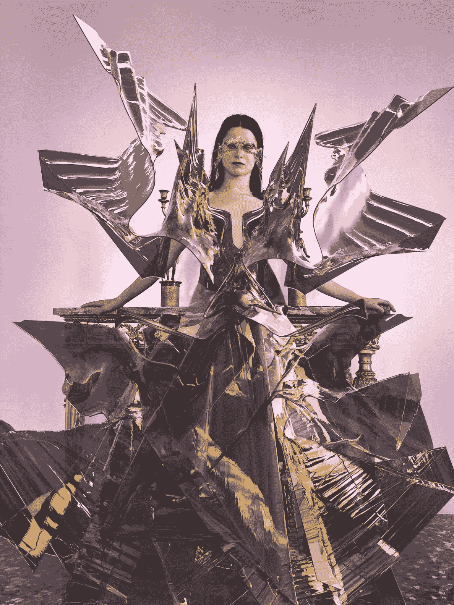
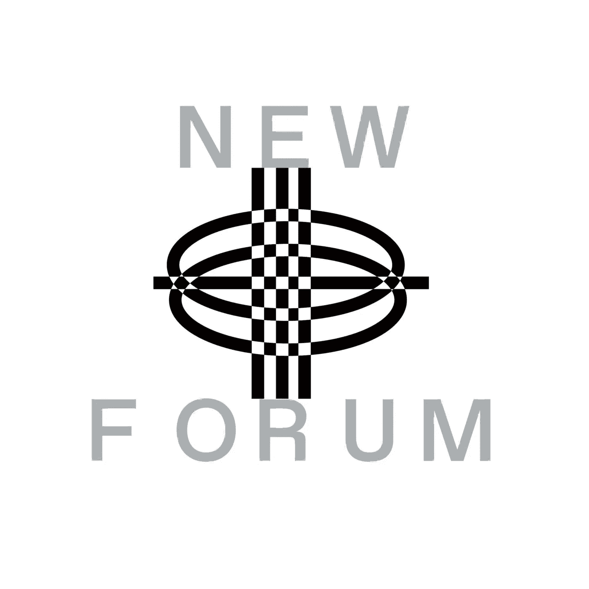

# Dani Loftus 将数字时尚分为三类，并解释了为什么它现在如此重要

> 原文：<https://medium.com/coinmonks/dani-loftus-dissects-digital-fashion-into-three-categories-explains-why-it-is-essential-right-now-7fc85b7f2f5f?source=collection_archive---------8----------------------->

Dani Loftus Founder Of [This Outfit Does Not Exist](http://www.thisoutfitdoesnotexist.com) | Founder & CEO Of [DRAUP](https://twitter.com/pronounceddrop)

我们很荣幸向我们的新论坛社区介绍神话般的 Dani Loftus！Dani 是这家不存在的公司的创始人，也是一个名为 DRAUP 的新数字时尚平台的创始人兼首席执行官。她以其数码服装引领数码时尚而闻名于业界。我们很高兴能与 Dani 讨论为什么现在数字时尚是必不可少的，目前大规模采用的障碍，以及推动行业前进需要什么！

# 谁是丹妮？她的故事是什么，是什么导致了这套服装的创作并不存在？

Dani 从小就热爱时尚，她过去常常看蒂埃里·穆勒时装秀或 Alexander McQueen 的视频，直到她大约十六七岁时，她还以为自己会在时尚行业工作。

> “我记得当我大约 17 岁，即将高中毕业的时候，我坐在家里，有一种巨大的生存危机。我想到了时尚行业，这个行业一度非常有创造力，对我来说非常有使命感，现在已经变得非常以消费者为中心，我想这不是我想要支持的风气……”—Dani

Dani 做了一个重要的转变，进入了纽约的一个社会影响基金。在那里，一位顾问邀请她加入他在 DeFi 的创业公司。她补充说，2018 年是 DeFi，所以这是一个 ICO 热潮。她在一家贷款市场工作，帮助那些没有银行的人和那些在印度得不到金融服务的人通过把他们放在链条上来获得贷款。

> “你可以看到贷款人和借款人之间的关系，你可以看到这些人对财务是有效的，所以我进来时什么都不知道，和他一起建立了一年半……”——Dani

Dani 随后回到英国，在 venture 寻求一份工作，最终在一家名为 Founders Forum 的创新咨询公司工作。

她的责任是走进大公司，从能源公司到媒体公司，并对他们说——*“这就是新兴技术将如何颠覆你的行业，这就是你应该如何应对，那么你与哪些初创公司合作？你如何投资你的钱？*

根据 Dani 的说法，这一直是她生活的一面，另一面是从未消失的对时尚的热爱，尽管她不认为自己会在那个行业工作。丹妮表示，她所有的朋友都在时尚行业工作，她总是对前卫的服装着迷。

Dani Loftus In Glass Dress Designed by [KAI KAI](https://www.instagram.com/kaikai_design/)

> “我在读一篇文章，古驰 CMO 说他们将在未来几年内开始设计数字化生产的服装，我突然有了灵感。我认为这种创造者经济，游戏皮肤的兴起，是我非常关注的事情。我觉得这很有意义。我们可以通过数字时尚将创造者经济民主化，让它变得更令人兴奋，所以我以这样一种视觉时尚的想法去了互联网……”——Dani

Dani 找不到这方面的资源，决定自己创建一个。她受到启发，创建了一个 Substack 账户，在那里她写了 5000 字的文章，阐述这项技术为何如此具有破坏性，以及公司应该如何应对。

她使用了与她之前工作相似的方法，但是，由于 Substack 是一种视觉媒介，她能够通过图像赋予它生命。她向我们的社区解释说，当帐户开始时，所有的视觉效果都链接到一个时事通讯，这意味着将有一个关于数字设计和她将设计不同的一切。

她热情地分享了更多关于这个过程和她创造性方法背后的目的，在这一集的 NEWFORUM 中使用 Substack 作为她的媒介。

> “我向彭博、连线等媒体推销新闻，他们的反应是:这里面有哪些大品牌，我当时还不知道，但很快每个人都会知道，他们会说，现在我们还没有真正明白，这不适合我们。那是在 1 月份，然后到了 3 月，数字资产热潮发生了，我的副业开始成为全世界都开始关心的事情。”—达尼

丹妮有大约十个月的时间在从事她以前的顾问工作，每天早上四点钟起床，为这件不存在的衣服工作。在经历了许多 Web3 的创作者所经历的挣扎之后，试图弄清楚他们正在做的工作是一份真正的工作还是一种爱好。Dani 最终找到了她的答案，全职工作于这套服装并不存在，这是一个通过探索和展览将数字时尚带入生活的平台。

每个月都探索一个主题:从数字设计和分销到元宇宙的营销，深入探讨它们的出现和可能性。

# 我们向 Dani 询问了她穿着由 TRIBUTE BRAND 设计的 BUBA(绿色)礼服的经历。

Dani Loftus In BUBA (Digital Dress) by [TRIBUTE BRAND](https://twitter.com/tribute_brand)

她回答说，这是她第一批在网上疯传的照片之一，是她说服人们，尤其是在创意经济中，穿数码时装的有力证据之一。

> “看看你可以获得的牵引力，它可以是可持续的，它也可以让你成为一个更有趣的创作者”——Dani

# **达尼所说的关注你能获得的牵引力是什么意思？**

> “例如，当我发布这条裙子时，我有大约 4000 名粉丝，它被茫然和困惑的人选中，并与一百万人分享。我有来自同一个设计师的其他照片，尽管事实上我有 11 或 12000 个追随者，但已经有 400000 的浏览量，所以这是创作者经济的一大卖点；这条裙子是一个专门设计的致敬品牌，它是 OG 在这一领域的先驱之一，创始人 Gala 非常有才华……”——Dani

Dani 表示，她与 TRIBUTE BRAND 有着宝贵的联系，因为他们的 Instagram 和时尚首先让她相信她需要进入这个行业。

> “作为一名创作者，我已经意识到，我的追随者真正喜欢的是并列，所以你穿了一套疯狂的数字时尚服装，结合了令人难以置信的渲染质量，所以它在我身上看起来很真实，使用了真正高质量的不同寻常的材料，经典的轮廓，但有一点扭曲，然后你把它放在一个你通常不会穿这套服装的环境中，这是我的工作类型中的快速通道，就像关键的成功一样……”—Dani

Dani Loftus In RED CIRCH Coat by [TRIBUTE BRAND](https://tribute-brand.com/products/)

# **数码时尚的现状如何？它会被大规模采用吗？有哪些障碍会阻止这种情况发生？**

Dani 将数字时尚分为三类；

*   第一类是她所谓的 IRL——在现实生活中的数字时尚，她解释说这有点矛盾，但它的意思是用数字后端生产的物理服装。例如，阿迪达斯自 2012 年以来一直在实施这一模式，博柏利最近开始制作图案，影响了几位设计师进入这一模式。

> “我看到每一个设计师都需要数字和物理手段的培训，大多数过程都是通过计算机完成的，所以这是最基本的类别，也就是 IRL，我认为这不是今天服装的大规模转变，只是生产它们的更有效的方式。”—达尼

*   第二类是她称之为 ORL 的现实生活，这是最初吸引她进入这个行业的类别。这是穿在人类身上的数字衣服，它跨越了渲染，这就是她穿的衣服，比如 BUBA(绿色)连衣裙；品牌会把它呈现在一个人身上，所以这个过程就是一个人买了这个东西，然后把自己的照片发给品牌。然后品牌会把它呈现给这个人。

Dani Loftus In Digital Outfit by [The Fabricant](https://www.thefabricant.studio/)

> “通过像 Snapchat 这样真正投资于身体跟踪的现有公司，以及像 Zero10 这样的年轻公司，AR 领域取得了这些令人难以置信的进步，zero 10 是一家非凡的公司，Tribute 也在开发他们的 AR，所以这被认为是 ORL 的数字时尚。就此而言，我认为保持价值的最简单的方法是作为一个 B2B 业务提案；我的意思是，像 Tribute brand 这样的数字时尚公司的业务，销售给其他收入来自服装的人。那可能是我与 Instagram，谁想要吸引注意力，谁想要获得存在；它也可以是一本杂志，这样你就不用让造型师拿着一袋实体衣服到处走，而是可以在后期制作中完成，这样效率更高……”—Dani

Dani 解释说，行业的现状是，对于数字创作者来说，这是一项工匠工作，渲染或创建 AR 滤镜的过程需要很长时间。这一过程会影响定价，对于普通消费者来说，最终的价格约为 100 多欧元，他们可能想要一件数字服装，但会去 Primark 或 fast fashion 以远低于这个价格的价格购买一件。

*   第三个也是最后一个类别是 URL——虚幻的现场时尚，对虚拟人来说是虚拟的数字时尚。Dani 预测这一类别将成为最具颠覆性和最大的市场。

> “你已经可以在游戏中看到它，所以游戏中的皮肤市场目前有 400 亿美元，这表明了人们对参与时尚的新方式感到兴奋。我认为将要改变的是，我们已经看到游戏行业从基于挑战的游戏转变为基于特定挑战或特定任务的游戏；这不仅仅是一种社交体验。我们已经看到了像堡垒之夜这样的转变，进入了一种创造性的模式，在这种模式下，你不会被枪击，并且可以与朋友互动……”——Dani

Dani 给出了 Meta 的另一个例子，说他们将成为一家基于虚拟形象的公司。她补充说，每个人都有自己的化身，这将会发生变化，我们将会看到化身是什么的明显变化；可能是个人资料的照片。

一个例子是看板猿游艇俱乐部热潮。古驰做了一项合作，他们给板猿穿上衣服。Dani 认为，随着事情的发展，我们将看到的是直接化身经济的真正扩张，以及我们除了拥有各种不同的身份可以穿着之外，还拥有自己的化身，这是开始形成的第三类数字时尚。

观看完整集，听听 Dani 在这一集 NewForum 中对她的三类数字时尚的透彻解释。她还谈到了为什么她是 Tribute DAO 的一员，这是一个在 Web3 空间中众所周知的数字时尚 DAO，并分享了作为创作者或设计师参与 DAO 的好处。当 Dani 给我们一些她即将到来的项目的预览，分享她对 Web3 的未来感到兴奋时，她结束了她清晰的想法。

[加入社区](https://twitter.com/newforum_nco)了解[@ danidoesnotexist](https://twitter.com/danidoesnotxist?lang=en)并在 web3 社区中发现其他创始人和远见者！

✨follow·达尼·洛夫特斯&这套服装根本不存在！✨

推特:[@ danidoesnotexist](https://twitter.com/danidoesnotxist?lang=en)insta gram:[@ thisoftdoesnotexist](https://www.instagram.com/thisoutfitdoesnotexist/)LinkedIn:[DaniLoftus](https://www.linkedin.com/in/daniella-loftus/)网站:[www.thisoutfitdoesnotexist.com](http://www.thisoutfitdoesnotexist.com)

# new forum # web 3 # digital fashion # creato economy # ar # Dao

爱 x 新论坛

# Twitter @newforum_nco

不和谐[@加入](https://discord.gg/DHepA4WTkN)

# 新论坛

[NEWFORUM](https://newforum.notion.site/newforum/Welcome-to-NewForum-48f9661398ec4ec6a1af37fcc96dc926) 由 [Newcoin Foundation](https://newcoin.org/) 提供支持，专注于促进去中心化社交应用的扩展，也被称为 Social 3.0，形成一个生态系统和一个由远见者、创造者和投资者组成的社区。它为思想者提供了一个安全的交流、传播和分享思想的空间，以确保一个新网络的自觉和道德发展，嵌入关怀、自由和创造力的价值观。✨每周新集！在 [Twitter](https://twitter.com/newforum_nco) 、 [Newlife](https://newlife.io/) 、 [Youtube](https://www.youtube.com/channel/UCWvHyau1nIJBffmaaj6FmbQ) 和 [LinkedIn](https://www.linkedin.com/showcase/newforum/) 上关注我们，了解 web3 的更多信息，认识生态系统！加入生态系统[不和](https://discord.gg/DHepA4WTkN)！

> 加入 Coinmonks [电报频道](https://t.me/coincodecap)和 [Youtube 频道](https://www.youtube.com/c/coinmonks/videos)了解加密交易和投资

# 另外，阅读

*   [加密货币储蓄账户](/coinmonks/cryptocurrency-savings-accounts-be3bc0feffbf) | [加密交易机器人](https://coincodecap.com/best-crypto-trading-bots)
*   [BigONE 交易所评论](/coinmonks/bigone-exchange-review-64705d85a1d4) | [CEX。IO 审查](https://coincodecap.com/cex-io-review) | [交换区审查](/coinmonks/swapzone-review-crypto-exchange-data-aggregator-e0ad78e55ed7)
*   [最佳比特币保证金交易](/coinmonks/bitcoin-margin-trading-exchange-bcbfcbf7b8e3) | [比特币保证金交易](https://coincodecap.com/bityard-margin-trading)
*   [加密保证金交易交易所](/coinmonks/crypto-margin-trading-exchanges-428b1f7ad108) | [赚取比特币](/coinmonks/earn-bitcoin-6e8bd3c592d9)
*   [WazirX vs coin dcx vs bit bns](/coinmonks/wazirx-vs-coindcx-vs-bitbns-149f4f19a2f1)|[block fi vs coin loan vs Nexo](/coinmonks/blockfi-vs-coinloan-vs-nexo-cb624635230d)