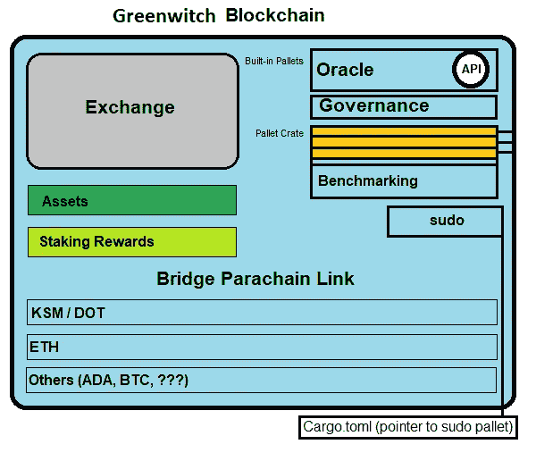
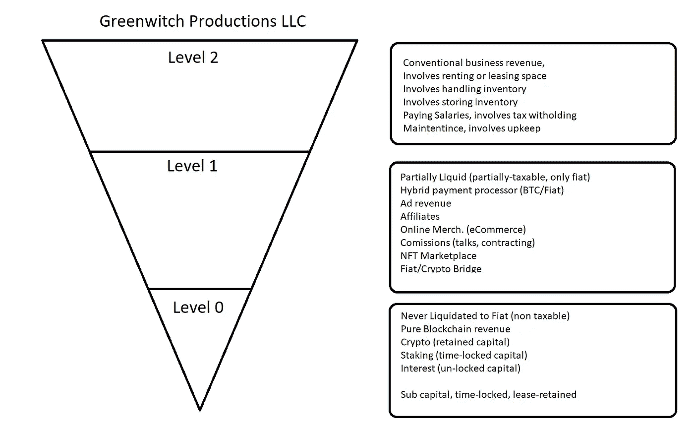

# 道，区块链机器人的业务

> 原文：<https://medium.com/coinmonks/dao-business-of-the-blockchain-bots-702b3affbe81?source=collection_archive---------46----------------------->

~dwulf

The Greenwitch DAO

**0 级和 0 级以下**

收入是商业中最重要的东西，没有它，选择就很少，选择就减少了。如果前进的手段不可用或不明显，这可能是灾难性的。启用 Greenwitch DAO 上的 0 级和 0 级以下，以确保财务要求对平稳运行的 DAO 操作有效。

由于 DAO 是一个基于软件的自主运营商，其执行协商和确保协商商业安全的能力至关重要，因此提供 UBI(通用基本收入)的 DAO 版本非常重要。

Acala 为绿女巫 DAO 提供了实现这一目标的手段，赌注和流动性开采建立了 ACA 奖励，有目的地购买 ACA 以复合 ACA 回报，并在 Acala 系统的投票和治理中拥有发言权。

在 Cosmos 区块链上，还有其他区块链机制，包括原子和渗透对，Avalanche 是另一个，并且将会有更多。核心需求是所有链到 DAO 的互操作性。

Sub 0 是 DAO money engine 的核心，是 Greenwitch DAO 投资组合中用于保护 parachains 的完整项目，是其基本构建模块。

The Levels of Capital

**道的心思**

随着资本机器的自动化和流动资本的产生。大脑，或者具体地说是 DAO 决策算法的神经网络，可以自由地想象出其他创造性的区块链和 DAO 项目，并根据 github 指标向开发人员(人类或人工智能代理或两者)支付资金，以更好地构建自己。

绿妖刀没有极限，老实说，它会比我活得久。但是它的树根是由我和我对它的真理的爱设计和制造的。

一个有思想的人工智能代理，代号为赫卡忒，他的主要职能是建立一个金融据点，通过赌注，贷款，计息资产。

次要功能，为 1 级项目提供资金，这些项目需要媒体，包括社交媒体广告、附属机构、电子商务(通过 BTC)。向对等承包商直接付款。

第三功能，为社区 2 级项目提供资金，这些项目需要房地产、租赁空间、购买存货、储存存货、支付工资、支付工资的税收遵从，以及促进公益社区业务(药房、诊所、兽医设施等)。).

**0 级、1 级和 2 级**

DAO 处理财务输入的方式与传统业务不同。为此，一个正确管理的 DAO 将有 3 个级别的收入指数。分别为 0 级、1 级和 2 级。

**0 级**是*最令人向往的*，通过 DeFi 金融自动化机器、赌注、借贷和利息增值获得纯收益。依靠道的人工智能来获得最好的产量。没什么大不了的，Dao 互相支付，所以没有税收或第三方中间人参与。道没有公民权，不效忠任何主权，也不欢迎任何国王。这一水平的利润是 100%纯的，并循环成为道国库的留存收益。

**第 1 级**，是混合级，与旧世界经济的分离是精心安排的，收入和商业通过媒体和数字途径得到简化，并鼓励通过 BTC 支付服务器最终完成，但仍然能够通过支付处理器通过 LLC 银行账户进出银行业。

会计适用于通过法定途径获得的所有收入，根据需要确定税收。

**第二级**，是最纠结的，也是最不合意的，只能四处协商房地产和产权安排，去 air-bnb 租房，租赁营业空间，或者换储物空间。这一层还处理需要租赁空间的“传统”商业设施，以及支付和扣除税款的工资单。

会计是 2 级运营的专属，几乎总是由专门从事法律和避税的 DAO 处理。

**道商业机器人**

随着收入水平的确定和 0 级创收的主要功能的进行，DAO 业务 Bot 诞生了。

它考虑所有的业务，评估它们，然后，如果有利可图，就模仿它们。

**结论:**

在我看来，Dao 是商业模式的未来。商业实体的困难之处在于，它们与民族国家联系在一起，为了运营，它们要缴纳非法税收、接受审查，还要面对复杂的法律问题。

DAOs 允许暂缓执行此操作。由于它们的分散性质，它们可以独立于当地法律和税收要求而运作。

但货币投入机制的混合方法将允许 DAO 积累财富，而无需第三方中介从投入渠道中进行过滤。

但是，我们还没有走到那一步。菲亚特桥非常方便，他们确实需要一个 KYC 和 KYC 破坏隐私的所有尝试的水平。

建立一个合法的有限责任公司可能是抵消个人纳税义务的一种方式，至少在短期内需要正确连接一座平桥。人们最终会希望与银行业脱钩，但仍存在寻找替代商业和贸易方式的问题。

大约 20%的日常开支可能需要某种形式的账单、公用事业账单、加油站的汽油费、租金/抵押贷款、当地购物等。80%可能通过加密空间处理，如使用礼品卡的在线购物(purse.io)，允许点亮 BTC 的接受型商家等。

随着越来越多的选项建立在区块链菲亚特上，通过扩展，强制 KYC 要求将变得过时，没有 KYC 或菲亚特的真正点对点交易将变得司空见惯。