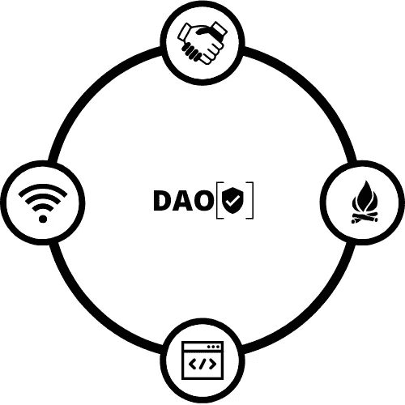

# DAO 索引:过渡到 0.9 版

> 原文：<https://medium.com/coinmonks/dao-index-transitioning-to-version-0-9-4f776d2681c5?source=collection_archive---------37----------------------->

关于将问卷过渡到 0.9 版、开发评级量表、培训和认证系统、制作演练视频和可视化分数的一些想法。

你可以在 Airtable 和下面的[用户指南](/@charles.adjovu/dao-index-user-guide-cf44f5998f40)中找到 DAO 索引数据库。

 [## Airtable |人人的 app 平台

### Airtable 是一个用于构建协作应用的低代码平台。定制您的工作流程、协作并实现…

airtable.com](https://airtable.com/invite/l?inviteId=invnmiZzs9LGeBO8V&inviteToken=838af8009c83f97ce78393e8a2ad5d27075621dd480cd8c2fc17ddd411c3588e&utm_source=email)  [## DAO 索引:用户指南

### 本用户指南旨在帮助人们了解 DAO 指数以及如何使用 DAO 指数的自我评估问卷…

medium.com](/@charles.adjovu/dao-index-user-guide-cf44f5998f40) 

# 将调查问卷过渡到 0.9 版

在 [**BanklessDAO 评测**](https://airtable.com/shrthQ7K20kJX4rUO) 之后，我想我会用 0.8 版本( [PrimeDAO](https://primedao.eth.link/#/) 和另一个 DAO 再做一两个评测；大概是 [MakerDAO](https://makerdao.com/en/) )才把问卷升级到 0.9 版本。

对于 0.9 版本，我考虑增加以下问题:

1.  DAO 是否有涵盖其入职流程的手册？；
2.  道是否有贡献者心理健康政策？；
3.  道对领导者和管理者的权力有控制机制吗？
4.  DAO 的规则、程序或政策是否有修正程序？
5.  DAO 是否明确描述了其针对贡献者的财务激励结构或薪酬结构？；
6.  DAO 是否提供了内部术语表？；
7.  "一体行动"是否有明确描述的战略优先排序方法？；
8.  道有没有决策矩阵？；
9.  道是否要求成员遵守行为准则中描述的行为标准？；
10.  道是否要求成员使用社会契约，例如谅解备忘录？；和
11.  DAO 是否使用任何组织网络分析工具？

对于 0.9 版，我计划删除以下问题:

1.  (问题 11 )"一体行动"是否使用参与式经济模式？

我认为应该删除 Q11，因为该问题的主题在其他问题中有更详细的阐述。

此外，我将根据讨论问卷会议的早期反馈，编辑问题的语言。

我还计划在 0.9 版本中添加以下字段(您也可以在 BanklessDAO 评估中找到这些字段):

1.  证据声明:来自 DAO 文档或第三方资源的片段，为响应提供直接证据
2.  注意:关于问题和回答的评论。
3.  困难:用于说明回答问题的困难
4.  花费的时间:用于说明回答问题所花费的时间
5.  需要帮助:一个二元(是/否)字段，用于说明是否需要额外的帮助来对问题做出合理的回答
6.  文档:遍历文档的难度等级，从 1(最容易)到 5(最难)。
7.  证据(或参考)质量:对证据(例如，一个好的使命陈述)质量的评级，从 1(最低质量)到 5(最高质量)

我可能会删除置信区间字段，因为它本身不能提供足够的信息来帮助审查者。

# 审查标题

我目前的想法集中在审查回应的 4 个标准上:

1.  解释的合理性
2.  解释的深度
3.  参考/来源的充分性
4.  适当的回应(简明英语/要点)

每个方面的评分为 1-5 分，除了同意/不同意的适当回答，如果不同意，则为问题的更适当的回答。

还不确定审核评价的最低分数。

# 等级量表、认证和培训系统

我正在考虑为组织和个人开发一个评级量表和认证系统。认证系统可能需要更多的工作来完成，因为我需要足够多的 DAO 生态系统利益相关者来断言或确定 DAO 指数是自愿信息披露的可行或合理的标准。对于个人来说，可能会得到更多关于背景知识和程序的反馈

## 量表

对于等级量表，我需要更多的问卷评估。我目前的想法是使用 A-D 等级量表:

*   a = 90–100%，
*   b = 80–89%，
*   c = 70–79 %,以及
*   D = < 70%.

## Certification and Training System

For the certification system for organizations, this depends on setting up the rating scale, a method for certifying (e.g., reaching a minimum score on the Questionnaire), gaining enough attention and affirmation from DAO ecosystem stakeholders that the DAO Index is a reasonable standard for evaluating and rating DAOs ( and even as a voluntary information disclosure method), and designing a certification mark.

For individuals, this depends on the whether the Rater Quiz covers enough substantive knowledge on digital organizing, and providing an assessment method for evaluations with the Questionnaire (e.g., having the individual candidate review a previous response).

# Walkthrough

I also plan on making a short 5–10 minute video where I provide a quick walkthrough explaining the Questionnaire and going over some questions from past evaluations.

If you have any questions or topics you want me to go over, please leave a reply or send me a message on [推特](https://twitter.com/CAdjovu)。

# 激励性奖励

此外，我还在考虑是否通过以下方式为那些为 DAO 索引做出贡献的人颁发代币:

1.  完成评价人测验，
2.  将问卷的回答添加到 Airtable 数据库中，
3.  用审查标题审查答复，
4.  改进问卷，
5.  将调查问卷与"一体行动"生态系统中的问题/挑战对应起来，或
6.  在道生态系统中推广道指数。

# 数据可视化和特定维度的数据

我会开始做一些以往测评的蜘蛛图或者柱状图，以便更容易理解各个维度的得分。此外，我将开始将每个维度的分数添加到使用 0.8 版问卷评估的 Dao 的 Airtable 评级配置文件中。