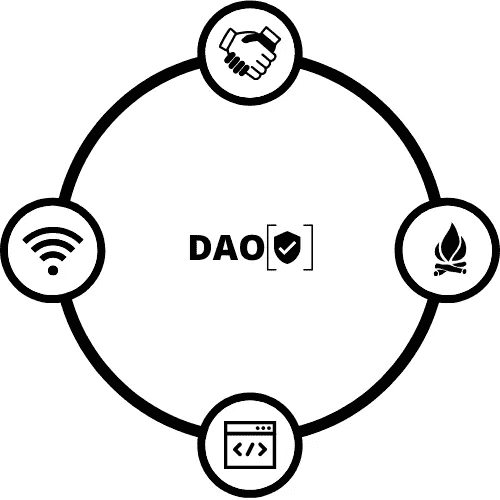
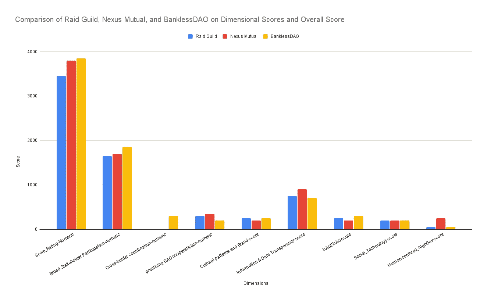
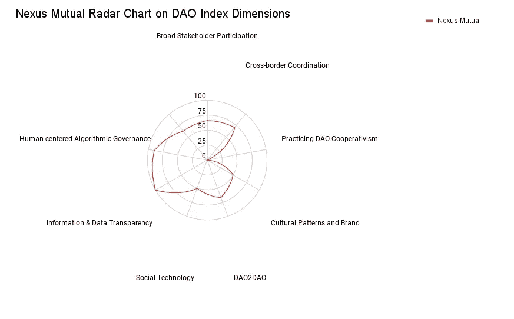
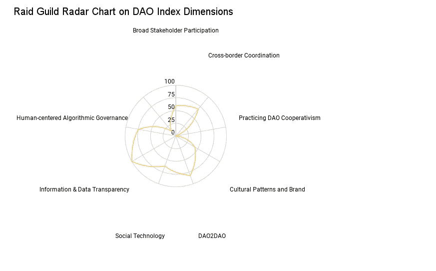
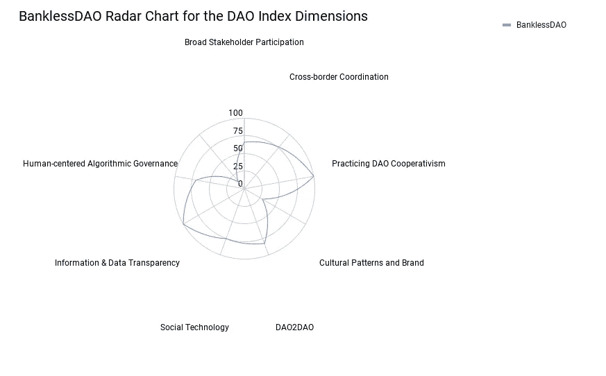

# DAO 索引:更新 Airtable 和新的可视化

> 原文：<https://medium.com/coinmonks/dao-index-updating-the-airtable-and-new-visualizations-5628da48c288?source=collection_archive---------33----------------------->

我更新了 [Airtable](https://airtable.com/invite/l?inviteId=invnmiZzs9LGeBO8V&inviteToken=838af8009c83f97ce78393e8a2ad5d27075621dd480cd8c2fc17ddd411c3588e&utm_source=email) 的底座。

迄今为止的变化:

*   我将 rating_profiles 表分为分数概况表和实体概况表

如果您正在寻找一个实体的基本信息，包括其评级和排名，请参考实体简介表。

如果您正在通过调查问卷的评估寻找有关实体的评分信息，请参考评分概况表。

你可以在这里找到 Airtable 底座:

 [## Airtable |人人的 app 平台

### Airtable 是一个用于构建协作应用的低代码平台。定制您的工作流程、协作并实现…

airtable.com](https://airtable.com/invite/l?inviteId=invnmiZzs9LGeBO8V&inviteToken=838af8009c83f97ce78393e8a2ad5d27075621dd480cd8c2fc17ddd411c3588e&utm_source=email) 

# 形象化

下面是一个条形图，比较了使用 0.8 版调查问卷进行的 BanklessDAO、Nexus Mutual 和 Raid Guild 评估的维度得分和总体得分

## 条形图

为了使 score_profiles 表可视化，我建议转置该表。

## 雷达图(单独)

Nexus Mutual Radar Chart

Raid Guild Radar Chart

BanklessDAO Radar Chart