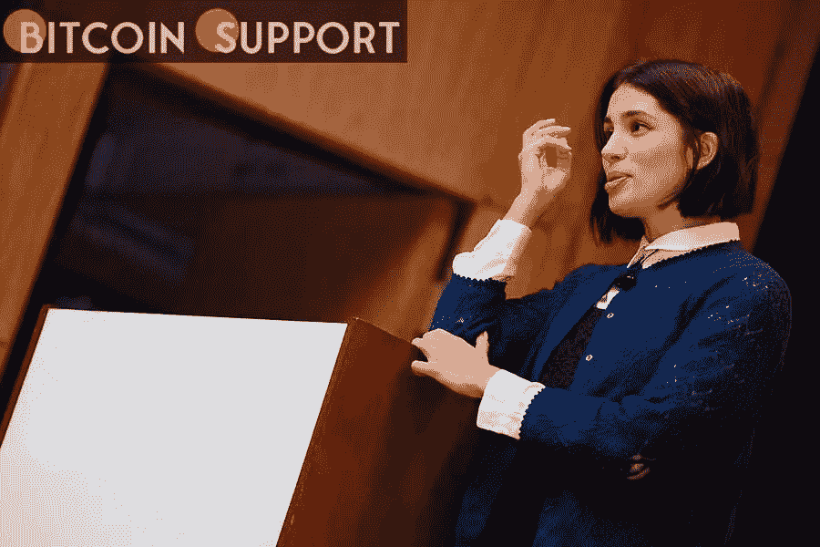

# Pussy Riot 联合创始人推出 DAO，旨在支持女性和 LGBTQ+艺术家

> 原文：<https://medium.com/coinmonks/dao-launched-by-pussy-riot-co-founder-in-support-of-women-and-lgbtq-artists-50aabaa268d1?source=collection_archive---------81----------------------->

**Visit our website:-** [**https://bitcoinsupports.com/**](https://bitcoinsupports.com/)

根据其网站，UnicornDAO 的主要目的是为加密货币和 Web3 领域中代表性不足的艺术家和团体提供金融工具、知识和资源。Pussy Riot 的联合创始人 Nadya Tolokonnikova 宣布成立 UnicornDAO，这是一个分散的自治组织，自称是“试图在 Web3 中对抗父权制的女权运动”在 Web3 中，它打算只投资女性、非二进制和 LGBTQ+艺术家。Tolokonnikova，她最著名的作品是概念抗议艺术团体 Pussy Riot，最近她更多地参与到 DAO 领域。DAO 是一个去中心化的自治组织(DAO ),它使用加密货币来组织、激励和控制群体决策。Tolokonnikova 是 UkraineDAO 的联合创始人，该公司通过出售显示乌克兰国旗的 NFT(一种用于代表数字资产所有权的象征)在五天内筹集了 675 万美元。独角兽号的目标与乌克兰号截然不同，后者是为了帮助乌克兰对抗俄国而创建的。联合创始人丽贝卡·拉米斯(Rebecca Lamis)表示，DAO 希望以“去中心化和社区运营的方式”，将金融工具和资源带给加密领域中代表性不足的群体。Lamis 评论道:“我非常欣赏 DAO 范式，以及它如何在 Web3 中实现一个新的、合作的、可扩展的架构。”据 Lamis 称，UnicornDAO 成员计划在最初成立时筹集 100 万美元投资艺术家。然而，由于需求高于预期，该公司正在寻求筹集更多资金——它已经有了一份长长的早期支持者名单，包括好莱坞经纪公司 Gary Oseary、企业家和 NFT 粉丝加里·维纳查克，以及数字艺术家 Trippy、Pplpleasr 和 Beeple。据拉米斯透露，https://twitter.com/RebeccaLamis/status/1501295957069107201 独角兽道希望在首轮融资中筹集 500 万至 1000 万美元。UnicornDAO 打算向其支持者提供“席位”,而不是像许多 DAO 那样出售代币或 NFT。

谈到 UnicornDAO 的投票和治理，Lamis 认为，该 DAO 不会有基于治理令牌的加权投票，每个成员都必须有一票。“基本上，当你购买一个座位时，你会以彩虹代币(道的代币)的形式收回你的股权，这取决于你给道的金额。”根据 UnicornDAO 联合创始人 Jenni Thompson 的说法，大多数早期支持者已经承诺购买门票，加密货币支付初创公司 MoonPay 赞助公共席位，艺术家捐赠 NFT。汤普森认为,“道”是一个很好的例子，说明了一个有着共同目标的组织如何转移权力和资本；发展中的 NFT 市场为艺术家，尤其是女性和 LGBTQ+人群提供了获得应有认可的机会。据拉米斯说，独角兽道希望它展出的艺术代表世界上的大多数人，而不仅仅是少数人，她认为“这个社区有大约 20 名女性，非二进制的创作者”“我们正在创建一个平台，展示…一系列女性、非二元 LGBTQ+作品，展示我们认为值得关注的更大生态系统中的人，”拉米斯说，并补充说，尽管 DAO 有长期目标，但其成员正在专注于支持数字艺术家和寻找 Web3 组织进行投资:“我们正在创建一个平台，展示…一系列女性、非二元 LGBTQ+作品，展示我们认为值得关注的人。”

**访问我们的网站:-**[**https://bitcoinsupports.com/**](https://bitcoinsupports.com/)

**免责声明:以上为作者观点，不应视为投资建议。读者应该自己做研究。**