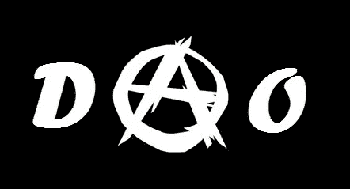

# 道:隐无政府主义的社会结构

> 原文：<https://medium.com/coinmonks/dao-the-social-structure-of-cryptoanarchism-618d700aa66?source=collection_archive---------18----------------------->

无政府状态不是混乱。无政府主义不是他们在学校学到的东西。

“无政府状态”一词源于希腊语“ἀναρχία”，意思是“没有”、“权力”或“授权”，即“没有权威”，由权威理解为一个实体或中心人物，或权力集中于少数人。

无政府状态促进人与人之间的自由市场，有自愿的协议，没有强加一个控制一切的中央权威。无政府主义提倡废除国家。

无政府状态是所有人的政府，人人为己。它需要个人的成熟和自主，而不期望从一个“捐助国”那里得到什么，“保护”一些人掠夺其他人的产品。国家的暴力行为被认为是不道德的，它接管了人们的私有财产。

密码无政府主义是一种无政府主义思潮，专注于保护隐私、政治和经济自由，其追随者支持使用密码学来实现社会变革。

该运动由美国工程师蒂莫西·c·梅(Timothy C. May)于 1988 年发起，并发表了“[宣言隐无政府主义者](https://www.activism.net/cypherpunk/crypto-anarchy.html)”。

在[密码会议](https://www.wikiwand.com/es/Cyphernomicon)中，May 指出:

> 从这一切中会出现什么还不清楚，但我认为这将是一种无政府资本主义市场体系的形式，我称之为“隐无政府主义”。Cyphernomicon，第 2.3.4 节。

密码无政府主义者的目标是创造用于避免迫害和国家入侵的密码软件。 [Vernor Vinge](https://www.wikiwand.com/es/Vernor_Vinge) 将隐无政府主义描述为一种资本主义在网络空间的实现，尽管这不是一种共识。

我们今天生活的世界，已经将互联网作为我们栖息地的一部分。我们大部分时间都在联系，我们的部分工作也是在互联网上完成的。人们在网上交易、社交、放松，有时甚至结婚。

因此，颠覆指日可待，这样人们就可以通过计算机代码组织起来，以非常低的成本和在线速度做出电子仪器化的决定。

传统的组织是以层级的形式构成的。董事会、管理层和员工。这些人中的每一个都有不同程度的权力，而雇员是那些很少有或没有权力的人。

DAO(去中心化自治组织)是由区块链中的智能契约管理的组织，它模仿任何现实世界的契约，自动执行预先建立的条件。

[fuente](https://dev.to/3scava1i3r/what-s-a-decentralized-autonomous-organisation-dao-6dj)

因此，与传统公司的政府相比，DAO 的政府结构是完全透明和可审计的。我们也不谈论州政府的公共腐败。

阿道与传统公司的区别在于，它的结构是分散的，没有中央权威的身影。Dao 是民主的，因为他们准备广泛参与决策。治理令牌的任期使这种参与成为可能。

通过使用这些计算机结构，组织中的参与者的身份可以从假名中探测，并且当需要在不损害财产的情况下维护隐私时，这对于大量参与者是有用的。

很难说哪些国家的法律会被忽略，因为甚至连特定用户的所在地都不知道。在某种意义上，匿名网络的加密(“密码空间”、“加密空间”)可以被视为一个独立的领域，没有一个特定管辖区的公法。对于法学家来说，这是一个需要研究的问题，本文无意讨论。事实上,"一带一路"作为一个没有实体总部的全球性组织，是一种未经探索的法律结构。

2021 年 7 月，怀俄明州成为第一个承认 DAO 为法律实体的州，此前[怀俄明州的 DAO](https://sos.wyo.gov/Business/Docs/DAOs_FAQs.pdf) 法案将生效。这意味着在怀俄明州注册的 Dao 在美国被法律认可为商业实体，因此将获得与有限责任公司相同的法律保护。

在最近俄罗斯入侵乌克兰的行动中，一个[道](https://www.coindesk.com/business/2022/03/09/ukraine-has-received-close-to-100-million-in-crypto-donations/)被组建起来，为面对俄罗斯军队的乌克兰士兵筹集资金，并被命名为[乌克兰道](https://www.ukrainedao.love/)。

参与者可以在工作状态下自愿创建私法，使用智能合同，其中个人身份取决于在线声誉。在这里 DID(去中心化的身份)很重要，并且是一个成长中的机构，道可以在地穴提供的范围内选择。

权力下放的概念培养了信任的观念，随着损害的减少，欺诈在组织形成者的行动中被最小化，在该组织中，每笔交易在区块链中被不可改变地登记。

在没有中央权威的情况下，接受创新不需要漫长而艰苦的过程。有了“道”,创新不需要经过不同的层级，就可以到达有决策权的人手中。

这种损害可能容易受到错误的影响，如果它们被盗版，经济后果可能是灾难性的，这是一个必须小心的弱点。

没有商业秘密。由于智能合同中的所有内容都编码在区块链中，并且是透明的，因此可以复制。

道的结构可以是多种多样的，包括形式和参与者的数量。一个经典的结构可以这样呈现:

# 最后的话

传统的组织在等级结构中是有意义的，是促进中央集权的政府的理想选择。

如果我们想从政治权力向社会权力发展，在社会权力中，个人可以直接参与，而不仅仅被视为权力结构的数字，那么损害在区块链中提供了适当的工具。

损害允许其参与者的直接和个人投票，这就是它的力量。

当局对宣布的新冠肺炎疫情实施的封锁给我们留下了一个受损的经济和许多感到被利用和没有发言权的雇主和工人。

目前还不清楚传统的系统是否会改变，或者他们会在多长时间内改变，但 Dao 已经展示了一条改善工作条件和员工管理的清晰道路。

我必须诚实地承认，并不是所有类型的结构都应该去中心化，一个 DAO 并不能解决任何治理问题，但它可以为许多公共和私有系统提供一个解决方案，其中至少有一部分可以去中心化。

由于这些原因，有必要将权力下放给私人和公共治理。

在之前的一篇文章中，我解释了 DAO:“[去中心化自治组织(DAO):简史、挑战和经验教训](https://adapulse.io/decentralized-autonomous-organization-dao-the-brief-history-challenges-and-lessons-learned/)”，在下一篇文章中，我解释了治理:[定义去中心化治理和众多不同的模型](https://adapulse.io/defining-decentralized-governance-and-the-multitude-of-different-models/)。

【Liberlion.com 

> 加入 Coinmonks [电报频道](https://t.me/coincodecap)和 [Youtube 频道](https://www.youtube.com/c/coinmonks/videos)了解加密交易和投资

# 另外，阅读

*   [Bookmap 评论](https://coincodecap.com/bookmap-review-2021-best-trading-software) | [美国 5 大最佳加密交易所](https://coincodecap.com/crypto-exchange-usa)
*   最佳加密[硬件钱包](/coinmonks/hardware-wallets-dfa1211730c6) | [Bitbns 评论](/coinmonks/bitbns-review-38256a07e161)
*   [新加坡十大最佳密码交易所](https://coincodecap.com/crypto-exchange-in-singapore) | [收购 AXS](https://coincodecap.com/buy-axs-token)
*   [红狗赌场评论](https://coincodecap.com/red-dog-casino-review) | [Swyftx 评论](https://coincodecap.com/swyftx-review) | [CoinGate 评论](https://coincodecap.com/coingate-review)
*   [投资印度的最佳加密软件](https://coincodecap.com/best-crypto-to-invest-in-india-in-2021)|[WazirX P2P](https://coincodecap.com/wazirx-p2p)|[Hi Dollar Review](https://coincodecap.com/hi-dollar-review)