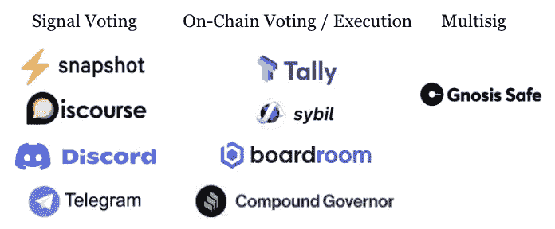

# 钉你的刀:如何为你的刀选择最好的商业工具

> 原文：<https://medium.com/coinmonks/dao-tooling-how-to-choose-the-best-business-tools-for-your-dao-45e8fd7d1669?source=collection_archive---------10----------------------->

# DAOs:潜力巨大但工具有限

根据专家的说法，我们现在正处于“道”的第[年。截至 2022 年 2 月，](https://consensys.net/blog/blockchain-explained/2022-will-be-the-year-of-the-dao-but-practical-challenges-remain/)[至少有 188 家 Dao 控制着超过 120 亿美元](https://kraken.docsend.com/view/kfzxp6qqaqnqyue6)的资产。这些组织拥有巨大的潜力:它们是数字原生的，在设计上是透明的，它们以社区为主导的精神意味着它们通常比传统的自上而下的组织扩展得更快。然而，运行 DAO 的一个主要障碍是缺乏可以实现高效的资金管理、支出、报销和平稳治理的工具。传统企业有各种各样的 Saas 产品和商业应用程序来支持他们的运营，此外还有专门从事初创公司和小企业的律师和会计师团队。在 web3 的世界里，情况还不是这样。下面你会发现一些解决方案，我们已经看到我们的用户实施，以改善工具，并创造整个布的解决方案。

# 道金库管理:涵盖基础和多样化的新兴工具

几乎所有的 Dao 都在[多签名钱包](https://www.coindesk.com/tech/2020/11/10/multisignature-wallets-can-keep-your-coins-safer-if-you-use-them-right/)上储存他们的国库，这是[为团队](https://multis.co/post/multisignature-wallets-the-gold-standard-for-companies)打造的。尽管有各种各样的多重签名钱包，Gnosis Safe 是 DAOs 的事实上的多重签名钱包。大多数 Dao 将他们的资产锁定在多个多签名钱包上，并将国库支付给个人钱包，用于硬币投放或分配拨款资金。我们与一个主要“道”的赠款委员会成员进行了交谈，他总结说“我最大的问题是，大多数“道”捐助者根本不了解财政管理。许多资金闲置，因为财政部最重要的事情是知道如何使用它。”

# Multis:用于资金和现金流监控的 DAO 工具

Snapshot metrics give DAOs financial KPIs

我们建立 [Multis](http://multis.co) 的原因之一是让 DAOs 和 web3 组织清楚并控制他们的加密库。我们在 [Gnosis Safe](https://gnosis-safe.io/) 上开发了我们的应用，不仅因为我们认为它是 Multisig 钱包的[黄金标准](https://multis.co/post/building-with-gnosis-the-gold-standard-of-multisig-wallets)，还因为 Dao 可以简单地连接他们现有的保险箱并访问应用。无需将资金转移到新钱包。

## **监控财务并获取公司指标**

You can track all company wallets crosschain

Multis 允许团队跟踪 ETH、BNB、Polygon 和 BTC 的钱包金融活动。Dao 可以链接他们正在使用的多个钱包，以便全面了解他们的资金。对于 Dao 来说，这可能是使复杂的财务信息更容易阅读和理解的一种重要方式。随着时间的推移，按类别可视化公司的资金可以帮助团队在现金流和预算方面做出更好的决策，这是掌握您的 DAO 资金的关键一步。

## 社区访问

与 Gnosis 保险箱不同，只有“所有者”才能访问钱包中的资金，Multis 帐户包括队友级别的访问权限。这意味着非所有者仍然可以看到钱包上的活动，标记交易，并导出财务数据。

## 轻松报告

Reporting on finances is easy to do

多账户使财务报告变得简单。“交易”选项卡是真实信息的单一来源，用户可以[对所有钱包的交易进行分类](https://multis.co/post/category-labels-and-a-contact-book-the-details-that-make-a-difference)，添加注释和附件以增加清晰度，并将数据导出为会计友好的 CSV 报告。

## 易于分享的见解

Multis 上的[“Insights”选项卡旨在让用户快速了解基本 KPI:一段时间内的流入和流出，以及按类别划分的支出明细。与分钟会计数据不同，这些图表是为了让非专家更好地了解基金的透明度和更容易做出决策。我们已经被告知，我们的一些 DAO 用户正在截取公司见解的截图，并在 Discord 上与他们的社区分享。我们希望在未来使这个特性更具共享性，并更好地集成 DAO 社区。](https://multishq.medium.com/multis-adds-insights-section-for-better-visibility-of-crypto-cashflow-f433123f3e6e)

## 工资单

Multis 旨在使 DAO 支付尽可能简单。这就是为什么帐户配备了[工资功能](https://multis.co/post/mass-pay-a-first-step-towards-crypto-payroll)，允许在一次交易中支付多达 65 个地址。由于内置的公司地址簿，联系人都存储在一个地方。因为我们的账户是建立在 Gnosis Safe 上的，用户可以制定一个支付批准政策，确保支出的支付由多个管理员验证，以确保最大的透明度。

## 对冲:优化道金库

大多数道的[有超过 95%的资金锁定在他们的本地代币](/hedgey/the-dao-treasurer-series-part-1-fundamentals-f6fcefefaad0)。这是一个巨大的风险:除非你的代币升值，否则由不稳定资产组成的国债是高风险的——在最坏的情况下，DAO 可能会在熊市期间出售其原生代币。[传统金融的一个最佳实践](/blockchain-capital-blog/dao-treasury-balance-sheet-management-ce5e96da34ac)当然是用低风险资产分散他们的资金。稳定的货币是这种资产的一个完美的例子，然而，在一个指数上出售本国货币会导致真正的价格影响。Hedgey 是一种无许可协议，旨在让 Dao 无需在公开市场上进行现货销售就能产生收益并分散其国债。Hedgey 允许用户创建 t [时间锁定的 OTC 报价作为可转让的 NFTS](/hedgey/time-locked-otc-deals-as-transferable-nfts-a2b2757a7c33) ，或者通过直接从他们的应用程序中用本地国债代币[写备兑买入期权来产生前期收益。这是一个强大的工具，Dao 可以用它来长期保护他们的国债，使其免受熊市波动的影响。](https://hedgey.finance/)

# 道法律工具

目前，大多数 Dao 存在于法律的灰色地带——介于合作社和小企业之间。随着道继续积累[可观的美国国债](https://deepdao.io/organizations)和[数量的增长](https://www.forbes.com/sites/jeffkauflin/2022/02/03/daos-arent-a-fad-theyre-a-platform/?sh=1b94d92219d0)——保护利益相关者免于法律责任并为即将到来的税收建立适当的结构变得势在必行。怀俄明州是这一领域的先驱——[允许 Dao 成立有限责任公司](https://decrypt.co/75222/americas-first-dao-approved-in-wyoming)，马绍尔群岛[也在这一领域效仿](https://cointelegraph.com/news/marshall-islands-officially-recognizes-daos-as-legal-entities)。

## 卡利道——推出合法利益的道

KaliDAO 是我们见过的最有趣的项目之一，希望以合法身份推出。KaliDAO 从由法律工程师组成的 [LexDAO](https://www.lexdao.coop/) 团队中分离出来，允许 DAO 成员将他们的钱包直接连接到他们的平台，并建立关键的预备工作，如投票结构和法律地位、端到端令牌化、投票支持以及 LLC 组建和起草协议软件。目前，有 4 种类型的协议可用[怀俄明道有限责任公司](https://sos.wyo.gov/Business/Docs/DAOs_FAQs.pdf)、[特拉华道有限责任公司](https://www.doola.com/blog/what-is-a-dao-llc-your-complete-guide-to-daos)、[非公司非营利协会](https://www.legalzoom.com/articles/unincorporated-nonprofit-association-vs-nonprofit-corporation)和[投资俱乐部](https://www.investopedia.com/terms/i/investmentclub.asp#:~:text=An%20investment%20club%20refers%20to%20a%20group%20of%20individuals%20who,of%20non%2Dprofessional%20club%20members.)。这是从第一天起就保护新生刀的一种令人惊叹的一体化方式。

## lex Dao——法律工程师社区

[LexDAO](https://www.lexdao.coop/) 不提供法律建议。这是一个为“法律工程专业人士”提供的空间，他们正在建设区块链项目，可以用来代替基本的法律费用。他们还想出了一种方法来为[提供仲裁服务](https://github.com/lexDAO/Arbitration)，通过 LexDAO 法律工程师组成的多签名委员会做出决定。[他们的博客](https://lexdao.substack.com/)提供了关于 web3 法律纠纷的有趣观点，以及对协议的法律含义的解释。我们还应该提到的是，他们的关键贡献者目录是一份许多专门从事 web3 的律师的名册——对于那些在他们的 DAO 上寻找法律顾问的人来说，这可能是一个很好的起点。

## 反垄断法——网络 3 名获得 Dao 的专业律师

[Antifirm](https://www.antifirm.com/) 是律师事务所 [Campbell Teague](https://campbellteague.com/) 的 web3 分支。与不提供法律咨询的 KaliDAO 和 LexDAO 不同，Antifirm 提供从 DAO 结构到 NFT 销售到总法律顾问的各种咨询服务。

# 道治理工具

Image courtesy of Nichanan Kesonpat

DAOs 的一个关键特征是[决策和资金分配的透明度。成员通常通过向 DAO 捐款来获得投票权。与典型的公司不同,"一体行动"的利益攸关方有权提交"一体行动"所有领域的提案:从赠款、工程、营销到活动。DAOs 中的投票结果意味着连锁行动。](https://papers.ssrn.com/sol3/papers.cfm?abstract_id=3549469)

## 链上治理投票工具

从历史上看，链上投票工具用于支持 DAO 治理和决策制定。允许这样做的工具包括 [Tally、](https://www.withtally.com/) [Sybil](https://sybil.org/#/delegates/uniswap) (由 Uniswap 开发)[会议室](https://www.boardroom.info/)和[复合调控器](https://compound.finance/docs/governance)。然而，由于以太坊上不稳定的天然气费用，Dao 们越来越普遍地寻找其他投票工具来节省天然气费用。

## 离线/信号投票工具

通常，Dao 会使用像 [Discord](https://discord.com/) 和 [Telegram](https://telegram.org/) 这样的离线社交网络进行简单的投票，因为这些工具通常是 Dao 社区不可或缺的一部分。[快照](https://snapshot.org/)还提供了可适应不同系统(二次投票、批准投票等)的离链无气体投票系统。

# 道工具始于心态

正如 Vitalik Buterin 所说,“你不能只把一把刀当作一把刀。你需要一把刀来做一些事情。”最有活力的 Dao 正在建立交易所，将法律服务转化为代码，使网络更容易使用，资助具有重要文化意义的数字艺术。

然而，作为一家公司，我们建议新生的 Dao 从一开始就认真对待他们所做的事情。首先要选择正确的工具来完成资金管理，确保法律地位，并使治理易于实施。为了让 DAO 做伟大的事情，工具需要成为早期对话的一部分。在许多方面，我们谈论的是心态，以及对一定程度的集中化的开放(尤其是在跟踪投资组合中的资产时)。任何一个"一体行动"组织都应努力制定工具和工作方法，以确保该组织未来的成功和繁荣。

我们有没有遗漏任何工具？让我们了解 support@multis.co

‍

‍

‍

*最初发表于*[T5【https://multis.co】](https://multis.co/post/dao-tooling-how-to-choose-the-best-business-tools-for-your-dao)*。*

> 加入 Coinmonks [电报频道](https://t.me/coincodecap)和 [Youtube 频道](https://www.youtube.com/c/coinmonks/videos)了解加密交易和投资

# 另外，阅读

*   [BigONE 交易所评论](/coinmonks/bigone-exchange-review-64705d85a1d4) | [电网交易机器人](https://coincodecap.com/grid-trading)
*   [氹欞侊贸易评论](https://coincodecap.com/anny-trade-review) | [CoinSpot 评论](https://coincodecap.com/coinspot-review)
*   [新加坡十大最佳加密交易所](https://coincodecap.com/crypto-exchange-in-singapore) | [购买 AXS](https://coincodecap.com/buy-axs-token)
*   [投资印度的最佳加密软件](https://coincodecap.com/best-crypto-to-invest-in-india-in-2021) | [WazirX P2P](https://coincodecap.com/wazirx-p2p)
*   [7 个最佳零费用加密交易平台](https://coincodecap.com/zero-fee-crypto-exchanges)
*   [最佳网上赌场](https://coincodecap.com/best-online-casinos) | [期货交易机器人](/coinmonks/futures-trading-bots-5a282ccee3f5)