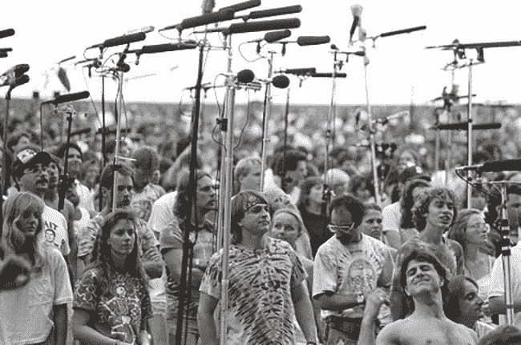

# DAOs 和 Deadheads

> 原文：<https://medium.com/coinmonks/daos-and-deadheads-8247a2a273db?source=collection_archive---------31----------------------->

音乐家和他们的粉丝之间一直有一种情感联系。音乐将人们联系在一起，从历史上看，粉丝们已经围绕他们喜欢的乐队和音乐家有机地创建了社区。

一些流行粉丝的例子包括 MCRmy，蛆，KissArmy，骷髅团，Phishheads，Echelon，小怪物，Juggalos 和最近的 BTS' ARMY(青年的可爱代表 MC)。

早在 70 年代，乐队 *The Grateful Dead* 就有一群铁杆粉丝，他们从一份门票邮寄名单开始，发展成为一种大规模的亚文化。粉丝们投入了他们的生命去跟随乐队巡回演出，并在支持乐队的同时找到了在经济上支持自己的方法。

他们被称为 *the Deadheads* ，这是一个拥有 40K+成员的狂热粉丝群体，承担着诸如“小锥”(录制节目的人)、制作独特 t 恤的衬衫小贩、艺术家、邮寄者(管理活动交流的人)、组织者等角色

他们是一个围绕共同使命的自发组织的社区，那些在 70 年代报道这一现象的人说，很难想象没有死人的感恩而死。他们是同一个——一个统一的公共体验。一个人可以说，这些死党为乐队的使命所做的比任何唱片公司或公司都多。

## Web 3 音乐社区

web 3 和音乐 NFT 的出现以全新的方式将音乐家和艺术家联系在一起。粉丝可以通过拥有歌曲、购买使用权，甚至拥有歌曲的版税来支持音乐人。这反过来又使乐迷们有可能从音乐家的职业生涯中获利。

但是，web 3 的另一个趋势有可能创造一种新的粉丝群体，类似于死对头，形成一种统一的连通性。这就是道的概念。

Dao(分散自治组织)是具有共同使命的自组织社区，通常包括内置的金库和由团体定义的治理模型。它们通常被称为数字合作社。

DAO 的有趣之处以及我将它们比作死对头的原因在于，DAO 的价值在于社区本身，而不是它产生的产品。粉丝的真正价值是成为社区的一部分，是一种氛围，是一种体验。无论道产生了什么或解决了什么问题，都可能是重要的，但这不是它的核心精神。

我只是想澄清一些事情，我并不是说 Dao 是现代版的死脑筋。死对头的价值是完全不同的，因为死对头是关于身体的公共聚会，音乐会的经验，更不用说迷幻的实验。我想说的是，Dao 有潜力在同等规模或更大规模上创造一种文化冲击。

但 DAOs 与典型的数字原生社区或社交媒体集团有何不同？

Dao 的不同之处在于，它们有经济激励、治理和创造新收入形式的能力。放弃了自己的生活去追随乐队的死对头们不得不寻找在旅途中赚钱的方法，DAOs 可以利用数字景观，并可以在全球范围内扩展。

## DAOs 与唱片公司的未来

如果音乐人或乐队形成了一个以品牌愿景为中心的 DAO，那么 DAO 就有可能承担通常由唱片公司管理的许多任务。独立和即将到来的音乐人已经在出版和建立他们的音乐事业，而没有唱片公司，如果他们能够形成一个强大的粉丝社区，他们对音乐和愿景充满热情，并且也是经济增长的一部分，这是一种具有爆炸性势头的新参与。

“道”将作为一种共同创作的过程，粉丝可以实际参与音乐家的发展。参与的规则必须由道来定义，但创造的潜力是巨大的。关于这在不久的将来会如何发展，还会有更多的报道。

## 最后

在这篇文章中，我从概念上起草了一些关于为什么一把刀可以成为一种新的爱好者的想法，但我没有给出这是如何发生的例子或模型，主要是因为它仍然在出现。我们确实是在 DAO 音乐空间的早期，这是特别在 crypto 世界中产生的牵引力，但它很快就会成为主流，看到音乐人和粉丝可以一起做什么将是令人惊讶的。