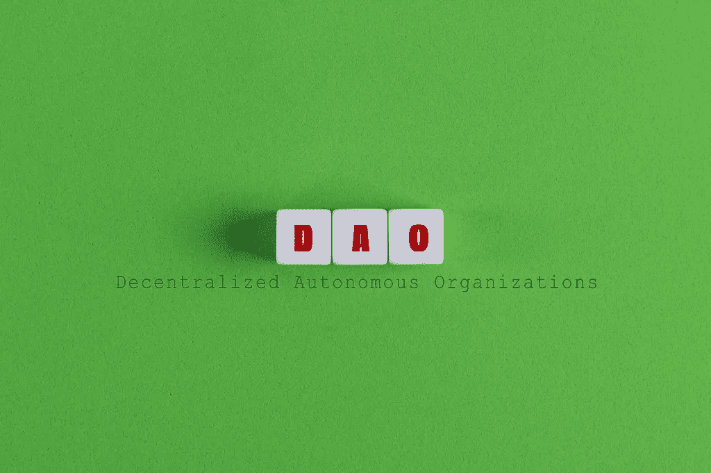

# 道:民营企业能否突破 SEC 的股东门槛？

> 原文：<https://medium.com/coinmonks/daos-can-private-companies-break-the-sec-s-shareholder-threshold-d45d6aa11f64?source=collection_archive---------62----------------------->

昨天我在一家私人公司咨询时遇到了一个有趣的挑战…

该公司的创始人希望通过一个 10k 的 NFT 项目来众筹他的业务。他希望用他公司的股份来回报投资者。在实践中，每个 NFT 将代表分配给投资者的总股本百分比(例如，公司的 10%)的 1/10，000。

问题:我的客户不希望他的公司上市。但是，用 NFT 的股票直接代表该公司的股票将打破 SEC 的利益相关者门槛，迫使他的企业成为上市公司。

如[交易法案](https://www.investor.gov/introduction-investing/investing-basics/role-sec/laws-govern-securities-industry#secexact1934)第 12 节所述，证券交易委员会(SEC)要求任何拥有 2000 名或更多股东的公司提交注册声明并成为报告公司。因此，推出一个 10，000 NFT 集合，其中每个 NFT 的价值直接代表该公司的一只股票，这将迫使该公司进行 IPO，因为它将在 100%的翻新后聚集 10，000 名利益相关者。

在头脑风暴寻找解决方案的时候，我开始思考:*创造一个细分的道来代表利益相关者的团体能解决这个问题吗？*在这种情况下，部分 DAO(即分散的自治组织)将代表分组利益攸关方的决策权。

*例* : 10 个细分道分别包含 1000 个 NFT 持有者。因此，利益相关者的总数将是 10，而不是 10，000。如果这种代表形式被 SEC 准则所接受，NFT 收藏背后的业务就不必上市，因为它们没有超过 2000 名股东的门槛。

我设想的自动化系统的功能将类似于美国总统选举选举团背后的流程。利益相关者在细分的 DAO 内投票将代表各县。每个县(即利益相关者)将投票决定他们的州(即他们所在的细分道)是变成红色还是蓝色。基于其县的投票多数，一个州将有效地变成红色或蓝色，影响各州之间举行的更大的多数票。根据各州(即所有细分的 DAO)的投票，最终结果将根据大多数人的投票决定。

*例*:道决定将其部分资金捐赠给哪个慈善机构:慈善机构 1、慈善机构 2 或慈善机构 3。放置 100 个细分的刀，以容纳该系列的 10，000 个 NFT(即，每个刀 100 个 NFT)。我拥有 1 个 NFT，并投票给慈善机构 1，但我的细分道(例如，100 个道中的第 21 个)中的大多数投票选择了慈善机构 2。要维持这一决定，慈善 2 必须赢得其他 99 道的多数票。但是，在 100 个细分的道中，慈善 3 以 43 票代表了最大的多数。因此，慈善机构 3 获胜并被选中捐赠。

让我知道你对这个概念的想法。告诉我为什么这行得通或行不通。我洗耳恭听，在这里学习。在推特 [@ChurchofWeb3](https://twitter.com/ChurchOfWeb3) 或我的个人账号[@ burner fpp](https://twitter.com/BurnerPfp)上与我联系！

> 加入 Coinmonks [电报频道](https://t.me/coincodecap)和 [Youtube 频道](https://www.youtube.com/c/coinmonks/videos)了解加密交易和投资

# 另外，阅读

*   [印度最佳 P2P 加密交易所](https://coincodecap.com/p2p-crypto-exchanges-in-india) | [柴犬钱包](https://coincodecap.com/baby-shiba-inu-wallets)
*   [8 大加密附属计划](https://coincodecap.com/crypto-affiliate-programs) | [eToro vs 比特币基地](https://coincodecap.com/etoro-vs-coinbase)
*   [最佳以太坊钱包](https://coincodecap.com/best-ethereum-wallets) | [电报上的加密货币机器人](https://coincodecap.com/telegram-crypto-bots)
*   [交易杠杆代币的最佳交易所](https://coincodecap.com/leveraged-token-exchanges) | [购买 Floki](https://coincodecap.com/buy-floki-inu-token)
*   [3Commas 对 Pionex 对 Cryptohopper](https://coincodecap.com/3commas-vs-pionex-vs-cryptohopper) | [Bingbon 评论](https://coincodecap.com/bingbon-review)
*   [加密复制交易平台](/coinmonks/top-10-crypto-copy-trading-platforms-for-beginners-d0c37c7d698c) | [如何在 WazirX 上购买比特币](/coinmonks/buy-bitcoin-on-wazirx-2d12b7989af1)