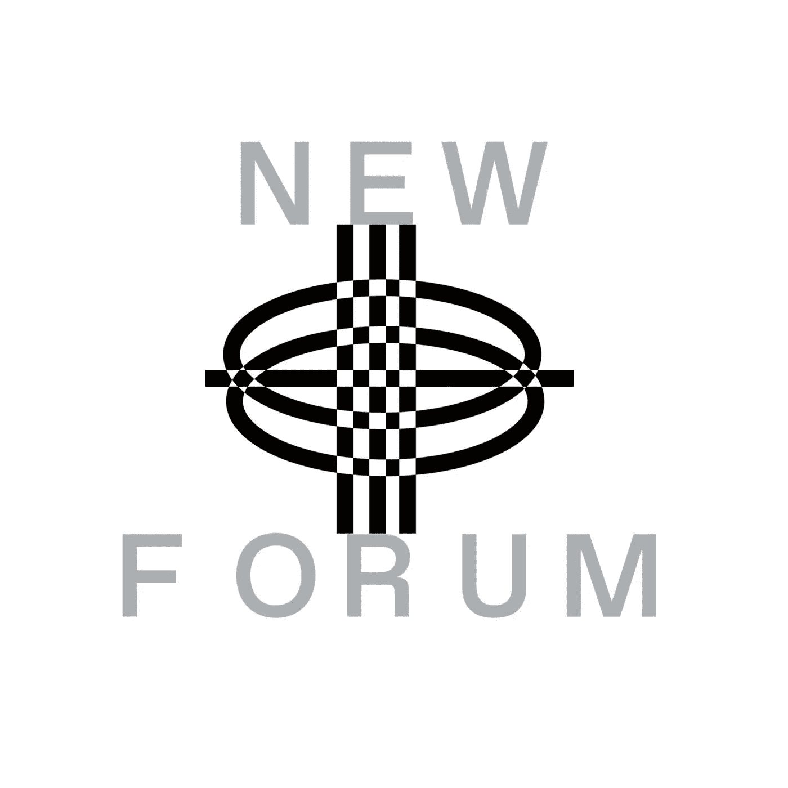

# Sarah Lu 解读网络 3 文化中的 DAOs 与数字社区

> 原文：<https://medium.com/coinmonks/daos-digital-communities-in-web3-culture-explained-by-sarah-lu-36ef366595dc?source=collection_archive---------21----------------------->

Sarah Lu

萨拉·卢，哥伦比亚大学的毕业生，她有一个掉进兔子洞的最精彩的故事，加入了我们这一集的新论坛。萨拉最初是哥伦比亚大学政治学专业的一名非常理想主义的新生。他们的目标是最终进入耶鲁大学，成为第一位亚裔美国最高法院法官。毕业后，他们的下一步是学习 LSAT 和去法学院，但 Covid 改变了 Sarah 对事物的看法，追求法律不再是正确的。

> “世界末日到了，我觉得自己正走向单调，恐慌开始了:我这辈子到底想做什么”——莎拉

莎拉决定快速转换运营商，开始在一家中国社交媒体/电子商务初创公司工作，这是他们在私营行业的第一次经历；在那里，他们选择了有益的技能和职业道德，但现在是时候继续前进了。莎拉不喜欢这家初创公司服务于一个巨大的平台，偶然发现了李进的文章，并开始以不同的方式思考创造者经济。

> “我创建了一个 Twitter 账户来探索 Web3，然后我立刻掉进了兔子洞”——Sarah

Sarah 承认他们旅程的开始是困难的，认为他们的第一步是在 Web3 中获得一份工作，知道她没有任何技术背景。然而，随着 Dao、奖金、兼职工作和新项目在该领域如此盛行，他们意识到他们可以通过追求非传统机会来开辟后门。

> “Web 3 中的创造者经济是这样一种理念，即你可以建立自己的社区并从中获利，而不必通过那些会从你那里拿走一大块钱的人。令人兴奋的是，创作者现在拥有他们的社区，他们的社区反过来也可以拥有他们作品的一部分，或者他们也可以以社交令牌或创作者令牌的形式拥有社区的一部分，或者你知道所有这些非常网络的全新概念 3”-Sarah

数字社区是 Web3 文化的重要组成部分。Sarah 分享说，他们加入的第一个社区是由 Crypto 的一个朋友推荐的，是一个名为 Dencentraliens 的学习 DAO。莎拉目前是 Dencentraliens 的成员，该组织被称为隐形大学。她解释说，无形学院本质上是一个学习道，学生或道中的人可以拥有学校的一部分。成员可以决定他们想看什么样的资源，让谁来谈，并对组织的总体方向做出贡献。

如果你问我们新论坛社区，我们会说，这是一个很酷的刀！

Sarah 分享了更多关于他们对分散化 DAO 的兴奋以及他们第一次在 Discord 和 Twitter 上参与其中的经历-他们还在采访中谈到了他们加入的其他令人兴奋的 NFT 和 DAO 社区。如果你正在阅读这篇文章，并且不熟悉 Web3 空间，我们推荐你观看这一集！

> “我认为这是 Web3 令人兴奋的事情，你不再需要订阅一个平台，在这个平台上每个人都知道如何受欢迎，或者知道如何创建内容，或者知道如何以这种特定的方式与其他人互动；每个社区都有自己的定位、兴趣和目标；只要你认同这一点，你的动机就会一致，你仍然可以拥有它的一部分……”—Sarah

“社区”这个词已经成为 Web3 文化中的流行语，我们应该给这个词下一个定义，尤其是对这个领域的初学者。NewForum 主持人向 Sarah 提出了这个问题，以获得她对这个词在空间中代表什么的定义和观点。

> “当我第一次进入时，我在想，这个大家都在谈论的社区是什么？是某种地方吗？一次？这对我来说很模糊，我认为人们故意保持这种方式是一回事……”——Sarah

Sarah 尽她最大的努力来定义社区对她意味着什么，分享了-

> “我所看到的是，一个社区是一群人，他们的动机是一致的，这通常比你想象的更难做到；因为你怎样才能让每个人的动机在一个团队中保持一致，而不使事情过于复杂或管理不当……”—Sarah

Sarah 建议 DAOs 可以弥合这些由人性引起的潜在挑战。他们还对社会标志的作用提出了一个有趣的观点；在他们的完整访谈中定义什么是社区。

Sarah 讨论了他们认为 DeFi 和加密货币如何增强全球创造者和人们的能力。他们在这个问题上给出了诚实和透明的例子。

> “人们看不到将所有资产投入一家机构的好处；这些机构并没有把你的最佳利益放在心上。我认为这是 DeFi 的真正潜力，这是一个让我们可以自由转移资金的全球系统，我认为这将帮助那些受到金融制裁或经济战争影响的人……”—Sarah

莎拉预测，正如许多 Web3 爱好者预测的那样，DeFi 和加密货币可以在未来给我们带来经济自由。

> “我认为，每个人都应该有权决定自己的资产去向，而不受一家公司撤出该国的影响；我认为这是非常不道德的，在未来，这是人们将要考虑的事情……”——Sarah

观看 Sarah 的完整采访，听他们深入定义 Web3 中的社区、DAOs 和创造者经济，这种方式非常刺激，但对 Web3 的初学者来说也足够容易理解。他们还解释了 DeFi 和加密货币在未来实现金融和经济自由的原因和方式。

[加入社区](https://twitter.com/newforum_nco)了解[@ meow lark](https://twitter.com/meowllark)并发现 web3 社区中的其他创作者！

跟着莎拉·卢！推特:[@ meowlark](https://twitter.com/meowllark)

[# web 3](https://www.linkedin.com/feed/hashtag/?keywords=web3&highlightedUpdateUrns=urn%3Ali%3Aactivity%3A6895027524963753984)[# social 3](https://www.linkedin.com/feed/hashtag/?keywords=social3&highlightedUpdateUrns=urn%3Ali%3Aactivity%3A6895027524963753984)[#](https://www.linkedin.com/feed/hashtag/?keywords=crypto&highlightedUpdateUrns=urn%3Ali%3Aactivity%3A6895027524963753984)加密货币# daos # defi # nfts # creatoreconomy #社区

爱 x 新论坛

# Twitter @newforum_nco

不和谐[@加入](https://discord.gg/DHepA4WTkN)

# 新论坛

[NEWFORUM](http://Sarah Lu) 由 [Newcoin Foundation](https://newcoin.org/) 提供支持，专注于促进去中心化社交应用的扩展，也被称为 Social 3.0，形成一个生态系统和一个由远见者、创造者和投资者组成的社区。它为思想者提供了一个安全的交流、传播和分享思想的空间，以确保一个新网络的自觉和道德发展，嵌入关怀、自由和创造力的价值观。✨每周新集！在 [Twitter](https://twitter.com/newforum_nco) 、 [Newlife](https://newlife.io/) 、 [Youtube](https://www.youtube.com/channel/UCWvHyau1nIJBffmaaj6FmbQ) 和 [LinkedIn](https://www.linkedin.com/showcase/newforum/) 上关注我们，了解 web3 的更多信息，认识生态系统！加入生态系统[不和](https://discord.gg/DHepA4WTkN)！

> 加入 Coinmonks [电报频道](https://t.me/coincodecap)和 [Youtube 频道](https://www.youtube.com/c/coinmonks/videos)了解加密交易和投资

# 另外，阅读

*   最佳[密码交易机器人](https://coincodecap.com/best-crypto-trading-bots) | [购买索拉纳](https://coincodecap.com/buy-solana) | [矩阵导出审查](https://coincodecap.com/matrixport-review)
*   [Coldcard 评论](https://coincodecap.com/coldcard-review) | [BOXtradEX 评论](https://coincodecap.com/boxtradex-review)|[uni swap 指南](https://coincodecap.com/uniswap)
*   [比特币基地评论](/coinmonks/coinbase-review-6ef4e0f56064) | [德里比特评论](/coinmonks/deribit-review-options-fees-apis-and-testnet-2ca16c4bbdb2) | [FTX 评论](/coinmonks/ftx-crypto-exchange-review-53664ac1198f)
*   [n ave 零点回顾](/coinmonks/ngrave-zero-review-c465cf8307fc) | [Phemex 回顾](/coinmonks/phemex-review-4cfba0b49e28) | [PrimeXBT 回顾](/coinmonks/primexbt-review-88e0815be858)
*   最佳[区块链分析](https://bitquery.io/blog/best-blockchain-analysis-tools-and-software)工具| [赚比特币](/coinmonks/earn-bitcoin-6e8bd3c592d9)