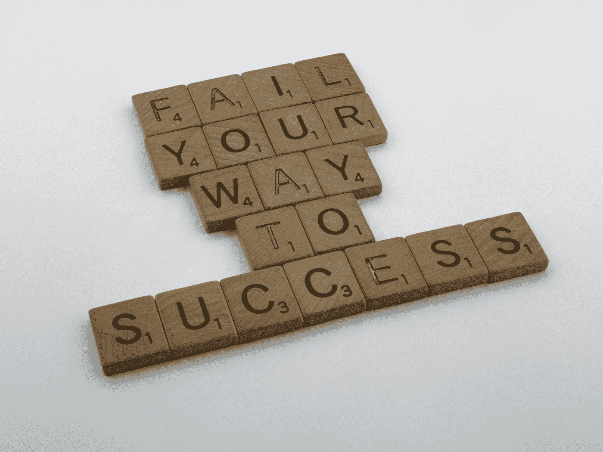

# 道斯…..失败者

> 原文：<https://medium.com/coinmonks/daos-the-underdogs-68d6f4ae0d0d?source=collection_archive---------59----------------------->

Photo by [Brett Jordan](https://unsplash.com/@brett_jordan?utm_source=medium&utm_medium=referral) on [Unsplash](https://unsplash.com?utm_source=medium&utm_medium=referral)

说 DAOs 不行很容易。说 DAOs 会失败很容易。很容易说 Dao 是一种时尚或另一种趋势。说这项工作太难很容易，但让我给你六个报价，告诉你为什么我仍然坚持做我今天做的工作。是我不确定，是的，但怀疑他们；我不会。

以下六段引文摘自《高海拔领导力:世界上最险峻的山峰教给我们的东西》一书