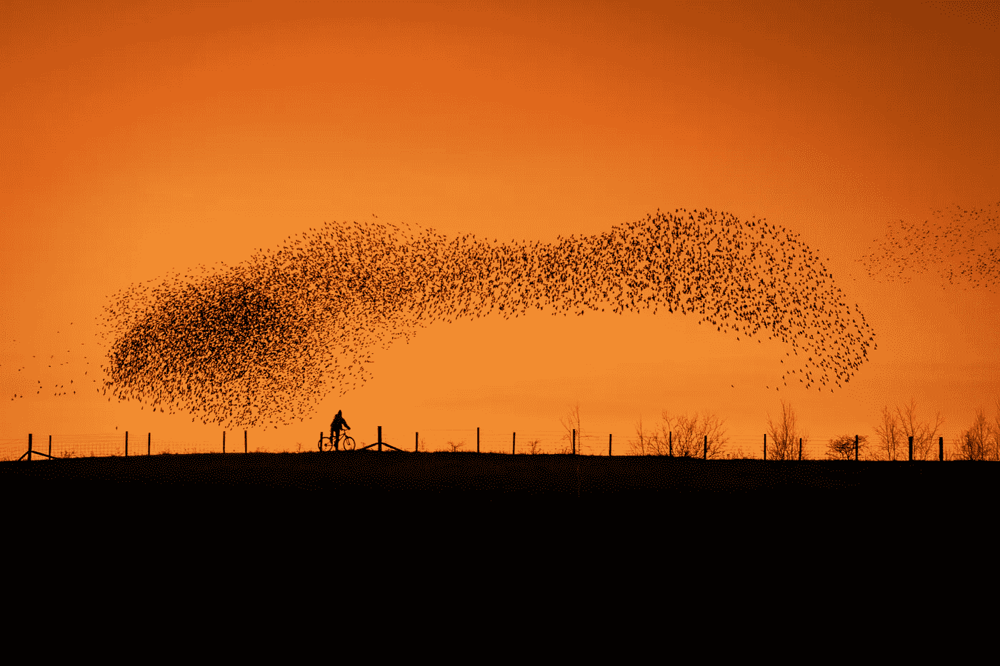

# 道斯:集体治理的容器和人类的蜂群思维。

> 原文：<https://medium.com/coinmonks/daos-the-vessel-for-collective-governance-and-human-hive-mind-149a573e028a?source=collection_archive---------5----------------------->

Flockness

凯文·凯利在他的*失控:机器、社会系统和经济世界的新生物学*中生动地描述了 90 年代初进行的一项社会实验，图形奇才罗兰·卡彭特建立了一个计算机巢，以数字和几何形状显示成千上万拥有夜光棒的人的集体运动。这些未经训练和无组织的暴民发现，他们不仅可以通过联合手势让数字出现在电脑屏幕上，还可以降落一架虚拟飞机，以某种方式设法控制模拟器，以避免坠机并将飞机带到安全的地方。

如果说有 5000 人狂热地挥舞着荧光棒的狂热人群的想法不仅仅是一点点令人不寒而栗，那么一群鸟庄严地飞向天空的形象激发了更多充满希望的感情——完美的协调，和谐，就是约翰·克莱尔这位伟大的鸟类爱好者会称之为*“一首未被发现的歌”。*

这两种类型的协同行为的一个区别是，前者是故意的，并遵循其代理人可识别的模式，而后者是本能的，而不是任何视觉提示的产物或结果。正如凯利形象地描述的那样，*“与会者像鸟儿一样:成群结队。但他们自觉地蜂拥而至。当他们共同组成“5”字形或驾驶飞机时，他们对自己的概貌做出反应。然而，一只飞翔的鸟对其鸟群的形状没有总体概念。“絮状物”出现在完全忘记集体形状、大小或排列的生物身上。成群结队的鸟对飞行中的鸟群的优雅和凝聚力视而不见”。*

成千上万只鸟如何知道同时翱翔或者每只鸟在群体中的位置？在它们飞行的协调美背后，在它们上升的队形中，最典型的高贵是什么？最重要的是，在我们生活的这个前所未有的不确定时代，人类能从它们身上学到什么？

凯利解释说，活系统包括自然系统与机械元素的融合:人造事物充满了自然法则和原则。活系统有四个明显的特征:没有强加的集中控制，亚单元的自主性，亚单元之间的高度连接性，以及对等体影响对等体的韦伯非线性因果关系。在自然界中，这些特征也非常明显地出现在鸟群和鱼群的情况中，它们以太快的速度同步移动，而不是每个个体深思熟虑或推理的结果。

昆虫群落也表现出这些特征，这是所谓的“超有机体”的典型特征。美国昆虫学家威廉·莫顿·惠勒(William Morton Wheeler)首先在蚁群中发现了一系列涌现的特性，这些特性取代并超越了单个昆虫有机体的特性——甚至是群体的特性——从而变得与众不同。惠勒的结论是，涌现是一种自然现象，赋予了群体、蜂巢或鸟群独特的属性，而这些属性是它们的任何部分或成员都不具备的。

让我们再来看看凯文·凯利敏锐的评价:*“‘蜂群思维’的奇妙之处在于，没有人处于控制之中，然而却有一只看不见的手在统治着，这只手来自非常愚蠢的成员。神奇的是，更多的是不同的。从一个昆虫有机体中产生一个群体有机体只需要让昆虫繁殖，这样就有更多的昆虫，而且它们可以互相交流。在某个阶段，复杂程度达到了一个点，在这个点上，像“群体”这样的新类别可以从简单的“bug”类别中出现。殖民地是与生俱来的，暗示着这一奇迹。因此，在蜂箱里没有什么东西是不被蜜蜂淹没的。然而，你可以用回旋加速器和荧光镜永远搜索一只蜜蜂，但你永远也找不到蜂巢”。*

这是生命系统的普遍规律:有一种涌现的复杂性在集体层面上表现出来，而在个体层面上是看不到的。科学家们已经发现，这种复杂性，当在行动中看到时，似乎如此轻松——如此轻松，以至于用克莱尔的话说，在*看来，“只不过是建立在一朵云上”——实际上可以基于一些简单的规则。*

一只蜜蜂的大脑有六天的记忆；蜂巢作为一个整体有三个月的记忆，是普通蜜蜂寿命的两倍。所以想到的问题是——组成这个集体记忆的信息储存在哪里？它是如何访问的？信任和优先级协议是如何工作的？当信息不再相关时，如何取消删除或丢弃？

人们可以进一步询问——另一个有趣的问题——这些知识如何被用来指导蜂巢运行的治理系统。

我们知道在蜂巢中没有等级管理权力。蜂王不统治。相反，她是一个饱餐一顿的奴隶，孕育着系统的生命。

我们也知道有某些潜在的模式和原则来管理这个系统。

此外，康奈尔大学生物学家托马斯·西利(Thomas Seeley)认为，某种分散的、自主的集体决策正在发生。蜜蜂的方法是建立一个联盟，直到法定人数发展。这种法定人数是分歧和竞争的产物，而不是共识或妥协的产物——它始终产生优秀的集体决策。

莫里斯·梅特林克在他 1901 年的经典著作《蜜蜂的一生》中断言:“如果蜜蜂从地球上消失，人类只能再活四年”，这充分说明了这些蜂群决策的相关性。

生命系统理论作为一门科学才刚刚开始出现，但它已经帮助回答了许多问题。其中，也许它帮助提供的最重要的结论是:如果我们设计符合自然规律和生命组织背后的普遍模式和原则的系统——这些模式和原则在现实世界中经受了时间的考验——并且我们在再生流动过程中部署这些系统以使它们可持续，那么我们自己也将变得可持续。

当然，这将包括放弃对我们技术成就的完全控制，让这些自然法则产生它们自己的、受生活启发的规则和模式。用凯文·凯利的话来说:“这就是所有神必须接受的困境:他们不再能完全支配他们最优秀的创造物”。

在蜂群思维中，蜜蜂集体管理着源源不断的信息流，创造了一个类似蜂巢的知识共享空间。蜂群思维有自己的基本分类账，遵循自己的协议 Seeley 和一个多世纪前的 Maeterlinck 都有这样的描述。

例如，蜜蜂可以决定优先从东北 400 英尺的苜蓿草原采集花粉，而不是从西边 300 英尺的甘菊地里采集。这些来源的知识被交流和存储，分散的评估过程导致对一个选项优于另一个选项的决策。

我们人类能为自己设计出这样的东西吗？我相信我们可以，而且已经开始这样做了。密码学为生命系统的设计打开了一个令人难以置信的潜力，人类经济就是其中之一。正如在所有的生命系统中一样，我们人类的努力提供了一种模式和原则，以一种全面和相互依赖的方式，使所有的生命系统在自身内部得以持续和可持续。

我们的基础组织方案可以与这些相同的模式和原则保持一致。[密码学正在引发一个新的人类学知识和集体智慧空间的出现](https://ernesto-87727.medium.com/a-new-language-for-a-fast-spinning-world-fa473cc11955)，它深深地支持这种结盟。

我坚信，进化正带领我们走向一个拥有集体智慧和分权治理的人类群体。正如 Pierre Levy 所观察到的,*智能*这个词在这里必须从词源学的意义上理解为联合在一起(*inter legere*)——不仅是思想的联合，也是人的联合，这最终是构建社会的意义所在。

随着生命系统理论框架的演变，我们开始理解我们也是如何集体进化的——以及生命系统为了可持续发展而部署的模式如何能够应用于管理我们自己的社会经济和文化安排。

现在，多亏了密码术，我们可以用比 Loren Carpenter 让 5000 人疯狂挥舞魔杖更强有力的方式来复制生命系统的行为。

有了 Web 2.0，我们第一次理解了互联网是一个知识分类账。现在，有了 Web 3.0，我们可以设计由健康的嵌套层次系统(嵌套系统是一个包含其他系统的系统，而其他系统又同时包含其他系统，等等)支持的分散的集体治理系统。

这其中包含的可能性是惊人的。例如，想象一下不可替代代币或 NFT 的潜力，它可以让我们——通过加密区块链总账——证明事件(如出生或婚礼)、里程碑或学习过程的可追溯性(从开始到结束)(如获得大学学位)、授予“信任票”、委派教师和权力等等。

这一权力目前被国家垄断，无论是通过它自己的机构和登记处，还是通过公证人等代理人。，可以通过最终的记录保存设施——互联网及其分类账——由整个社区民主和负责任地共享(其产品可以自由获得、访问和流通)。我们对代表的信任，无论是通过特定时期的选举还是一次性的“信任投票”，都不会局限于投票站。

然而，这个乌托邦需要满足某些条件。

第一个是“市政厅”的存在，它被理解为在一个公共领域内建立和运作，或根据社区的协议和价值观利用社区管理的集体资源。在《蜜蜂世界》中，这个市政厅就是聚集在蜂巢中的蜂群，等待侦察员带来信息，使集体能够做出某些决定(正如 Seeley 的研究表明的那样，这些决定几乎总是准确无误的)。

而这些选择又必须通过行使投票权来实现。尽管我们对蜂箱中决策的细节仍有许多要了解，但我们知道，在人类世界中，可靠性和问责制是任何投票程序的关键。在 Web 3.0 中，分散自治组织(Dao)是投票平台或“市政厅”的新兴表现形式。虽然还不成熟，但它们在权力下放和投票的可靠性方面取得了显著的成功。我们可以知道在加密货币交易中谁已经投票(或已经投票)，与我们知道的方式相同，谁执行了任何给定的操作，而不需要银行或其他机构来认证。

即使治理仍然是一个有待解决的问题，并且共同的目的、价值观和原则需要进一步发展，我们也开始看到为我们规划的路线，并且目标越来越清晰。

在《蜜蜂世界》中，治理问题是根据蜂巢生存、维持健康种群、生产蜂蜜以及为植物和花朵提供授粉服务的需要来解决的。没有花，没有蜜蜂。群体的所有成员都无意识地分享和体现了对生命系统行为模式的全面理解。有一个健康的治理体系。蜂群的代表拥有对整体财富的投票权(这个词经常被遗忘，是“联邦”的原意)。

有趣的是，其他有翼物种也有类似的情况。我们从未见过两只鸟争夺一群鸟的领导权。就像蜂巢一样，蜂群遵循一系列体现“絮性”及其特征和目的的原则。

法定人数，通过联盟的建立，确立了集体将采取的方向，这个方向得到集体的遵守和信任，并最终趋向于整体的改善。

这是因为蜂巢是一个嵌套在另一个嵌套系统中的生命系统。蜂巢为生态系统提供服务，例如，蜂巢所在的山谷。它的授粉服务增强了整个系统的健康。换句话说，蜂巢作为一个嵌套系统提供再生的生态系统服务，没有它，山谷将无法生存。嵌套系统根据再生活力的八个原则相互作用，都是为了寻求整体的整体财富。

我们可以自信地肯定 Dao 在未来会以这种方式行事的可能性。“到”作为一个动词，非常主动。“道者”是指那些努力争取授权参与并热衷于部署我们智力(记住， *inter legere* )和知识的共同资源的无限财富的个人。

那么分散的自主再生企业呢？这些也是由道伊尔领导的——开明的个人在寻找一个整体的、再生的、可持续的生活方式，不仅仅是为了他们自己，也是为了他们所属的嵌套系统。

因为 DAREs 遵循管理生命系统的原则。这就是为什么，作为蜂巢，它们是自我管理的，但是随着它们所属的更大整体的模式流动。

地上的一群鸟不是一群。浮躁来自于一起飞翔的渴望，来自于对整体的全心信任。当蜜蜂群集时，蜂群思维活跃起来。但这种集体行动也是生存需要的后果。单个鸟类无法独自对抗距离和风力:鸟群创造了一种内部上升气流，这种气流提供了更少的能量消耗和更小的空气阻力，这是许多鸟类的一种奇妙的空气动力学。蜜蜂也不能在蜂巢外生存，正如懒惰蜜蜂的寓言生动地教导孩子们的那样。俗话说“自己走得更快，和别人走得更远”。人类很久以前就知道这一点，因为对任何古代人的传统和知识的调查都会很容易地告诉你。土著智慧的永恒模式和仪式遵循整体财富的节奏，寻求持续的一体性，结合，是的，生存。

但是这些观念和信仰并不是古代文化的特权。事实上，在我们这个时代，Dao 本质上已经准备好应对我们所面临的新挑战所带来的指数级复杂性，而 dare 则通常寻求浮躁。这两种类型的组织正在走到一起，并很可能引发一群人——Loren Carpenter 在智能算法和密码学上的技术飞跃。这些将是我们包罗万象的人类山谷的传粉者。

当目光敏锐的梅特林克或西利研究二十一世纪人类的行为和习惯时，他们会看到什么？他们会说我们利用了互联网提供的巨大连接资源来创建社区，建立信任和知识的独立网络，并组织整体的集体行动(Flockness 和 Hiveness)来实现共同利益吗？

正如你现在已经猜到的，这是我的希望。

> *加入 Coinmonks* [*电报频道*](https://t.me/coincodecap) *和* [*Youtube 频道*](https://www.youtube.com/c/coinmonks/videos) *了解加密交易和投资*

# 另外，阅读

*   [3 商业评论](/coinmonks/3commas-review-an-excellent-crypto-trading-bot-2020-1313a58bec92) | [Pionex 评论](https://coincodecap.com/pionex-review-exchange-with-crypto-trading-bot) | [Coinrule 评论](/coinmonks/coinrule-review-2021-a-beginner-friendly-crypto-trading-bot-daf0504848ba)
*   [莱杰 vs n rave](/coinmonks/ledger-vs-ngrave-zero-7e40f0c1d694)|[莱杰 nano s vs x](/coinmonks/ledger-nano-s-vs-x-battery-hardware-price-storage-59a6663fe3b0) | [币安评论](/coinmonks/binance-review-ee10d3bf3b6e)
*   [Bybit Exchange 审查](/coinmonks/bybit-exchange-review-dbd570019b71) | [Bityard 审查](https://coincodecap.com/bityard-reivew) | [Jet-Bot 审查](https://coincodecap.com/jet-bot-review)
*   [3 commas vs crypto hopper](/coinmonks/3commas-vs-pionex-vs-cryptohopper-best-crypto-bot-6a98d2baa203)|[赚取加密利息](/coinmonks/earn-crypto-interest-b10b810fdda3)
*   最好的比特币[硬件钱包](/coinmonks/hardware-wallets-dfa1211730c6) | [BitBox02 回顾](/coinmonks/bitbox02-review-your-swiss-bitcoin-hardware-wallet-c36c88fff29)
*   [BlockFi vs 摄氏度](/coinmonks/blockfi-vs-celsius-vs-hodlnaut-8a1cc8c26630) | [Hodlnaut 审核](/coinmonks/hodlnaut-review-best-way-to-hodl-is-to-earn-interest-on-your-bitcoin-6658a8c19edf) | [KuCoin 审核](https://coincodecap.com/kucoin-review)
*   [Bitsgap 审查](/coinmonks/bitsgap-review-a-crypto-trading-bot-that-makes-easy-money-a5d88a336df2) | [Quadency 审查](/coinmonks/quadency-review-a-crypto-trading-automation-platform-3068eaa374e1) | [Bitbns 审查](/coinmonks/bitbns-review-38256a07e161)