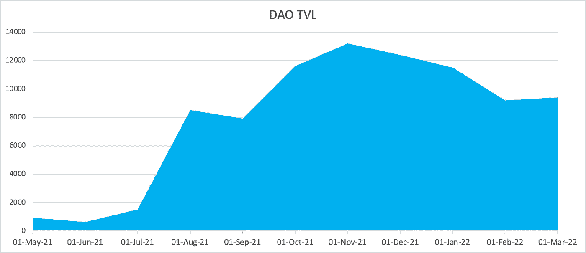
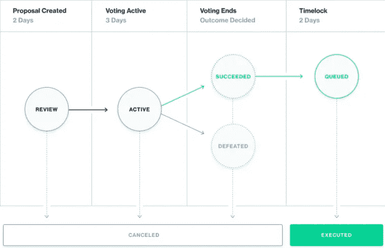
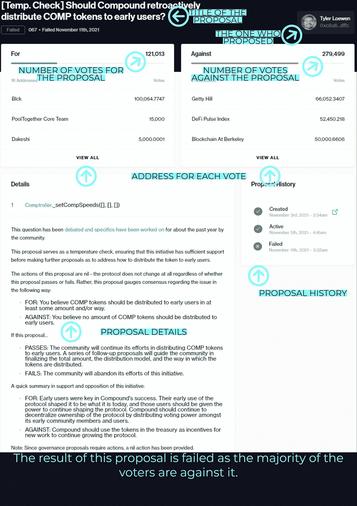
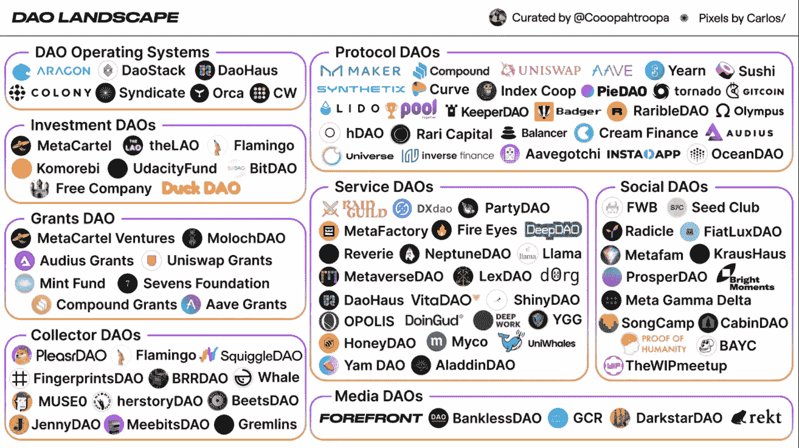
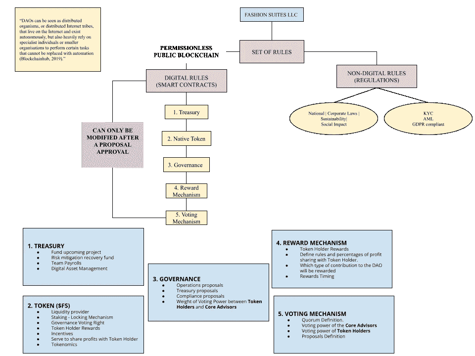

# 道与现代企业

> 原文：<https://medium.com/coinmonks/daos-vs-modern-corporation-a79294521caf?source=collection_archive---------13----------------------->

# 道的定义

一个“去中心化的自治组织”清楚地说明了技术发展是如何适应“政府”这一概念的

2021 年对于道斯来说是不平凡的一年，在不到 360 天的时间里 TVL 成长了 13X T3！下面是 deepdao 提供的一个更加惊人的图表。

> Dao 是独一无二的**本地在线组织**，赋予他们**决策特权**。成员们聚在一起组成组织，确立目标，并制定规则来支持道的使命。

虽然您听说过“分权”一词的含义，但**组织中真正的自治是什么？**

> 自治指的是管理 DAO 操作的规则，用源代码编程和编写。在适当的条件下自动执行，不受任何人为因素的干扰。

以我们传统的全球企业组织为例:

每个公司都有一套等级制度，这些制度也必须遵循公司所在国家的法律。
这套规则将成为每个雇主为了公司完成使命而必须遵守的核心原则。

Dao 并没有什么不同，但是包含了技术。

Dao 的规则是通过使用一组支持**智能合约的规则**编写的。根据提案和社区投票创建和更改相同的规则集。这正是**数字合同的定义。**

与传统企业相比，DAO 的主要优势之一是更加开放。**透明度**级别很高，因为任何人都可以检查所有 DAO 活动和融资。道的整个资产负债表可通过公共区块链查阅和记录。

这种新型的**业务结构**结合了数字和法律合同。这样做有助于资产交换，并使社会和商业互动更加顺畅。

# 它是如何工作的？

DAO 操作最重要的特性之一是使用智能契约通过**社区投票**来开发规则。

你可能会问，我如何成为一个道的**成员**，我需要什么来行使我的**投票权**？

这就是需要 DAO **令牌**的地方。成员必须获得 DAO 的本机令牌，该令牌与 DAO 的项目和任务相链接。
*(存在不需要代币的 Dao 的情况，目前我们不考虑代币会员制与股份会员制)*

所有代币持有者根据其持有的份额**获得社区中的投票权。代币允许拥有道的股权，同时塑造其未来的增长。**

成为 DAO 的**令牌持有者**是令人兴奋的，因为你不受任何法律契约的约束，相反，以帮助 DAO 实现其核心使命的方式行事会得到奖励。

为了清楚起见，让我们检查一下[复合财务](https://compound.finance/governance)提案机制:

基于智能合约的初始设置，每个 DAO 可以有不同的机制和一组规则。
有可能是这样的情况，一项提案在具有某种暗示的强制力之后获得通过。

让我们继续使用 Compound 作为我们的参考来检查他们的一个社区提案:

这个系统的美妙之处在于它运作的清晰性。您可以通过治理仪表板查看过去的提案和投票。

# 治理和主要利益相关方

如您所知，用户持有的**代币数量**在每张选票的权重中起着关键作用。

这些提议可以是关于修改规则、资金分配、雇佣或解雇某些人，以及你能想到的任何事情。

拥有大多数令牌的**利益相关者**在引入新提案方面拥有更多特权。这类似于拥有一家公司的有投票权的股票，但是有更多的自由来转让你的无权限令牌。

虽然这引起了对一个 DAO 的**权力下放**的一些担忧，但其稳定性依赖于仅在**大多数利益主体或该领域高级专家委员会**批准的情况下通过治理提案。

同样清楚的是，上述类别的股东是最相信道的使命的人，因此他们必须在道本身中发挥重要作用。

想象一下，如果每个涉众对治理提案都有相同的权力，那么新提案的洪流是不可能的。

简而言之， **DAO 是由通过代码执行所有操作的个人和其他组织**管理的加密钱包的集合，允许在没有基础法律或传统银行结构的情况下安全管理资产和投票。

没有 KYC，没有管辖权，没有开销。只是纯粹的社区共识，对什么是最好的道。

请注意上述声明，因为管辖权可以适用于 DAO，但不是从内部的角度，而是在其运营所在的国家/地区。

# DAOs 和遗留企业系统

时间是所有资产中最好的，所以它是不应该被浪费的东西。

在我的公司工作经历中，我总觉得组织在决策上浪费了大量时间。想象一下，在您的业务中包含一个 DAO 来管理不太重要或最重要的部分。

当然，你不应该把你的商业模式转换成一种**道**，现在还不行。
我们研究的目的是围绕在你的商业模式中拥有一个的好处。

Dao 通过使用透明和可验证的编程减少了信任他人的需要。分散的自治组织本质上简化了治理。

这些突破可以改变我们的社会经济结构。

在当今世界，我们面临许多新的社会问题，这些问题似乎无法在现有结构的约束下解决。

# 用例

Dao 可以有无限的**用例**，从对 [**DeFi 协议**](https://compound.finance/) (复合)做出治理决策到 [**提供媒体服务**](https://www.raidguild.org) 、**风险基金**、**社交媒体平台**、**自由职业者网络、**等等...

为了实用，数千个中的一些实际上已经存在。每一个都有明确的核心任务。

下面我用了 coopahtroopa 的这篇文章(文章链接)的截图，给你一个当前道景观的微风。

# 实体企业的数字化。(时尚品牌)

> 请原谅我们，因为我们不是这个领域的专家，所以下面的例子可能会有一些基本的时尚差异。

让我们来玩一个游戏，假设我们愿意**创建一个 DAO** 来资助我们古老的家族企业 **Fashion Suites LLC** 。我们的目标是通过一个原生代币(FS 代币)积累流动性，并资助一项有助于我们品牌病毒式传播的战略。

最终，我们只是想生产现有的最好的男性时装套装，有什么方法可以将刀的美运用到工作中呢？

我们理想的 Fashion Suites LLC Dao 应该是这样的:

过分简化了 DAO 结构，我们现在可以继续进行项目了。

通过使用我们的 **$FS** 令牌，我们将能够借助一个有组织的社区的力量来资助特定的项目，例如:

1.  雇佣/解雇设计师来实施我们的项目。
2.  增加营销方面的支出预算，推广我们的品牌。
3.  将出售/出租我们套房的利润重新分配给代币持有者。

我可以继续列举多少传统的实体企业可以用一把刀的力量数字化(比如房地产)。

你可能会想，为什么不众筹整个过程呢？

虽然 DAO 在一定程度上为我们的业务注入了流动性，但在这种情况下，我们引入了董事会成员，他们将传达共同的使命(创作者、时尚专家)，他们将分享相同的目标，并将为 DAO 的成功欢呼。

记住组织就是力量，理解组织是解决方案的一部分。

# 赞成、反对和结论

传统组织拥有中央集权的权力形式，这是它们的主要缺陷之一。

当谈到等级制度、官僚主义、权威、权力、腐败和组织理论中持续存在的缺陷时，我们遗留下来的企业界有着**严重的担忧**。

> 像**管理和管理工作**这样的集权本来是为了让整个运作完美无缺，但结果却产生了意想不到的后果，比如管理者和被管理者之间的信息不对称、紧张和冲突。

Dao 有一个建立在社区基础上的**分散的集体权力结构**，这给了组织中的所有成员更大的发言权。如上所述，区块链技术提供了一种高效的决策方法。

尽管 Dao 并不完美，但正如任何高新技术发明一样，它也有缺陷:

1.  涉及大多数成员参与的决策过程可能会非常缓慢和低效。
2.  围绕 Dao 的不确定的法律环境**现在是如何监管的？而未来呢？**
3.  **智能合同安全问题**。Dao 的核心基础是国库，和大多数国库一样，安全级别必须完美无瑕。我们已经看到有史以来第一把刀发生了什么，对吗？[了解“天道”攻击](https://www.coindesk.com/learn/2016/06/25/understanding-the-dao-attack/)

Dao 是**灵活的**并且可以**适应**在许多上下文的大量用例中，**“天空是极限”**是我在这种情况下使用的表达。

这种新型的社会动力机制将重塑我们组织和创造顶级公司规模的协作方式。