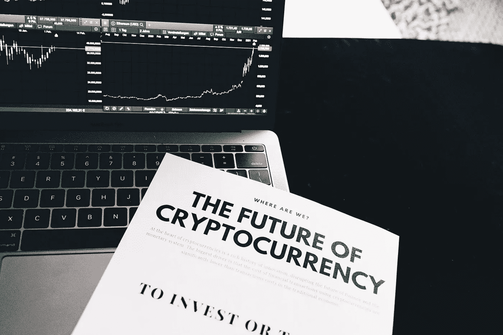
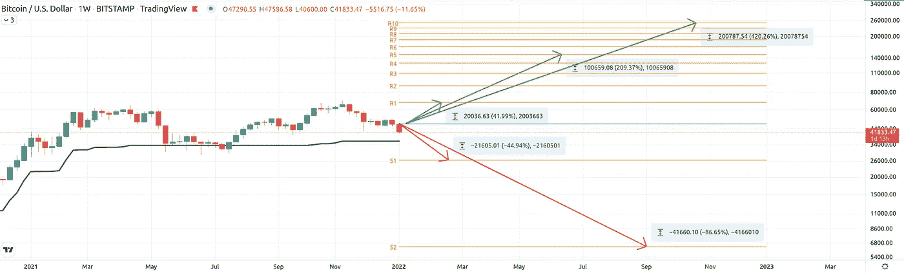
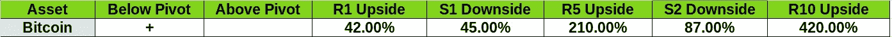
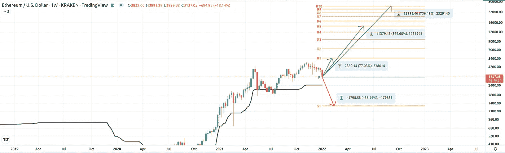
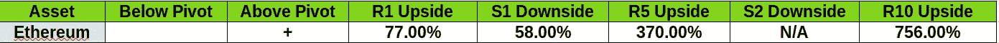
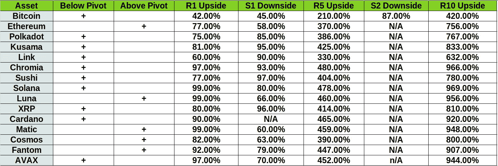

# 大胆预测加密资产价格使用每年支点&看不见的

> 原文：<https://medium.com/coinmonks/daring-to-predict-crypto-assets-prices-using-yearly-pivots-unseen-ones-e969fe1dcb3d?source=collection_archive---------8----------------------->

2022 年初，我们来到了这里。在加密和传统金融市场中，等待我们的是怎样的一年？预言是给傻瓜的，但是那些敢于实践它的人从来没有市场支点。

正如我以前多次提到的，我对这个简单指标的喜爱源于三个原因:

1.  这很简单
2.  这是有效性
3.  它是规划未来的能力。

你可以看我以前的帖子，[看](https://youtu.be/g8bOxYINOjA)的解释，或者看几十条[的推文](https://twitter.com/RotzeO)解释支点交易和分析。你也可以继续阅读，边读边学，因为这不是一门火箭科学。

我首先要说的是，在分析 2022 年密码市场的年度支点时，我将关注几件事情。我首先关注的是 price 今年的开局。它是在年度支点之上还是之下？这将是我建立一个非常适度且容易改变的年度偏差的第一个迹象。价格高于年线是看涨信号，低于年线是看跌信号。

接下来，我将检查最接近年度支点的水平，以及它们在今年第一次和极有可能发生的交易中的利润潜力。我朝两个方向看，上面是一年一度的 R1，下面是一年一度的 S1。然后，我在观察更深层次的利润潜力。从好的方面来看，我认为 R5 在非常看涨的一年中有很高的利润潜力，而 R10 则在荒谬的情况下，价格只是告别了重力和任何常识。我也在检查像 S2 这样的低海拔地区，如果它们存在的话。

# BTC 和 ETH 展示了他们的承诺

让我们用做市商比特币来应用这个。这是比特币的周线图，上面标有年度支点，包括我的[指示器](https://www.tradingview.com/script/9GDng9Mg-Unseen-Pivot-Points/)，它标有[支点，在](https://rotzeod.medium.com/the-invisible-unspoken-pivots-2151f44f86eb)之前从未标过。

就比特币而言，你确实可以看到第一周的蜡烛线(目前的样子)是在年度支点下方开始的，因此我目前倾向于下跌。顺便提一下，这对整个市场都有影响——如果比特币下跌，整个市场都会跟着下跌！

今年下跌的第一笔交易是在 26k 美元左右的 S1(如果价格到达那里),提供了近 45%的移动。第二次迟到，这是极不可能的(谁说的？)是 S2，价格约为 6500 美元，提供 87%的年度支点移动。

现在让我们从更乐观的角度来考虑。R1 的价格约为 46.6 万美元，比支点高出 42%。每年的 R5 几乎是 15 万美元，提供了超过 200%的移动，而价格满月的情况下几乎是 25 万美元，移动了 420%!

将这些数字放入一个表中，如下所示:

让我们再举一个大众喜爱的以太坊的例子:

与比特币不同的是，以太坊实际上仍然在年度支点之上开启了新的一年。通常我会称之为有点看涨偏见，但正如我之前提到的，如果比特币下跌，那么整个市场都会跟着下跌。这一直是真的，直到它不会(“翻转”)。

它为 S1 的下跌提供了 58%的空间，而向相反方向的第一个阻力位的下跌提供了 77%的空间。对 R5 的非常乐观的变动将把以太坊带到大约 14.5k 美元，移动 370%，而疯狂将把它送到大约 26k 美元，从每年的支点移动 756%。

总结一下:

# 投资组合重新洗牌的机会

我冒昧地从上面画了同样的交易逻辑，到 15 个加密资产。他们被选中主要是因为，嗯，因为我追随他们。就传统资产而言，我们有比特币、以太坊、XRP 和卡尔达诺。其余的更多是去年市场最喜欢的烫手山芋。

我还在 Tradingview 上制作了所有提到的资产和图表，作为公开交易的想法，并将在下面进一步链接到它们，因此很容易在今年晚些时候返回，并观察这种支点投机是否真的发生了。

完整的表格如下:

## 我们能从中学到什么？

先说坏处。如果 2022 年确实是熊年，那么有理由推测，比特币很有可能在达到每年 26k 美元的 S1 之前不会停止，并随之将列表上的其他资产分别移动到符合各自 S1 的轨迹。如果这种情况发生，比特币将是受打击最小的资产，预计损失 45%，其次是以太坊(Ethereum)和 Matic，损失 58%和 60%。如果你想做空，你最好选择寿司、XRP 或 KSM，它们的首付都在 95%以上。

另一方面，如果市场领主决定开启一波牛市，那么你最好的赌注很可能是到达 R1。在这种情况下，Matic、Luna 和 Solana 提出加倍投资，而 Avax、Fantom 和 chromia 等资产紧随其后。R1 最差的演员？对，你猜对了，45%的比特币。

正如你从上表中注意到的，今年提供的大多是梦幻般的升级，从 X2 到 R1，从 X4-X6 到 R5，从 X7 到 X11 到 R10 都是多人游戏。深入潜在的利润和损失可以提供更聪明的选择，在技术层面重新平衡你的投资组合，这忽略了基本面。这是一个独特的提议，只有极少数指标可以提供，如果有的话。

现在要做的是煞费苦心地把所有这些都制作成图表，这样你就不用亲自动手了。下面是这里提到的所有 15 项资产的图表链接。你可以跟踪这些交易理念的发展，看看我的支点崇拜是否合理。不要忘记，你可以在图表上安装指标，不仅可以看到它在年度中枢上工作，还可以在每月、每周甚至每天的时间框架上工作。

他们在这里:

[比特币](https://www.tradingview.com/chart/BTCUSD/5c0GZBXy-Pivot-Yearly-predictions-for-BTC-using-hidden-pivots/)走势图、[以太坊](https://www.tradingview.com/chart/ETHUSD/xOBYHAKW-Pivot-Yearly-predictions-for-ETH-using-hidden-pivots/)走势图、[圆点](https://www.tradingview.com/chart/DOTUSD/7uceMYRP-Pivot-Yearly-predictions-for-DOT-using-hidden-pivots/)走势图、 [KSM](https://www.tradingview.com/chart/KSMUSDT/ftlJJyWF-Pivot-Yearly-predictions-for-KSM-using-hidden-pivots/) 走势图、 [Link](https://www.tradingview.com/chart/LINKUSD/8KNCfYlA-Pivot-Yearly-predictions-for-LINK-using-hidden-pivots/) 走势图、 [CHR](https://www.tradingview.com/chart/CHRUSDT/ziaz3Tr8-Pivot-Yearly-predictions-for-CHR-using-hidden-pivots/) 走势图、[寿司](https://www.tradingview.com/chart/SUSHIPERP/vJxTpIRl-Pivot-Yearly-predictions-for-Sushi-using-hidden-pivots/)走势图、 [SOL](https://www.tradingview.com/chart/SOLUSD/fiCV40OV-Pivot-Yearly-predictions-for-SOL-using-hidden-pivots/) 走势图、[露娜](https://www.tradingview.com/chart/LUNAUSD/5gDGfPtx-Pivot-Yearly-predictions-for-Luna-using-hidden-pivots/)走势图、 [XRP](https://www.tradingview.com/chart/XRPUSD/3S9SIvj8-Pivot-Yearly-predictions-for-XRP-using-hidden-pivots/) 走势图、[阿达](https://www.tradingview.com/chart/ADAUSD/DkSuQIrX-Pivot-Yearly-predictions-for-ADA-using-hidden-pivots/)走势图、 [Matic](https://www.tradingview.com/chart/MATICUSD/eIOrUkGr-Pivot-Yearly-predictions-for-Mativc-using-hidden-pivots/) 走势图

> 加入 Coinmonks [电报频道](https://t.me/coincodecap)和 [Youtube 频道](https://www.youtube.com/c/coinmonks/videos)了解加密交易和投资

## 另外，阅读

*   [3 商业评论](/coinmonks/3commas-review-an-excellent-crypto-trading-bot-2020-1313a58bec92) | [Pionex 评论](https://blog.coincodecap.com/pionex-review-exchange-with-crypto-trading-bot) | [Coinrule 评论](/coinmonks/coinrule-review-2021-a-beginner-friendly-crypto-trading-bot-daf0504848ba)
*   [莱杰 vs n rave](/coinmonks/ledger-vs-ngrave-zero-7e40f0c1d694)|[莱杰 nano s vs x](/coinmonks/ledger-nano-s-vs-x-battery-hardware-price-storage-59a6663fe3b0) | [币安评论](/coinmonks/binance-review-ee10d3bf3b6e)
*   [币安 vs FTX](https://blog.coincodecap.com/binance-vs-ftx) | [最佳(SOL)索拉纳钱包](https://blog.coincodecap.com/solana-wallets)
*   [比诺莫评论](https://blog.coincodecap.com/binomo-review) | [斯多葛派 vs 3Commas vs TradeSanta](https://blog.coincodecap.com/stoic-vs-3commas-vs-tradesanta)
*   [Capital.com 评论](https://blog.coincodecap.com/capital-com-review) | [香港的加密借贷平台](https://blog.coincodecap.com/crypto-lending-hong-kong)
*   如何在 Uniswap 上交换加密？ | [A-Ads 评论](https://blog.coincodecap.com/a-ads-review)
*   [WazirX vs coin dcx vs bit bns](/coinmonks/wazirx-vs-coindcx-vs-bitbns-149f4f19a2f1)|[block fi vs coin loan vs Nexo](/coinmonks/blockfi-vs-coinloan-vs-nexo-cb624635230d)
*   [本地比特币审核](/coinmonks/localbitcoins-review-6cc001c6ed56) | [加密货币储蓄账户](https://blog.coincodecap.com/cryptocurrency-savings-accounts)
*   [什么是融资融券交易](https://blog.coincodecap.com/margin-trading) | [美元成本平均法](https://blog.coincodecap.com/dca)
*   [拥护卡审核](https://blog.coincodecap.com/uphold-card-review) | [信任钱包 vs MetaMask](https://blog.coincodecap.com/trust-wallet-vs-metamask)