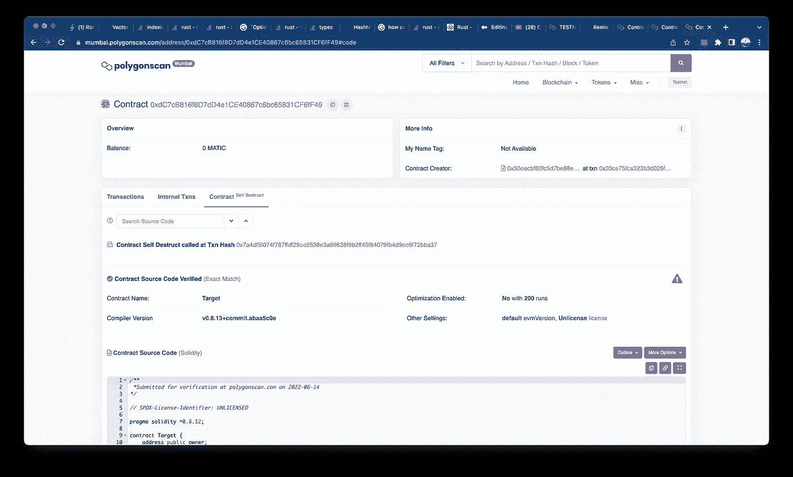
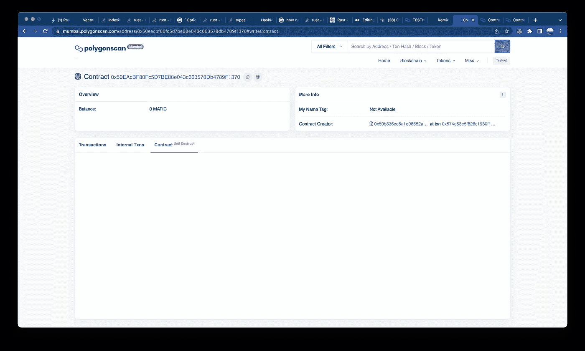
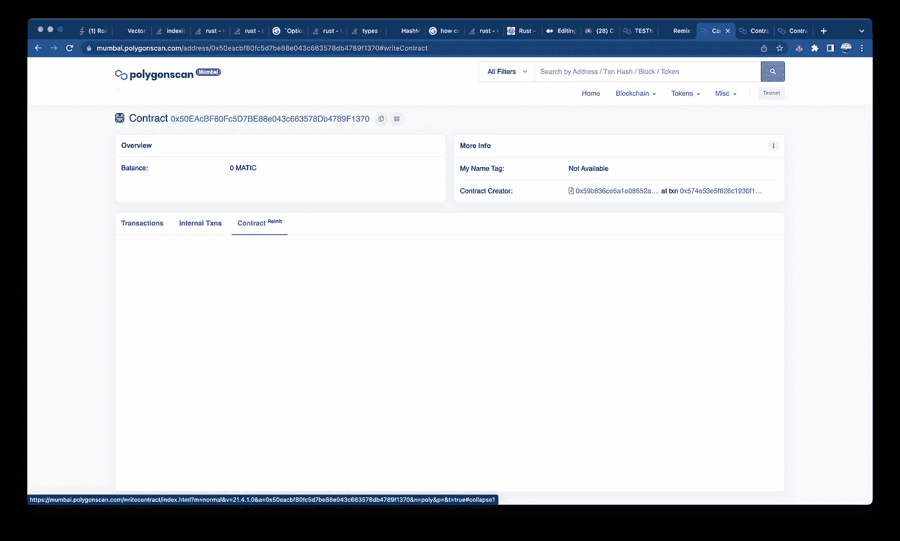
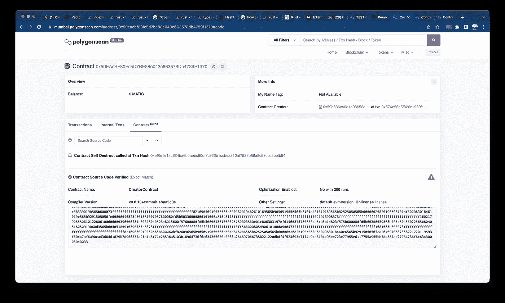
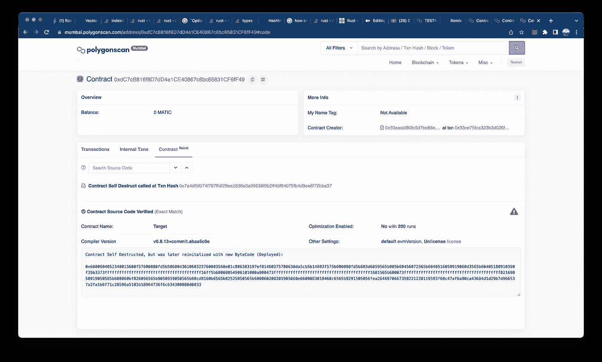

# CREATE2 操作码的负面影响

> 原文：<https://medium.com/coinmonks/dark-side-of-create2-opcode-6b6838a42d71?source=collection_archive---------2----------------------->

# 创造 2 和自毁的结合是致命的，我们将在这篇文章中探讨这一点。

CREATE 和 CREATE2 操作码的区别:

**创建:**

*   散列创建它的帐户的地址。
*   对“账户现时”进行哈希运算，相当于账户迄今完成的交易数量。

```
new_address = keccak256(sender, nonce);
```

**创建 2 :**

*   0xFF，一个常数。
*   部署者的地址，即发送 CREATE2 的智能合约地址。
*   一种随机盐。
*   将在该特定地址上部署的散列字节码。

```
new_address = keccak256(0xFF, sender, salt, bytecode);
```

关于 CREATE2 和分步指南的更多内容，请点击这个[链接](https://ethereum-blockchain-developer.com/110-upgrade-smart-contracts/12-metamorphosis-create2/)。

让我们讨论一下 CREATE2 与自毁操作码配对时的黑暗面。

1.  **可以根据创建期间使用的操作码(即 CREATE 或 CREATE2 操作码)来区分合同吗？**

*   **是的，但是这被使用 create2 操作码欺骗了，这也使得 create 不安全。**
*   示例:协定 A 使用 CREATE2 创建协定 B，然后协定 B 使用标准的 CREATE 操作码创建协定 C。然后，如果我们销毁契约 B 和 C，我们可以使用与之前相同的地址再次创建契约 B 和 C**。**
*   **换句话说，契约 B 可以用 CREATE2 重新创建，而契约 C 可以用相同的地址重新创建，因为相同的“帐户随机数”可以重复使用。**

****代码**？→我们开始吧！！！**

```
// SPDX-License-Identifier: UNLICENSEDpragma solidity ^0.8.12;contract Target { address public owner;constructor() {
 owner = msg.sender;
 }function destroy() public {
 selfdestruct(payable(msg.sender));
 }

}contract CreatorContract { event CreatorDeploy (address addr);
 address public _targetaddr; function deployTarget() external {
 Target _contract = new Target();
 emit CreatorDeploy(address(_contract));
 _targetaddr = address (_contract);
 }function destroy() public {
 selfdestruct(payable(msg.sender));
 }}contract CreatorFactoryContract { event CreatorFactoryDeploy(address addrofc);
 address public _creatorContractaddr; function deployCreator(uint _salt) external {
 CreatorContract _creatorcontract = new     CreatorContract{salt:bytes32(_salt)}();
 emit CreatorFactoryDeploy(address(_creatorcontract));
 _creatorContractaddr = address(_creatorcontract); 
 }}
```

**将以下内容复制到 remix，并遵循以下步骤:**

*   **部署 CreatorFactoryContract 并验证它**
*   **使用 CreatorFactoryContract 中的 deployCreator 函数部署 CreatorContract，并保持一个常量 salt 比如 1。**
*   **使用 CreatorContract 中的部署目标函数部署目标合同，并记下目标和 CreatorContract 的地址。**
*   **使用 Destroy 函数销毁目标合同，然后使用 destroy 函数销毁 creator 合同。**
*   **使用步骤 2 和 3 重新部署两个合同。**
*   **对两份合同的地址感到惊讶。**

**测试网上的证据——我们开始吧**

*   **按照这些链接和图片进行链上分析**
*   ****CreatorFactoryContract address→**[**https://Mumbai . polygonscan . com/address/0x 59 b 836 ce 6a 1e 08652 a4 ac0 c 5564 F2 cc 313 c 44602 # write contract**](https://mumbai.polygonscan.com/address/0x59b836ce6a1e08652a4ac0c5564f2cc313c44602#writeContract)**
*   ****creator contact address→**[https://Mumbai . polygonscan . com/address/0x 50 ea CBF 80 fc 5d 7 be 88 e 043 c 663578 db 4789 f 1370 # code](https://mumbai.polygonscan.com/address/0x50eacbf80fc5d7be88e043c663578db4789f1370#code)**
*   ****标的合同地址→**[**https://Mumbai . polygonscan . com/address/0x DC 7 CB 816 f8d 7 DD 4 E1 ce 40867 c6bc 65831 cf 6 ff 49 #代码**](https://mumbai.polygonscan.com/address/0xdC7cB816f8D7dD4e1CE40867c6bc65831CF6fF49#code)**
*   ****部署者地址→0x 700 e 9 da 3270 aacb 3042 DC 25 da 677 ba 517 CCD C4 f 7****

****整个过程中合同状态的图像****

********************

**这只是 create2 操作码可能性的冰山一角。**

**我将在下一篇文章中进一步阐述这一点，因为这会变得很长。**

****下一主题:使用上述方法改变变量的值并触及变质作用。****

**不能等到下一次吗？阅读此处了解更多关于下一主题的内容→ [**链接**](https://ethereum-blockchain-developer.com/110-upgrade-smart-contracts/12-metamorphosis-create2/) 。**

**创建者注释:这是我的第一篇文章，所以欢迎对文档格式和内容提出建议。请容忍我，直到我在这个平台上选择步伐。**

**通过→ [**邮箱**](http://jayakumargowtham2812@gmail.com) 联系我。→ [**领英**](https://www.linkedin.com/in/jayakumar-sathayadhran-8b70a819b/) 。**

> **加入 Coinmonks [电报频道](https://t.me/coincodecap)和 [Youtube 频道](https://www.youtube.com/c/coinmonks/videos)了解加密交易和投资**

# **另外，阅读**

*   **[BigONE 交易所评论](/coinmonks/bigone-exchange-review-64705d85a1d4) | [电网交易机器人](https://coincodecap.com/grid-trading)**
*   **[氹欞侊贸易评论](https://coincodecap.com/anny-trade-review) | [CoinSpot 评论](https://coincodecap.com/coinspot-review)**
*   **[新加坡十大最佳加密交易所](https://coincodecap.com/crypto-exchange-in-singapore) | [收购 AXS](https://coincodecap.com/buy-axs-token)**
*   **[投资印度的最佳加密软件](https://coincodecap.com/best-crypto-to-invest-in-india-in-2021) | [WazirX P2P](https://coincodecap.com/wazirx-p2p)**
*   **[西班牙 5 大最佳文案交易平台](https://coincodecap.com/copy-trading-spain)**
*   **[Pionex 双重投资](https://coincodecap.com/pionex-dual-investment) | [AdvCash 审查](https://coincodecap.com/advcash-review) | [支持审查](https://coincodecap.com/uphold-review)**