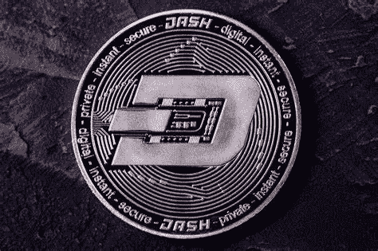

# Dash 价格预测

> 原文：<https://medium.com/coinmonks/dash-price-prediction-9df8fc5da411?source=collection_archive---------34----------------------->

Source photo [dash crypto — Bing images](https://www.bing.com/images/search?view=detailV2&ccid=yECgAzLX&id=AE914370605944BE68D0077E6347CC31EA23B672&thid=OIP.yECgAzLX6dFb7HAmZ6RyGgHaE7&mediaurl=https%3a%2f%2fnulltx.com%2fwp-content%2fuploads%2f2018%2f11%2fdash-cryptocurrency.jpg&cdnurl=https%3a%2f%2fth.bing.com%2fth%2fid%2fR.c840a00332d7e9d15bec702667a4721a%3frik%3dcrYj6jHMR2N%252bBw%26pid%3dImgRaw%26r%3d0&exph=733&expw=1100&q=dash+crypto&simid=608003610900845398&FORM=IRPRST&ck=0B018D02C29063D9034831698EE8BE39&selectedIndex=0&ajaxhist=0&ajaxserp=0)

全球有相当多的人已经利用了加密业务的快速增长。自诞生以来，比特币一直是使用最广泛的加密货币。除了比特币，还有许多其他加密货币也有许多相同的功能。在一个更高级的方法中。