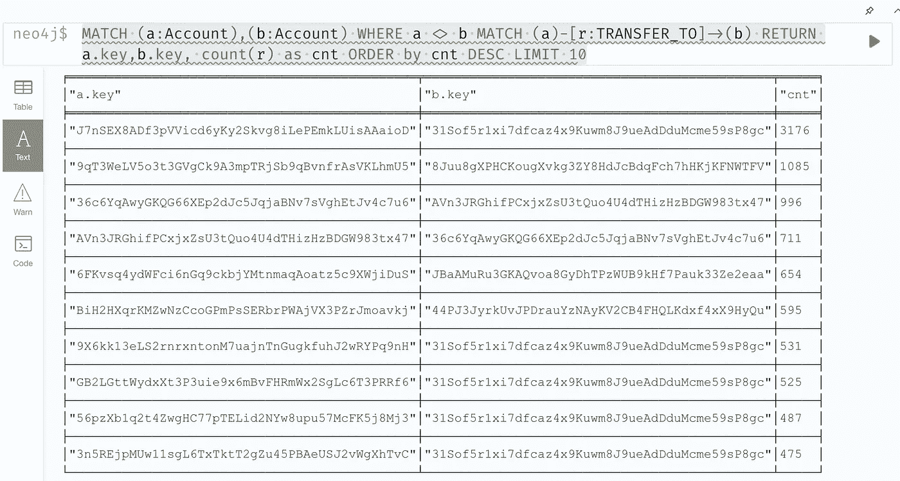
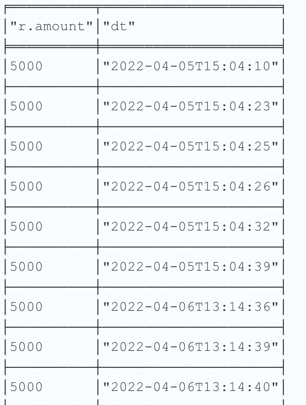
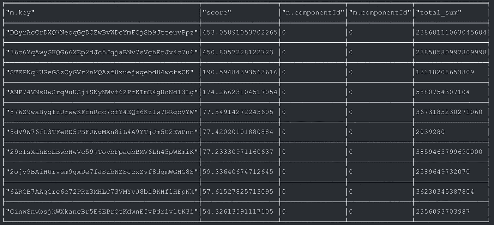

# Solana 区块链数据的数据分析

> 原文：<https://medium.com/coinmonks/data-analysis-on-solana-blockchain-data-193ce5d82bbb?source=collection_archive---------8----------------------->

继续分析我在上一篇文章中使用 Rust 程序收集的交易数据。

1.  让我们试着找出哪对账户转账最多？运行下面的 Cypher 查询:

```
MATCH (a:Account),(b:Account) WHERE a <> b MATCH (a)-[r:TRANSFER_TO]->(b) RETURN a.key,b.key, count(r)as cnt ORDER by cnt DESC LIMIT 10
```

它返回前 10 个传输对。



然后我们把重点放在最上面的一对，按照时间戳的顺序把转账列出来。运行以下查询:

```
MATCH (a:Account{key: 'J7nSEX8ADf3pVVicd6yKy2Skvg8iLePEmkLUisAAaioD'})-[r:TRANSFER_TO]->(b:Account {key:'31Sof5r1xi7dfcaz4x9Kuwm8J9ueAdDduMcme59sP8gc'})  RETURN r.amount,r.datetime as dt order bydt limit 100
```

结果发现转账非常频繁，转账金额都等于 5000。这意味着它是支付给系统账户的交易费— `31Sof5r1xi7dfcaz4x9Kuwm8J9ueAdDduMcme59sP8gc`



2.让我们创建另一个虚拟图，它不包括上面的系统帐户— `31Sof5r1xi7dfcaz4x9Kuwm8J9ueAdDduMcme59sP8gc`。此外，我们将关系`TRANSFER_TO`聚合为一个关系`HasRecFrom`，并将总转账金额和转账次数作为关系属性。

下面是命令。

```
CALL gds.graph.project.cypher('HasRecFrom',
'MATCH (n:Account) where n.key <> "31Sof5r1xi7dfcaz4x9Kuwm8J9ueAdDduMcme59sP8gc" 
RETURN id(n) AS id',
'MATCH (n:Account)-[r:TRANSFER_TO]->(m:Account) where m.key <>"31Sof5r1xi7dfcaz4x9Kuwm8J9ueAdDduMcme59sP8gc" and n.key <> "31Sof5r1xi7dfcaz4x9Kuwm8J9ueAdDduMcme59sP8gc" 
RETURN id(m) AS source, id(n) AS target, "HasRecFrom" AS type, sum(r.amount) AS total_amount, count(r) as total_count')
```

3.然后运行社区检测算法—弱连接组件(WCC ),并将组件 ID 作为节点属性写回。

```
CALL gds.wcc.write('HasRecFrom', {writeProperty: "componentId"})
```

4.然后运行页面排名算法，找出账号的重要性。使用总转账金额作为权重。

```
CALL gds.pageRank.write('HasRecFrom', {relationshipWeightProperty:"total_amount", writeProperty: "pagerank"})
```

5.现在我可以找出排名最高的账户，以及他们所属的集群(`componentId`)。

```
MATCH (n:Account)-[r:TRANSFER_TO]->(m:Account) where m.pagerank>0 and m.componentId>=0 return m.key,m.pagerank as score, n.componentId,m.componentId , sum(r.amount) as total_sum order by score DESC LIMIT 10
```



两个收件人帐户排名最高，并且也都属于群集 0 ( `componentId=0`)。

6.集群 0 是一个大集群。运行下面的查询来计算帐户。结果是`59094`。由于总共有`115972`个账户，集群 0 已经占了 50%左右。

```
MATCH (n:Account {componentId: 0}) RETURN count(n)
```

7.让我们挑选在网页排名中得分超过 400 的前 2 个收件人帐户。分别是:`DQyrAcCrDXQ7NeoqGgDCZwBvWDcYmFCjSb9JtteuvPpz`和`36c6YqAwyGKQG66XEp2dJc5JqjaBNv7sVghEtJv4c7u6`。运行以下查询，找出他们收到的总金额。

```
MATCH (n:Account)-[r:TRANSFER_TO]->(m:Account {key:"DQyrAcCrDXQ7NeoqGgDCZwBvWDcYmFCjSb9JtteuvPpz"}) RETURN sum(r.amount)MATCH (n:Account)-[r:TRANSFER_TO]->(m:Account {key:"36c6YqAwyGKQG66XEp2dJc5JqjaBNv7sVghEtJv4c7u6"}) RETURN sum(r.amount)
```

结果是`23868111063045604`和`23850580997809998`灯。1 兰波特= 0.000000001 索尔，2022 年 4 月 10 日 1 索尔的价格约为 111 美元。将 2 笔金额转换为美元:`2,649,360,328`和`2,647,414,491`。这意味着超过 260 万美元流入这两个账户。

刚刚谷歌了 2 个账户的密钥，我发现第一个账户可能是一个索拉纳池硬币令牌账户，第二个是血清硬币金库账户。两者都可能与索拉纳令牌或工具的交易有关。有意思？

如果我们做更多的数据分析，可能会挖掘出更多的信息。

*未完待续……*

> *加入 Coinmonks* [*电报频道*](https://t.me/coincodecap) *和* [*Youtube 频道*](https://www.youtube.com/c/coinmonks/videos) *了解加密交易和投资*

# 另外，阅读

[](/coinmonks/best-crypto-tax-tool-for-my-money-72d4b430816b) [## 最佳加密税务软件——评论和比较

### 不管你是刚接触加密还是已经在这个领域呆了一段时间，你都需要交税。

medium.com](/coinmonks/best-crypto-tax-tool-for-my-money-72d4b430816b) 

*   [有哪些交易信号？](https://coincodecap.com/trading-signal) | [Bitstamp vs 比特币基地](https://coincodecap.com/bitstamp-coinbase) | [买索拉纳](https://coincodecap.com/buy-solana)
*   [ProfitFarmers 回顾](https://coincodecap.com/profitfarmers-review) | [如何使用 Cornix Trading Bot](https://coincodecap.com/cornix-trading-bot)
*   [十大最佳加密货币博客](https://coincodecap.com/best-cryptocurrency-blogs) | [YouHodler 评论](https://coincodecap.com/youhodler-review)
*   [my constant Review](https://coincodecap.com/myconstant-review)|[8 款最佳摇摆交易机器人](https://coincodecap.com/best-swing-trading-bots)
*   [MXC 交易所评论](/coinmonks/mxc-exchange-review-3af0ec1cba8c) | [Pionex vs 币安](https://coincodecap.com/pionex-vs-binance) | [Pionex 套利机器人](https://coincodecap.com/pionex-arbitrage-bot)