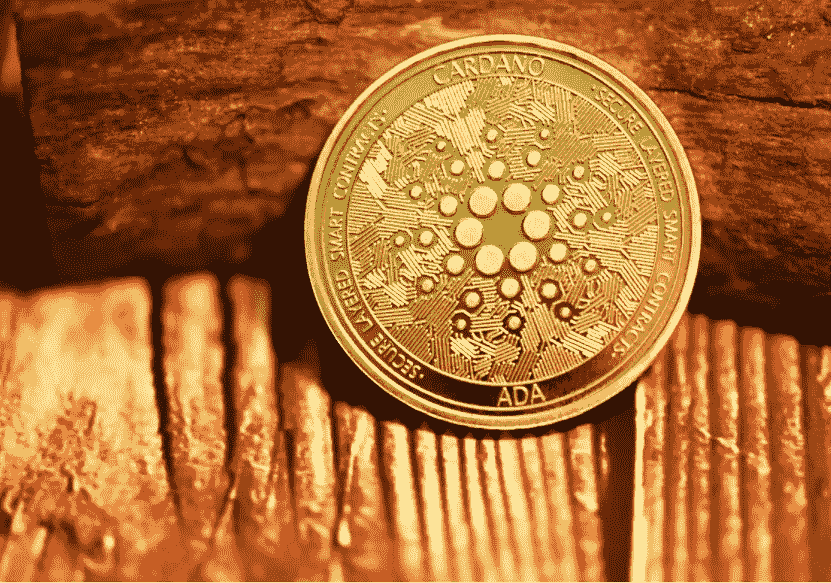

# 数据显示，Cardano Network 正在进行稳健的项目活动

> 原文：<https://medium.com/coinmonks/data-shows-cardano-network-has-ongoing-robust-project-activity-8e900fcb39f1?source=collection_archive---------9----------------------->

Image via [Unsplash.com- Kanchanara](https://images.unsplash.com/photo-1622538521146-ed39c9fbcbbf?ixlib=rb-1.2.1&ixid=MnwxMjA3fDB8MHxwaG90by1wYWdlfHx8fGVufDB8fHx8&auto=format&fit=crop&w=1172&q=80)

## 该加密有各种项目目前正在开发他们的区块链生态系统

在过去的六个月里，卡尔达诺的象征性价格可能已经从其历史高点下跌了 75%以上，但这似乎并没有反映出其生态系统正在发生的变化。最近…