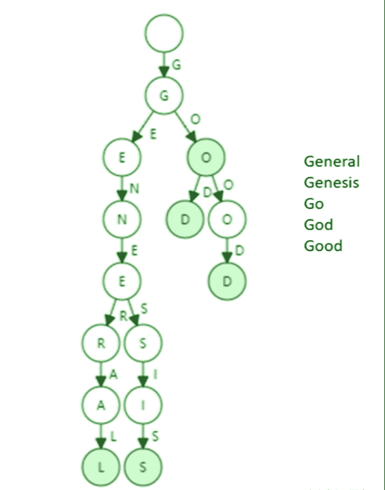

# 以太坊和比特币中的数据结构设计

> 原文：<https://medium.com/coinmonks/data-structure-design-in-ethereum-and-bitcoin-83de4bd991ac?source=collection_archive---------5----------------------->

我欣赏学习时的独立和批判精神，我喜欢问问题，比如为什么事情会这样。所以这篇文章将按照我自己的想法和思路来写，因为我希望它更像是一篇发人深省的文章，而不是一本告诉你事情如何运作的参考书。

**什么是区块链？区块链 V.S .链表**

我们从一个简单的问题开始:什么是区块链？

区块链是一种数据结构。为了理解区块链，你必须先了解链表。

在链表中，节点通过使用指针的链接来连接。

节点中有两个元素:

1.指向下一个节点的指针

2.存储数据的值部分

在一个链表中，你可以通过改变节点的指针轻松地插入和删除新的节点，而不会影响其他节点。

区块链是使用哈希指针连接节点的链表。哈希指针是什么意思？

散列指针包括指向前一节点的指针和存储在前一节点中的数据的散列值。

如果内容发生变化，该哈希值也会发生变化。因此，这使得区块链不可改变篡改明显的日志。例如，您更改一个节点的值内容，它旁边的节点等等都将更改。所以你可以保留最近块的 hash，证明所有的事务都是正确的。那就是光节点的来源。轻型节点只保留最近的块，并在需要时从完整节点查询附加数据。

**特里是什么？**

现在我们知道积木是如何连接的了。让我们看看交易和账户数据是如何存储在块中的(trie 是区块链的另一个重要的数据基础设施)。

使用 trie(也称为树)存储事务。Trie 来自“检索”,它是一种用于更好检索的数据结构。比特币使用 merkle 树组织交易，以太坊使用 merkle Patricia 树。

正常的 trie 具有以下特征:

1.  检索的效率取决于每个密钥的长度(以太坊地址的长度是 160 位，比特币地址是 256 位)。
2.  在树中没有冲突的可能性(哈希冲突是可能的，但在 trie 中不会发生)。
3.  对于给定的输入，输出总是相同的(trie 的结构总是相同的)。
4.  更新整个 trie 代价很大(最好小范围更新)。

**比特币中的 Merkle 树**

在比特币中，交易存储在 merkle 树中。“Merkle”来源于 hash 函数，这个 hash 函数用于替换普通 trie 中的普通指针。

交易存储在 merkle 树中。它们被逐层散列，最后构造一个根散列(如下所示)。

如果您想证明某个事务以前被正确执行过，您需要从完整节点(下面红色的节点)查询额外的哈希值，并通过 merkle proof 计算根哈希值。然后，您将这个计算出的根散列与您本地存储在您的光节点(SPV)中的根散列进行比较，如果根是相同的，那么您可以证明事务是正确的。

这一程序也被称为会员证明，它意味着证明一项交易是包括在区块链。但当涉及到非会员证明时，情况可能会有所不同。如果你想证明一个事务在区块链中不存在，你必须把整个 trie 树上传到 light 节点来检查 trie 树的正确性，并且在那些块中查找每个事务，这是非常费力和低效的。(这个有解决方法:排序 merkle 树。但是比特币没有采取这种方式，因为非会员证明的场景很少。)

**以太坊中的 Merkle Patricia 树**

为什么以太坊使用 merkle Patricia 树而不是像比特币一样使用 merkle 树？

有很多考虑因素。

与比特币中的 UTXO 模型不同，以太坊采用的是基于账户的模型。

在比特币中，交易由大小有限的区块管理。一个块可以容纳大约 4000 个事务。

基于帐户的模型意味着存在一个全局状态 trie，其中包含每个帐户的信息(包括随机数、余额、代码哈希和存储 trie)。

这种复杂的账目导致了一个问题。每次一个新的区块发布，整个 trie 都会改变，随着新帐户的创建，轮胎会不断增长。即使一个交易只涉及很少的账户，你也必须重新计算并重新发布整个 trie，这是很昂贵的。

所以以太坊采取了这种不同的方式:Merkle Patricia Tree。

帕特丽夏的意思是[空间优化](https://en.wikipedia.org/wiki/Memory_Optimization)和压缩。

一棵普通的树看起来像这样:

帕特里夏树看起来像这样:

帕特里夏树节省了大量资源。但是帕特丽夏·特里在什么情况下表现最好呢？答案是:键分布稀疏的地方。

想象一个场景，当关键字总是有相同的前缀时，Patricia 树看起来就像普通的树。这就是以太坊使用 160 位地址而不是较短地址来提高效率的原因。有 2 种⁶⁰类型的以太坊地址，2 个⁶⁰与账户数量相比是一个非常大的数字，所以分布足够稀疏。

此外，在完全分散的区块链系统中，地址由用户在本地生成，因此增加地址长度是防止分散系统中地址冲突的唯一方法。

(我可能会在下一篇文章中从源代码的角度写一些东西……)

> 加入 Coinmonks [Telegram group](https://t.me/joinchat/Trz8jaxd6xEsBI4p) 并了解加密交易和投资