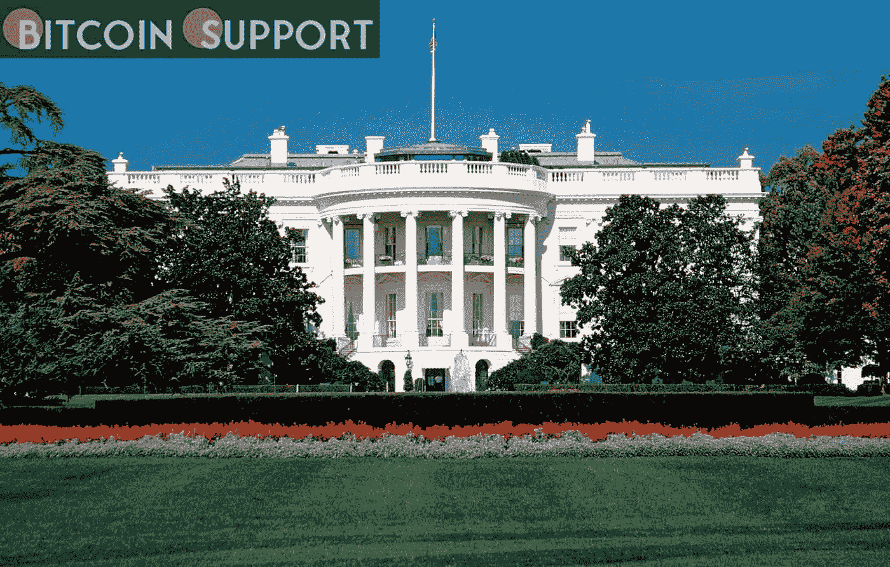

# 扭曲的数据:美国新法律如何帮助区块链研究？

> 原文：<https://medium.com/coinmonks/data-that-is-skewed-how-might-a-new-us-law-help-blockchain-research-51633c10e201?source=collection_archive---------71----------------------->

**Visit our website:-** [**https://bitcoinsupports.com/**](https://bitcoinsupports.com/)

基础设施公司现在将被要求在 24 小时内报告勒索软件付款。“这无疑将改变游戏规则。”根据 Chainalysis 的数据，2020 年是勒索软件支付创纪录的一年(6.92 亿美元)，一旦所有数据到位，2021 年可能会更高。随着乌克兰-俄罗斯冲突的爆发，勒索软件作为地缘政治策略的使用——而不仅仅是抢钱——预计会增加。

然而，美国的一项新法律或许能够遏制日益膨胀的勒索者洪流。美国总统乔·拜登最近签署了《加强美国网络安全法案》，通常被称为彼得斯法案，要求基础设施公司在 72 小时内和 24 小时内向政府报告重大网络攻击，如果他们支付勒索赎金。

这是什么意思？正如去年的 Colonial Pipeline 案件所见证的那样，司法部能够从支付给勒索软件团伙的金额中收取 230 万美元，区块链研究公司在打破勒索软件网络方面变得越来越高效。然而，需要额外的数据，特别是犯罪分子的加密地址来保持这一良好趋势，并且必须以更及时的方式交付，因为几乎所有的勒索软件攻击都包括基于区块链的加密货币，最常见的是比特币(BTC)。这正是新规则应该有所帮助的地方，因为勒索软件受害者过去很少向警方或其他人报告勒索。

“It will be quite beneficial,” Roman Bieda, Coinfirm’s head of fraud investigations, told. “The ability to instantly ‘tag’ specific coins, addresses, or transactions as ‘risky’ allows all users to see the risk even before any attempt at money laundering.”

“It will undoubtedly benefit blockchain forensic researchers in their investigation,” said Allan Liska, a senior intelligence analyst at Recorded Future. “While ransomware gangs frequently change wallets for each attack, the money eventually returns to a single wallet. Researchers on the blockchain have gotten quite proficient at connecting the links.” He said that they were able to accomplish so despite ransomware groups and their confederate money launderers using mixing and other techniques.

Professor of professional practise at Columbia University, Siddhartha Dalal, agreed. Dalal co-authored a paper titled “Identifying Ransomware Actors In The Bitcoin Network” last year that detailed how he and his colleagues were able to identify ransomware attackers with “85 percent prediction accuracy on the test data set” using graph machine learning algorithms and blockchain analysis.

While the authors’ findings were encouraging, they claimed that they could improve their accuracy even more by strengthening their algorithms and, most importantly, “collecting more data that is more dependable.”

The problem for forensic modellers is that they are dealing with severely skewed, or imbalanced, data. Only 143 of the 400 million Bitcoin transactions and close to 40 million Bitcoin addresses examined by Columbia University researchers were confirmed ransomware addresses. In other words, non-fraud transactions outnumbered fraudulent transactions by a large margin. With such skewed data, the algorithm will either generate a large number of false positives or leave the bogus data out entirely.

In an interview last year, Coinfirm’s Bieda gave an example of the problem:

**“Let’s say you want to construct a model that would extract photographs of dogs from a treasure of cat photos, but you only have 1,000 cat photos and one dog photo in your training dataset. Because the error margin is 0.001, a machine learning model ‘would learn that it is okay to treat all photographs as cat photos.’**

In other words, the algorithm would “constantly guess ‘cat,’ which, of course, would render the model unusable, despite its great overall accuracy.”

Dalal was questioned if the new US legislation will help to enhance the public dataset of “fraudulent” Bitcoin and crypto addresses that are needed for more effective blockchain analysis of ransomware networks.

Dalal told, “There is no doubt about that.” “Of course, for any analysis, more data is usually better.” But, more importantly, ransomware payments must now be disclosed within 24 hours by law, allowing “a better chance for recovery as well as the possibility of identifying servers and methods of attack so that other potential victims can take defensive steps to protect themselves,” he added. That’s because most criminals employ the same virus to target other people.

**A forensic tool that is underutilised**

It’s not often recognised that when criminals utilise cryptocurrencies to fund their operations, law enforcement benefits. “Blockchain analysis can be used to uncover their whole supply chain,” said Kimberly Grauer, Chainalysis’ director of research. “You can see where they get their bulletproof hosting from, where they get their malware from, and their Canadian affiliate,” and so on. “By using blockchain research, you can obtain a lot of insights into these groups,” she said at a recent Chainalysis Media Roundtable in New York City.

Will, however, this law, which will take months to execute, truly assist? At the same occasion, Salman Banaei, co-head of public policy at Chainalysis, responded, “It’s a plus, it would help.” “We pushed for it, but we weren’t completely blind before.” Is it likely to make their forensic efforts far more effective? “I’m not sure if it would make us a lot more effective, but we would expect some data coverage improvement.”

Before the law takes effect, the mechanics of the rule-making process must be ironed out, but one apparent concern has already been raised: Which corporations will be required to comply? “It’s vital to keep in mind that the bill only applies to ‘entities that own or run key infrastructure,’” Liska explained. “This obligation still only applies to a small number of companies in the United States,” says the report, despite the fact that it may affect tens of thousands of organisations spanning 16 industries.

However, this may not be the case. Financial services, IT, energy, healthcare, transportation, manufacturing, and commercial facilities are among the infrastructure industries included in the law, according to Bipul Sinha, CEO and co-founder of Rubrik, a data security company. “In other words, almost everyone,” he recently wrote in a Fortune piece.

Another question: Is it necessary to disclose every attack, even minor ones? Even minor acts may be regarded reportable, according to the Cybersecurity and Infrastructure Security Agency, to which the corporations will be reporting. The New York Times noted that “because of the looming potential of Russian cyberattacks any event could give vital bread crumbs leading to a sophisticated attacker.”

Is it correct to think that the war makes it more important to take preventative measures? After all, President Joe Biden, among others, has raised the possibility of Russian government retaliation cyber-attacks. But, according to Liska, this anxiety hasn’t materialised — at least not yet:

**“Ransomware attempts in retaliation for Russia’s invasion of Ukraine do not appear to have materialised.” Because Russia’s coordination was weak during the war, any ransomware gangs that may have been activated were not.”**

According to Chainalysis, over three-quarters of all money made from ransomware attacks went to hackers associated to Russia in 2021, thus an increase in activity can’t be ruled out.

**This isn’t a one-size-fits-all solution**

Machine-learning algorithms that identify and track ransomware actors seeking blockchain payment — and practically all ransomware now supports blockchain — will undoubtedly improve now, according to Bieda. Machine learning solutions, on the other hand, are just “one of the aspects supporting blockchain analysis,” not a complete answer. ” “Industry-wide cooperation between law enforcement, blockchain investigative businesses, virtual asset service providers, and, of course, victims of blockchain fraud” is still crucial.

Many technological obstacles remain, according to Dalal, most of which are due to the unique nature of pseudo-anonymity, as he explained:

**“Most public blockchains operate without authorization, allowing users to generate as many addresses as they desire.” The transactions become more more complicated because tumblers and other mixing services might combine tainted money with a variety of other currencies. The combinatorial challenge of detecting culprits hiding behind many addresses grows as a result.”**

**Is it possible to make further progress?**

Despite this, things appear to be progressing in the right way. “As an industry, I believe we are making considerable progress, and we are doing so relatively quickly,” Liska remarked. “A number of startups have been doing extremely interesting work in this area,” she says, “and the Department of Treasury and other government agencies are beginning to realise the benefit in blockchain analysis as well.”

While blockchain research is definitely progressing, “there is so much money being made right now from ransomware and bitcoin theft that even the influence our effort is having pales in comparison to the overall problem,” Liska remarked.

While Bieda sees progress, getting companies to report blockchain fraud, particularly outside of the United States, will be difficult. “Over 11,000 victims of blockchain fraud have contacted Coinfirm through our Reclaim Crypto website in the last two years,” he stated. “One of the questions we ask is, ‘Have you reported the theft to law enforcement?’ — and many victims haven’t,” she says.

The government mandate, according to Dalal, is an important step in the right direction. “This will undoubtedly be a game changer,” he told, because attackers will be unable to repeat their preferred approaches and will be forced to move considerably faster in order to assault several targets. It will help lessen the shame associated with the attacks, allowing future victims to better protect themselves.”

**访问我们的网站:-**[**【https://bitcoinsupports.com/】**](https://bitcoinsupports.com/)

**免责声明:这些是作者的观点，不应被视为投资建议。读者应该自己做研究。**

> 加入 Coinmonks [电报频道](https://t.me/coincodecap)和 [Youtube 频道](https://www.youtube.com/c/coinmonks/videos)了解加密交易和投资

# 另外，阅读

*   [Bookmap 评论](https://coincodecap.com/bookmap-review-2021-best-trading-software) | [美国 5 大最佳加密交易所](https://coincodecap.com/crypto-exchange-usa)
*   最佳加密[硬件钱包](/coinmonks/hardware-wallets-dfa1211730c6) | [Bitbns 评论](/coinmonks/bitbns-review-38256a07e161)
*   [新加坡十大最佳加密交易所](https://coincodecap.com/crypto-exchange-in-singapore) | [购买 AXS](https://coincodecap.com/buy-axs-token)
*   [红狗赌场评论](https://coincodecap.com/red-dog-casino-review) | [Swyftx 评论](https://coincodecap.com/swyftx-review) | [CoinGate 评论](https://coincodecap.com/coingate-review)
*   [投资印度的最佳密码](https://coincodecap.com/best-crypto-to-invest-in-india-in-2021)|[WazirX P2P](https://coincodecap.com/wazirx-p2p)|[Hi Dollar Review](https://coincodecap.com/hi-dollar-review)