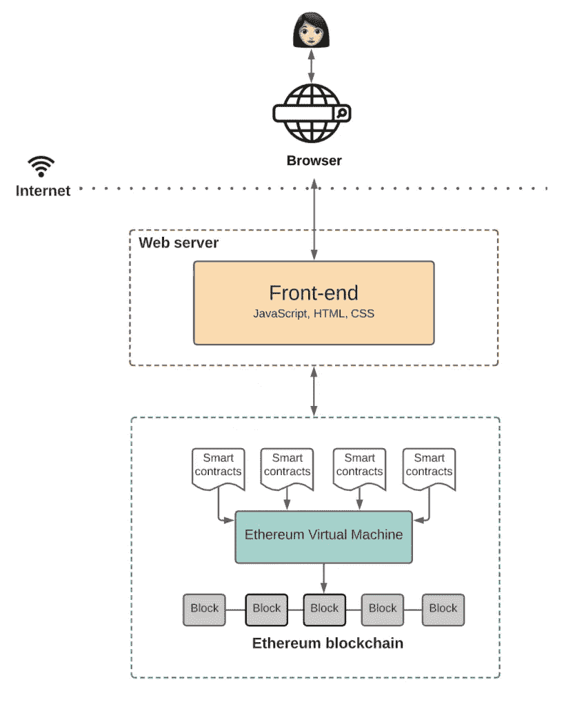
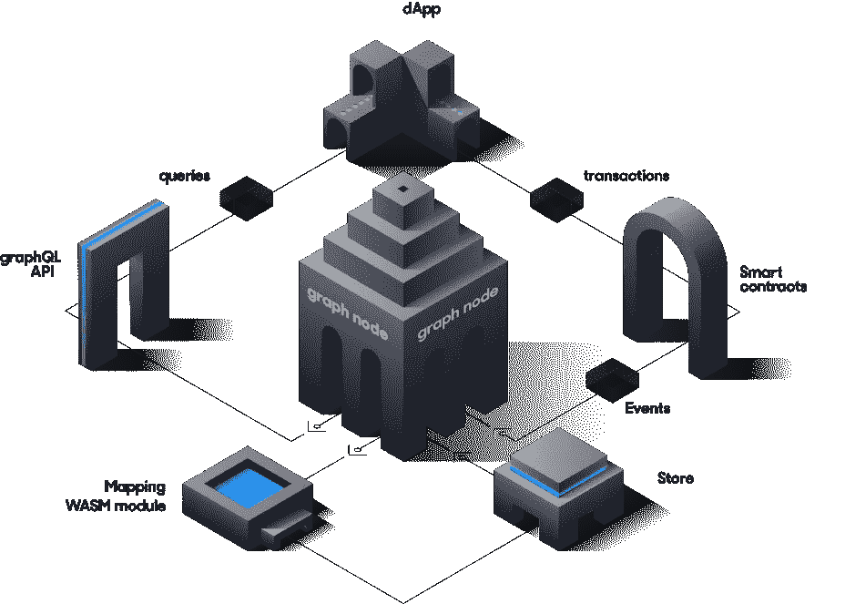
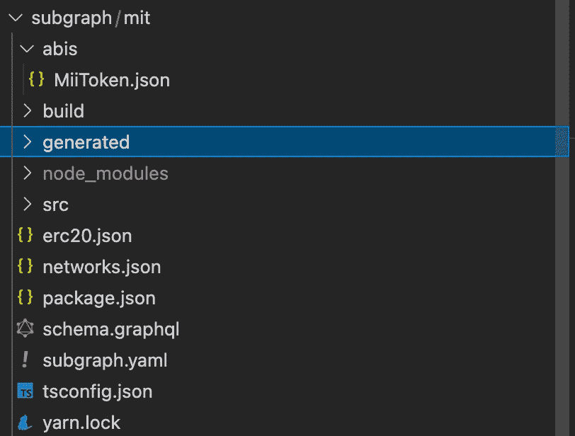
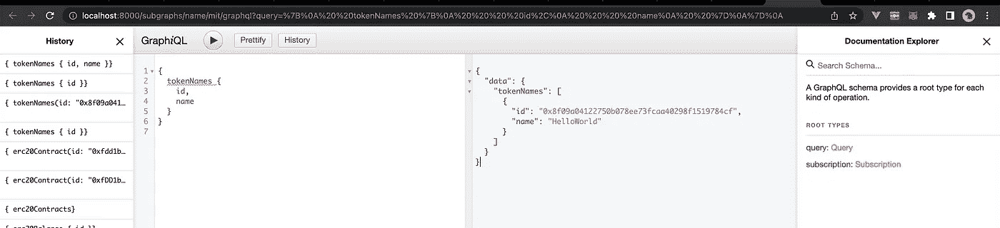
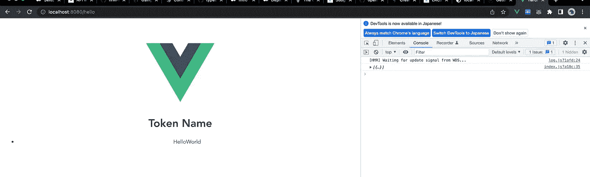

# 第 5 天:事件日志和关于图表的介绍

> 原文：<https://medium.com/coinmonks/day-5-events-log-and-introduction-about-the-graph-8254815eb95e?source=collection_archive---------1----------------------->

# 概观

我们都知道，块分散应用程序或 Dapp 利用智能合约来执行业务逻辑，而区块链 it 本身作为交易的超级分类帐，充当不可变的数据库。前端在 web3 库(如 EtherJS 或 Web3JS)的帮助下，将能够与区块链节点进行对话，以读取或写入区块链。在 Web3 的世界中，基本架构如下所示:



[https://www.preethikasireddy.com/post/the-architecture-of-a-web-3-0-application](https://www.preethikasireddy.com/post/the-architecture-of-a-web-3-0-application)

我真心建议你仔细阅读 Preethi Kasireddy 女士写的帖子，了解从 Web2 到 Web3 架构的演变。

# 事件日志机制的需求

如果我们想知道区块链上发生了什么？对于 Web2，这很简单，因为我们可以使用日志机制来捕获事件，以便稍后检查并显示在仪表板上(使用类似 ELK stack 的东西)。在 Web3 的世界里，事情变得更加复杂，因为:

*   当传统的区块链没有这样的日志记录机制时，我们如何知道区块链上发生了什么(用于监督、调试等……)。
*   我们可以创建智能合同，并将事件捕获到区块链中以备后用，但这将非常昂贵，而且每次我们需要读取数据时，都需要额外调用区块链，因此，我们如何以高效的方式存储日志并检索它们呢？
*   如果我们存储我们的日志，区块链不是一个真正的数据库，而是一个超级分类帐，因为它不提供像 SQL 这样的查询语言。那么，我们如何对那个分类账进行复杂的查询呢？

区块链像以太坊一样提供了对事件日志的支持。智能协定开发人员可以实现在事务发生时发出事件。这些事件被写到事务日志中，这要便宜得多，前端在 Web3 库的帮助下可以观察和过滤事件日志，以获得它感兴趣的内容并相应地做一些事情。

在这篇文章的范围内，我们不会进入以太坊如何做到这一点的技术细节，但我认为下面的链接将对理解以太坊区块链的事件日志有很大的帮助。

[](/mycrypto/understanding-event-logs-on-the-ethereum-blockchain-f4ae7ba50378) [## 了解以太坊区块链上的事件日志

### 每个事务都有一个事件日志，但是这些事件日志可能很难阅读。

medium.com](/mycrypto/understanding-event-logs-on-the-ethereum-blockchain-f4ae7ba50378) 

简而言之，要捕获事件，我们需要执行以下步骤

*   定义事件:定义需要捕获和索引的数据
*   发出事件:通过使用`emit`关键字，智能合约可以按照定义的格式动态发出事件。
*   捕获事件:前端显式地观察事件日志，捕获它感兴趣的任何内容，并执行预定义的逻辑或 UI 更新。

但是仍然有未解决的问题

*   对事件日志进行复杂的查询
*   回溯事件(过去的事件)

**介绍图表**

> 图表是什么？
> 
> 该图是一个分散的协议，用于索引和查询来自区块链的数据，从以太坊开始。使得难以直接查询的数据查询成为可能。
> 
> [https://thegraph.com/docs/en/about/introduction/](https://thegraph.com/docs/en/about/introduction/)

因此[图](https://thegraph.com/)通过构建一个分散的协议来解决我们的问题，该协议允许处理区块链事件并将它们存储为索引数据，dApps 可以通过 API 端点(GraphQL)查询这些数据。那么他们是怎么做到的呢？



*该图基于子图描述学习什么以及如何索引区块链数据，这被称为子图清单。子图描述定义了子图感兴趣的智能契约、这些契约中要注意的事件，以及如何将事件数据映射到图将存储在其数据库中的数据。*

因此，我们可以把图看作是一个分散的网络，包含许多运行图的分散协议的节点。图表是由子图表构成的，就像你的 DApp 是由智能合约构成的一样。每个子图都是使用子图清单定义的，子图清单实际上定义了目标智能合同及其需要被捕获和索引的事件。一旦子图被部署，下面场景显示了实际发生的情况:

*   dApps(通过它们的智能合约)提交事务，这将发出事件。
*   图形节点扫描每个块寻找事件
*   图节点在块中为您的子图查找事件，并运行映射处理程序来将捕获的事件存储到数据结构中。
*   dApp 可以通过 GraphQL APIs 查询这些数据，GraphQL APIs 由 Graph 节点进行翻译以获取索引数据。

## 动手部件

我们将尝试做以下事情:

*   使用 OpenZeppelin 库构建一个简单的 ERC20 智能合约
*   将我们的智能合约部署到本地 Ganache 上，并从我们的智能合约中发出事件
*   设置一个本地子图节点，用于监视和索引来自 Ganache 的事件
*   使用 Apollo 客户端从前端向本地子图进行查询

1.  **简单的 ERC20 令牌**

创建一个 hardhat-vue 项目(请参考[第 1 天](/coinmonks/blockchain-day-1-environment-setup-4b2ed581cc99)了解更多详情)

```
$vue create MyToken
$cd MyToken
$mkdir blockchain
$npm init
$npm install --save-dev hardhat
$npm install @openzeppelin/contracts
```

我们的智能合约非常简单，因为我们重用了 OpenZeppelin library 中的 ERC20。除了从 ERC20 发出的事件之外，还包括

*   转移
*   同意
*   所有权转让

出于测试目的，我们还自定义了`NameChanged`事件，并在我们更改私有属性`_name`时发出该事件。

```
// SPDX-License-Identifier: MITpragma solidity ^0.8.4;import "@openzeppelin/contracts/token/ERC20/ERC20.sol";import "@openzeppelin/contracts/access/Ownable.sol";contract MiiToken is ERC20, Ownable { string private _name; event NameChanged(string newName, address by); constructor(uint256 initialSupply) ERC20("MiiToken", "MIT") {
        _name = "MiiToken"; _mint(msg.sender, initialSupply); } function changeName(string memory name) public onlyOwner { _name = name; emit NameChanged(name, msg.sender); } function getName() public view returns (string memory){ return _name; }}
```

**2。在 Ganache 上构建和部署我们的智能合约**

*   首先运行我们的加纳切本地区块链
*   修改 hardhat.config.ts 以使用 ganache

```
networks: {
   ... ganache: { url: process.env.GANACHE_URL || "", accounts: process.env.GANACHE_PRIVATE_KEY !== undefined ? 
            [process.env.GANACHE_PRIVATE_KEY] : [], }, },
},
```

*   部署设置文件`scripts/deploy.ts`:

```
async function main() { const MiiToken = await ethers.getContractFactory("MiiToken"); const mitoken = await MiiToken.deploy(1000000); await mitoken.deployed(); console.log("Miitoken deployed to:", mitoken.address);}
```

*   部署智能合同:

```
$npx hardhat run --network ganache scripts/deploy.ts
```

*   在这一步，我们可以使用`hardhat console`来处理我们部署的智能契约，尝试发出诸如转移令牌、更改名称等事件..等等

```
$npx hardhat console 
> let MiiToken = await ethers.getContractFactory("MiiToken");
> let miiToken = await MiiToken.attach('<SmartContractAddress>');
> await miiToken.changeName('SomeInterestingName');
> await miiToken.getName();
> await miiToken.transfer('<SomeAddresss>', <SomeToken>);
```

**3-使用 docker** 运行子图节点

下一步是运行我们的本地图节点，并将其连接到我们的本地 ganache。首先，我们从 github 克隆图形节点

```
git clone [https://github.com/graphprotocol/graph-node/](https://github.com/graphprotocol/graph-node/)
```

然后，我们通过修改`graph-node/docker/docker-compose.yml`来使用[http://host . docker . internal:7545](http://host.docker.internal:7545)(ganache gRPC 服务器)将图节点连接到 Ganache

```
environment:
      postgres_host: postgres
      postgres_user: graph-node
      postgres_pass: let-me-in
      postgres_db: graph-node
      ipfs: 'ipfs:5001'
 **ethereum: 'mainnet:**[**http://host.docker.internal:7545'**](http://host.docker.internal:7545')
```

然后开始，我们设置图形节点并运行

```
$ ./setup.sh
$ docker-compose up
```

※有时我们需要删除数据文件夹来重新运行:

```
$docker-compose down -v 
$rm -rf data
```

此时，图节点连接到 ganache，但是我们还没有定义任何子图。

**4-定义我们的子图**

现在是时候通过定义子图来定义我们想要捕获和检索什么数据了。但是在此之前，我们在我们的 vue 项目根文件夹中创建一个文件夹

```
$ mkdir subgraph 
$ cd subgraph
```

然后我们需要安装 graph cli

```
npm install -g @graphprotocol/graph-cli
```

使用以下命令初始化子图

```
$ graph init
```

Graph CLI 将询问我们一些问题，并尝试从以太网扫描获取 ABI，这是不可能的，因为我们正在使用本地 ganache。但是不要担心，因为它毕竟允许我们手动提供 ABI:

```
❯ graph init
✔ Protocol · ethereum
✔ Product for which to initialize · subgraph-studio
✔ Subgraph slug · MIT
✔ Directory to create the subgraph in · MIT
✔ Ethereum network · mainnet
✔ Contract address · <Deployed Address on Ganache> 
✖ Failed to fetch ABI from Etherscan: ABI not found, try loading it from a local file
? ABI file (path) ›..**/blockchain/artifacts/contracts/MiiToken.sol/MiiToken.json**
```

这是结果:



正如我们已经知道的，子图定义有 3 个主要组成部分

*   yaml:把它想象成设置文件，定义数据源并把它们映射到预定义的句柄，句柄反过来处理数据源并将事件的数据存储到数据库中以备将来查询
*   schema.graphql:它实际上是一个定义结构(表/实体及其关系)的 DDL(数据定义语言)文件。处理程序将使用模式定义的数据结构来存储事件数据。
*   src/mapping.ts:一组处理程序，使用事件作为输入，处理它们，然后将它们存储到 schema 定义的数据结构中。

由于 OpenZeppelin 也为我们提供了它们预定义的子图，所以直接使用它们会比从头开始构建方便得多。要使用 [OpenZeppelin 子图](https://docs.openzeppelin.com/subgraphs/0.1.x/),我们首先需要安装它

```
$npm install [@openzeppelin/subgraphs](https://www.npmjs.com/package/@openzeppelin/subgraphs)
```

然后我们需要创建一个 erc20.json 配置文件

```
{ "output": "generated/openzeppelin.erc20.", "chain": "mainnet", "datasources": [ { 
    "address": "0xfDD1b55448da925abD960dF489d675616A7Ec301", 
    "module": [ "erc20",  "ownable"] } ]}
```

请注意

*   地址是部署的合同地址
*   保持链为`mainnet`
*   我们重用由`graph init`创建的`generated`文件夹，并将生成文件的前缀定义为`openzeppelin.erc20.`
*   由于我们的合同使用了来自 OpenZeppelin 的 ERC20.sol 和 Ownable.sol，在`module`中指出它们就足够了

使用以下命令为 OpenZeppelin 契约生成了模式和子图

```
npx graph-compiler --config erc20.json 
--include node_modules/@openzeppelin/subgraphs/src/datasources
--export-schema 
--export-subgraph
```

该命令将导出`generated`文件夹中 ERC20.sol 和 Ownable.sol 所需的 schema 和子图。我们复制那些生成的文件的所有内容来替换由`graph init`提供的文件的内容:

*   schema.graphql

*   subgraph.yaml

可以看出，已经定义了 3 个数据源，其中 2 个由 OpenZeppelin 处理。我们只使用在`mapping.ts`中定义的处理程序`handleNameChanged`来处理我们的自定义事件`NameChaned`:

```
import { BigInt } from "@graphprotocol/graph-ts"import { NameChanged,} from "../generated/MiiToken/MiiToken"import { TokenName } from "../generated/schema"export function handleNameChanged(event: NameChanged): void { let tokenName = TokenName.load(event.transaction.from.toHex()) if (tokenName == null) { // create if doesn't exist yet tokenName = new TokenName(event.transaction.from.toHex()); tokenName.name = event.params.newName; tokenName.owner = event.params.by.toHex(); } tokenName.name = event.params.newName; tokenName.save();}
```

你必须立即注意到`TokenName`直到现在还没有定义。什么是`TokenName`？如前所述，处理程序从发出的事件`NameChanged`中提取信息，然后将信息存储到一个表/实体中。我们需要一个名为`TokenName`的实体来存储事件信息，但是到目前为止我们还没有定义它，所以让我们打开 schema.graphql 文件并添加以下内容

```
type TokenName @entity { id: ID! name: String owner: Account!}
```

现在一切都清楚了，SubGraph 将从事件中提取信息并存储在 schema 定义的实体中，这种映射在 subgraph.yaml 中定义:

```
dataSources:- kind: ethereum name: MiiToken network: mainnet source: address: "0xfDD1b55448da925abD960dF489d675616A7Ec301" abi: MiiToken mapping: kind: ethereum/events apiVersion: 0.0.5 language: wasm/assemblyscript entities: - NameChanged abis: - name: MiiToken file: ./abis/MiiToken.json eventHandlers: - event: NameChanged(string,address) handler: handleNameChanged file: ./src/mapping.ts
```

是时候将我们的子图部署到本地图节点了

```
$npm run codegen   // <- Generate the file for sub-graph
$npm run build     // <- Build SubGraph
$npm run create-local  // <- Create API info on graph local
$npm run deploy-local  // <- Deploy to local graph node
```

成功部署将为我们提供 2 个端点用于前端:

*   HTTP 端点
*   订阅端点



HTTP endpoint testing

※跟随 OpenZeppelin 教程测试其他赛事:[https://docs.openzeppelin.com/subgraphs/0.1.x/](https://docs.openzeppelin.com/subgraphs/0.1.x/)

**5。玩前端**

我们可以用 Apollo 客户端玩前端。在 Vue 根文件夹中运行以下命令来安装必要的库

```
$npm install vue-apollo graphql apollo-client apollo-link apollo-link-http apollo-cache-inmemory graphql-tag
```

在 main.js 中:

```
**import VueApollo from 'vue-apollo'****import ApolloClient from 'apollo-boost'****Vue.use(VueApollo)****const apolloClient = new ApolloClient({****// You should use an absolute URL here** **uri: 'http://localhost:8000/subgraphs/name/mit'****})****const apolloProvider = new VueApollo({** **defaultClient: apolloClient,****})**new Vue({ router, **apolloProvider**, render: h => h(App),}).$mount('#app')
```

在 HelloWorld.vue 中，我们尝试进行查询以从 TokenName 实体获取数据列表，并将其打印出来:

```
<template><div class="hello"> <h1>Token Name</h1> <div v-if="tokenNames"> <ul v-for="item in tokenNames" :key="item.id"> <li> {{item.name}} </li> </ul> </div></div></template><script>import gql from 'graphql-tag'export default {name: 'HelloWorld',data () { return { // Initialize your apollo data tokenNames: [], }},apollo: { // Simple query that will update the 'hello' vue property tokenNames: gql`query getTokenNames{ tokenNames{ id, name } }`, },}</script>
```

结果看起来有点难看，但对于演示来说已经足够了



# 结束

这是一个漫长…的结束。故事。我将离开几个星期。

> 加入 Coinmonks [电报频道](https://t.me/coincodecap)和 [Youtube 频道](https://www.youtube.com/c/coinmonks/videos)了解加密交易和投资

# 另外，阅读

*   [德国最佳加密交易所](https://coincodecap.com/crypto-exchanges-in-germany) | [Arbitrum:第二层解决方案](https://coincodecap.com/arbitrum)
*   [币安交易机器人](/coinmonks/binance-trading-bots-d0d57bb62c4c) | [OKEx 审查](/coinmonks/okex-review-6b369304110f) | [阿塔尼审查](https://coincodecap.com/atani-review)
*   [最佳加密交易信号电报](/coinmonks/best-crypto-signals-telegram-5785cdbc4b2b) | [MoonXBT 评论](/coinmonks/moonxbt-review-6e4ab26d037)
*   [如何在 Bitbns 上购买柴犬(SHIB)币？](https://coincodecap.com/buy-shiba-bitbns) | [购买 Floki](https://coincodecap.com/buy-floki-inu-token)
*   [CoinFLEX 评论](https://coincodecap.com/coinflex-review) | [AEX 交易所评论](https://coincodecap.com/aex-exchange-review) | [UPbit 评论](https://coincodecap.com/upbit-review)
*   [十大最佳加密货币博客](https://coincodecap.com/best-cryptocurrency-blogs) | [YouHodler 评论](https://coincodecap.com/youhodler-review)