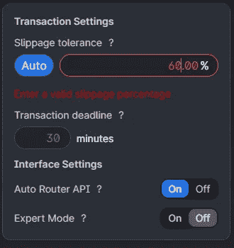

# 道之日

> 原文：<https://medium.com/coinmonks/day-of-the-dao-df13c70c528d?source=collection_archive---------46----------------------->

也许如果我们试着一起工作，我们可以缓解一些紧张...

**但是我们都朝着不同的方向前进。**

# 什么是刀？

它代表分散的自治组织。

***我们来分解一下。*** 
**分散**:不集中。好吗？也许吧。你听说过邓巴的号码吗？这是在秘密圈子里出现的东西，纸上谈兵的经济学家把福柯主义比作康普茶。

如果你没有在秘密空间逗留足够长的时间来理解我们已经迷化的精简哲学；邓巴的数字被认为是你能有意义地联系的最大人数。你可以有大约 15 个有意义的朋友，50 个熟人，那么，包括这 65 个人——你的社交圈最多有 150 个人。如果这些人在两小时车程内去世，你可能会参加他们的葬礼，否则你会送花。当然，你可以认识更多的人，但是你并不真正了解他们的生活、抱负和奋斗。那么，总统、议员或市长是如何代表数百万人做决定的呢？分权说:不能，所以不要一个领导；有很多——给他们自主权。

**自主**是为自己做决定的权利和能力。如果社交媒体是一个指标的话，这是一个很难理解的简单概念。

假设你要举办一次聚餐，你邀请你 15 个最亲密的朋友，带上他们想要的任何东西。

一个人想带他们的泰国花生沙拉，但另一个人对花生过敏，每个人都应该为这个人的过敏做准备吗？这是否减损了他们的自主权？
**否**因为群体的自主性允许它为了群体中每个人的健康和利益做出决定；如果你认为这个群体是一个巨大的，有 15 个部分的变异人，你可能会说弗兰肯斯坦的怪物不应该牺牲他们的怪物脚在火中漫步。火是整洁的，是的，在火中行走至少整洁 100 倍——但是拥有健康完好的脚是令人向往的。现在，不再是一群走火的变异个体，想象它是一个组织。

一个**组织**绝对不止一个人，很可能不止两个。这个由两个或两个以上的人组成的小组有着相同的目标，所以他们协作并分担任务——因此形成了一个组织。

现在，把这些概念结合在一起，然后就可以了。

如今，每个路线图都有一个 DAO 计划。从 Lunifty 的第一天开始，当我们还在考虑叫它 LuneUnit 或者 SpaceFace 的时候，就有人问我们什么时候道。我们说“可能在 10 月的某个时候”,因为没有人关心第四季度开始时会发生什么，希望那时每个人都已经忘记了。

## 如果我们做了，那会怎样？

制定 DAO 需要编写一个治理系统，允许成员对组织内的决策进行投票。首先决定你的刀将如何运作；什么可以投票？参与有哪些激励措施？什么时候投票？每把刀都不一样。

然后，您需要资金，您可以通过创建允许投票和参与 DAO 的令牌来做到这一点，您可以给高利益相关者的投票更多的权重，或者使所有参与者，无论其份额大小，在 DAO 眼中都是平等的。

最后，释放。给你的创造物呼吸，看着它改变、成长或瓦解。任何有钱有意愿的人都有机会根据自己的愿望改变组织的方向，现在，对自私利益的制衡在于那些反对他们的人的联合力量。该理论认为，没有人能够滥用该系统，因为联合控制将导致所有参与者受益的决策。我们刚刚是在买进的情况下实现了民主吗？或者，正如我们现在所说的:**民主。**

关键成分是区块链。Dao 位于区块链上，所有的事务都被记录下来，并且可以访问，从而增加了一点责任感。没错，我们在用*交易投票。*

## 现在我们不需要遭受暴政

利他主义会让你无处不在。人们对平等的机会和发言权感觉更好。

你需要刀吗？

在学校做过小组项目吗？没有一个领导或者有能力决策和分配任务的人，所有的工作通常都落到我身上，我是说，一个人。在生活中充满风险的科学展览实验中，你需要一个本生灯，而你微薄的津贴根本不够。为什么不让父母很有钱的梅丽莎给你买一个呢？梅丽莎得到了一些荣誉，你得到了有毒的粘液，每个人都赢了。
**在道中参与者必须得到回报，否则他们为什么要做我们想让他们做的事情？**

道对投资者来说并不都是空洞的吸引力，至少其中一些不是。在一个团队中，每个人都觉得自己是最重要的一部分，是一切的基石。道可以阻止魅力型的人转移低调务实的人的目标。

## 但是正常人(非密码族)呢？)

加密货币这个词本身已经成为我们这些多年前进入太空的人和那些只在主流新闻中听说过它的人之间的障碍。空间之外的人听到“加密货币”，他们会想到比特币、Quadriga 或 Dogecoin，一个密码迷听到“加密货币”，会想到区块链、桥梁、地毯、汽油费、公用事业、隐私、诈骗和一个古怪的另类 twitter 社区。

像 wealthsimple、robinhood 和其他应用程序创造了一个进入密码世界的入口，但也创造了一个保护投资者免受更广泛、更深入、更危险的复杂海洋影响的潮流池。用 Robinhood 买了 Dogecoin 的人能想出如何在 [Uniswap](https://uniswap.org/) 上购买定制令牌吗，他们知道如何增加滑点还是会放弃？

Let me have my suscoin and stop infringing on my autonomy, uniswap!

道是一个令人烦恼的术语——它听起来很技术化，很复杂，而且容易被忽视，而不是一头扎进去。它应该不需要太多的背景知识和[密码术语表](https://coinmarketcap.com/alexandria/glossary)来理解它基本上是一个区块链的合作项目。

合作组织已经存在很长时间了，它们是雇员和客户都是股东的组织，就像好市多一样，但道是以一种全新的方式进行营销的。不承认密码世界正在以利用新技术的方式重复使用旧的公式和结构，我们最终会在理解上产生差距，随着我们获得的每一个新工具和重新命名的每一个新工具，这种差距都在扩大。

道是工具，它们是古老的工具，也是有用的工具——但它们本身没有好坏之分。“道”的存在并不意味着一个抵制操纵的公平体系，但它可能是朝着正确方向迈出的一步。

[lunifty.io](https://www.lunifty.io/)

[不和谐](https://discord.gg/gzQ2EWNWFk)

[推特](https://twitter.com/lunifty)