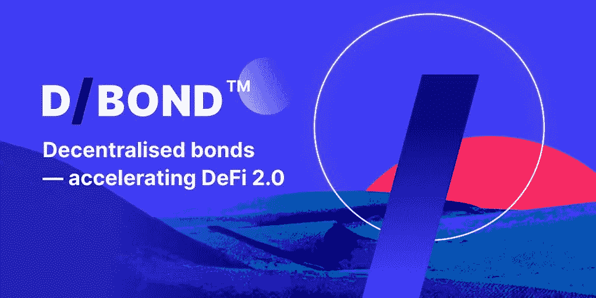

# DBit 和 DGov 用例

> 原文：<https://medium.com/coinmonks/dbit-and-dgov-use-cases-3cf7740b88d?source=collection_archive---------9----------------------->

D/债券指数令牌(DBit)和分散债券治理令牌(DGov)在确保优化[D/债券](http://debond.org)以实现其预期目标方面发挥着有些交织但不同的作用，特别是在分散债券(D/债券)方面。

代币在我们的创新平台上服务于互联目的，该平台寻求将任何数字资产证券化，并降低主要[传统金融(TradFi)](https://forkast.news/defi-traditional-finance-should-tradfi-be-scared/) 资产类别债券的准入门槛。

**DBit、DGov 和 D/Bonds**

D/Bond 开创了 ERC-3475 标准，将 D/Bond 作为区块链的一种资产类别，利用该技术的去中心化和点对点(P2P)功能，让尽可能多的人在没有大银行中介的情况下交易、投资、借贷和借入债券。

ERC-3475 是节能的，可以管理多个债券，存储更多的数据，并允许任何区块链上的代币创建自己的债券。新的流动性池(LP)令牌标准彻底改变了债券创建流程，从旧的 TradFi 系统转变为新的区块链驱动的[分散金融(DeFi)](https://ethereum.org/en/defi/) 系统。

**关于国债**

ERC-3475 标准旨在允许有限合伙人和借款人就贷款/债务达成可定制的协议，并在新的金融**衍生品**引入 **DeFi** 时管理赎回条件和价格范围。

除了作为发行债券的工具之外，债券还可以用来创造各种金融衍生品，如期权、期货、掉期等。通过将证券化合同投射到区块链网络，并使用 oracle 机器来促进链外债券的交易，也可以为链外衍生品实施这些协议。这些衍生物有几个用途:

1.  通过签订反向移动的衍生产品合同来抵消部分潜在损失，从而进行对冲或降低投资风险。
2.  用于创建衍生产品价值与预定条件或事件(如基础资产达到特定价格水平)相关的期权。
3.  提供杠杆作用，基础价值的轻微变动会导致衍生产品价值的巨大差异。
4.  从投机市场运动中获利。
5.  通过同时进入两个或多个市场进行交易来获得无风险利润。

**D/Capital 和 D/Bond 治理平台**

我们的生态系统由几部分组成。其中最重要的是 D/Capital，它处理债券等证券，以满足投资者利益的特定投资目标；D/Bond 治理平台使用称为“提案”的链上程序作为投票程序的对象。

D/Capital 基于基金管理公司的去中心化模式，基本上复制了你所知道的风险投资、投资银行或非营利组织的一切。

作为一家更好的投资银行——与 TradFi 不同，D/Capital 使用加密区块链技术来保证透明度实施的可访问性和可信度——D/Capital 可以从投资者那里借钱来资助创业公司、购买股票、投机金融市场等。

D/Capital 可以使用 D/Bonds 的抵押资产为其他 DeFi 项目建立 LP，投资于种子期等。它为 D/Bond 提供了投资或孵化任何链上项目的机会，而其在爱沙尼亚注册的法律实体(其银行账户将由会计公司审计)将涵盖链外投资。

同时，D/Bond 用户和社区将参与整个流程，因为 D/Capital 的所有投资决策，无论是链上还是链下的，都需要在治理平台上通过投票来批准。

治理平台提案通常采用开源智能合同的形式，该合同对治理系统施加了执行代码内容的基本义务，如支出资金、发放分配、更新智能合同等。

**D/Capital 和治理平台的组合功能带来了 D/Bond 平台上两种数字资产的一些交织使用案例。**

1.  要投票支持一项提案，你需要选票。要获得投票，你必须购买并持有 DGov 的专用合同才有资格。所有投票支持某项提案的用户都会获得与他们的投票数量和投票时间成比例的 DBit 奖励。
2.  D/Capital 还在投票支持提案时提供红股。只有间接持有 D/Capital 投资的链上和链下项目份额的 DGov 持有者才能获得奖金奖励。
3.  用户必须首先购买或持有 DBit 或 DGov，以发行债券，他们可以在到期日以结算货币赎回这些债券。购买法需要根据抵押资产的价值铸造新的 DBit，而赌注法将相应数量的 DBit 从 LP 转移给投资者。

总而言之，DBit 作为 D/Bond 生态系统的结算货币。它是协议的本地主要资产，代表和衡量基于效用和概述的商业模式的 D/债券市场的投资绩效和特征。DGov 代表投资者对 D/Bond 的主要去中心化治理平台 D/Capital 投资的持股证明。

> 另外，阅读

*   [OKEx vs KuCoin](https://coincodecap.com/okex-kucoin) | [摄氏替代度](https://coincodecap.com/celsius-alternatives) | [如何购买 VeChain](https://coincodecap.com/buy-vechain)
*   [ProfitFarmers 回顾](https://coincodecap.com/profitfarmers-review) | [如何使用 Cornix 交易机器人](https://coincodecap.com/cornix-trading-bot)
*   [如何匿名购买比特币](https://coincodecap.com/buy-bitcoin-anonymously) | [比特币现金钱包](https://coincodecap.com/bitcoin-cash-wallets)
*   [瓦济里克斯 NFT 评论](https://coincodecap.com/wazirx-nft-review)|[Bitsgap vs Pionex](https://coincodecap.com/bitsgap-vs-pionex)|[Tangem 评论](https://coincodecap.com/tangem-wallet-review)
*   如何使用 Solidity 在以太坊上创建 DApp？