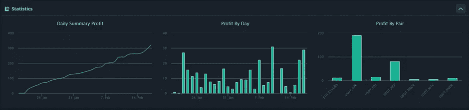

# 交易机器人，他们实际上工作吗？他们实际上是被动收入吗？我还没决定…

> 原文：<https://medium.com/coinmonks/dca-bots-do-they-actually-work-and-are-they-actually-passive-income-im-undecided-90846b04db2a?source=collection_archive---------2----------------------->

请记住这不是财务建议，请阅读文章底部的免责声明。

在过去的几年里，我花了太多的时间来创建新的机器人，调整和改变设置，在某些情况下，被清算并再次尝试新的设置或新的机器人。我买了测试多种[交易观点](https://bit.ly/3HP7cJY)策略的所有不同变化的工具，我分析了**数百万种**可能的变化。这些指标从众所周知的付费指标到简单的策略，比如 MA 交叉。在这篇文章中，我将从高层次上讲述我在过去 30 天里尝试了什么，学到了什么，以及我的结果是什么？

正如阿尔伯特·爱因斯坦的名言所说“精神错乱就是一遍又一遍地做同样的事情，却期待不同的结果”，那么我是不是精神错乱了？还没有…那么我测试了什么，我学到了什么？

我测试过许多不同的解决方案和机器人。这些从 [3Commas](https://bit.ly/3QIgQ5f) DCA & Grid、Cryptohopper、Capatalise.ai、LickHunter、WickHunter、ScavengerBot、Mudrex 等等。这些平台中的大多数专注于美元成本平均(除了 Mudrex&capitale . ai ),但机器人进入和管理交易的方式根本不同。如果你想让我在另一篇文章中讨论这些，请留下评论。

那么，学习呢？

**少量测试**

这是我能给任何安装机器人的人的第一条建议。我见过无数的 YouTubers 声称使用交易观点策略，他们使用 100%的账户资金，过去 12 个月的结果是一些荒谬的 7 位数百分比。**这不现实！**管理你的风险，使用少量资金，并让其积累。如果市场发生变化，你最终亏损了，你希望这会侵蚀你的利润，而不是清空你的账户。这很好地引出了下一点。

**如果你使用杠杆，做好被清算的准备**

如果使用得当，杠杆是一个很好的工具，但你是在玩一个有风险的游戏。在对我运行的机器人过于自信后，我用相对较低的杠杆承受了我最大的实际损失(证明如下)。当我被清算时，这个 ETH 值 17724 美元。这是一个昂贵的教训，但它确实减少了税单，所以每个银云，对不对？

**没有一劳永逸的策略(除非你有很多钱)**

更大的市场趋势的变化使得制定和忘记 DCA 策略变得非常困难，除非你有很多钱来持有大量未平仓头寸，并且你可以等待数月来平仓。对于那些账户较小的人来说，设置并忘记这些可能会让你一次坐在袋子里几个月，当其他赚钱的机会存在时，你的资金就会被套牢。站在市场的顶端和趋势的变化可以大大减少几个月来拿着袋子赚相对较少的钱。不像人们说的那么消极，对吗？

**回溯测试您的策略！**

我用 [3Commas](https://bit.ly/3QIgQ5f) 中的开箱即用设置交易了这么多机器人。这些并不适用于所有的硬币或硬币对。根据你的回溯测试结果选择一个 bot 策略。这可能是一个痛苦、漫长、永无止境的任务，但这可以给你一个很好的信心，让你相信这个策略适合这两个人。或者，如果你使用 DCA 机器人，我有一个 [TradingView](https://bit.ly/3HP7cJY) 指示器，可以在文章的后面帮助你。

**我没有在我的 DCA 机器人上使用止损**

我每天监控我的机器人，背面测试给了我信心，他们会自己解决问题。如果我有一笔看起来对我不利的未平仓交易，我会查看图表，分析技术并做出决定。有时，我会接受损失并手动平仓，但考虑到一些密码的规模，我不想在自己查看价格之前被止损。在某些情况下，我有另一个指标来帮助我决定什么时候手动 DCA，让我摆脱棘手的位置。稍后将详细介绍这一点！

**找一双有很多灯芯的鞋**

我希望我交易的货币对有波动性。我希望价格触及我的安全订单，并迅速获利。如果你能找到这种情况经常发生的图表，那么你就能相对较快地在你的资本上获得不错的百分比。

**找到一个指标，当趋势改变时，它将停止你的 bot，并关闭你的未平仓交易**

无论我的 DCA 机器人在当前趋势中表现如何，我都不想在 BTC 趋势变化时做多。如果我有一包特定的密码，我打算积累，我切换到一个短机器人对。这在现货交易中是有效的，卖出一些你有的袋子，然后以更低的价格买回。

**提示#1** :在 [TradingView](https://bit.ly/3HP7cJY) 中有一个免费策略叫做“Zendog V3 回溯测试 DCA bot 3commas”。这允许您使用 RSI-7 启动条件回测所有不同版本的 [3Commas](https://bit.ly/3QIgQ5f) 机器人。它显示了达到你的安全订单的次数，甚至分解了前 X 天的日回报率。

**提示#2** :如果你处于多头头寸，并且你被留下了一个袋子，并且你需要一些手动 DCA 的确认，有一个免费的 [TradingView](https://bit.ly/3HP7cJY) 指示器，由 TheTradingParrot 称为 Add find simulator。这甚至可以通过使用[trading view](https://bit.ly/3HP7cJY)&[3 commas](https://bit.ly/3QIgQ5f)在一定程度上实现自动化。

**我最近 30 天的成绩如何？**

我在下面附上了过去 30 天我的机器人性能的截图。

[**库币**](https://bit.ly/39nzbDQ) **细目**

在 Kucoin 上，我正在为 Multivac (MTV)运行一个长机器人，为 deep Network(DPR)运行一个短机器人。为什么？

好吧，让我们从 DPR 机器人开始。

首先要注意的是，就美元而言，自从我开始运行以来，这个机器人一直处于亏损状态。为什么？嗯，当我设置机器人时，我犯了几个匹配设置的错误，我们有一个巨大的泵，而不是等待看它是否恢复，我接受了损失，改变了设置，现在我赚回了$美元。如果我等待，它也会以盈利收盘…..也许这里还有另一个教训…..

但是为什么是 DPR 呢？

我最近买了一个更深的连接迷你，我一直在等待它出货的最后几个星期。如果你不熟悉这个设备，这是一个分散的 VPN 设备，你可以在家里使用，它支持 DPR 的网络。要求的一部分是赌注一些 DPR 代币，以增加每日收入。上个月我买了 10，000 个 DPR，放在我的钱包里，直到矿工出现，现在还没有到，所以我借此机会运行一个短机器人来增加 DPR 的数量。

MTV 龙

这个项目似乎得到了很多关注。如果我是诚实的，这是一个项目，我赚了很多钱，去年和兑现后(太早了！).当我回来测试一个 TEMA 交叉策略时，我发现了一些有趣的结果，这个策略让这个机器人成为了我在[3 社区](https://bit.ly/3QIgQ5f)的一个新机器人。

[**币安**](https://bit.ly/3OfkcKY) 击穿

**ENJ、KEY、MBOX & RNDR 短裤**

我拿着一些 Web 3.0 项目的袋子，挑选了所有这些项目。所有这些机器人都是基于 Zendog V3 回溯测试指示器的各种设置，结果非常好。几个月前我启动了钥匙机器人，我从来不需要去碰它。在过去的几天里，我只安装了 ENJ、MBOX 和 RNDR 机器人。

根据这个数字，这个月账户的总百分比收益是多少？嗯，我在这些账户里大约有 4100 美元。30 天收益为 320 美元，这个月这个账户增长了 7.8%。我真的很满意这个结果，在过去的几天里，我创建了几个新的机器人，我很高兴看到下个月我们是否能超过这个数字！

**关联链接**

您更多的福利也可以在这里找到:[https://linktr.ee/RealisticCrypto](https://linktr.ee/RealisticCrypto)

另外，如果你想请我喝杯咖啡或啤酒:

BTC-bc1 qaxa q2q 9 js 89 gyzhr 0202 xt6h hgchprqjga5px

ETH，BNB，AVAX，SOL，FTM 基令牌-0x3b 7b 843d 8125 Fe 7b 541 e 1d 751 a 4 a 73 f 0 cfad 4c

**免责声明**

这不是财务建议，我不是财务顾问、会计师或税务专家。这是我对帮助过我的软件工具的体验，也是我使用这些工具的体验。

我确实在本指南中使用了推荐链接。使用这些工具支持未来的文章，所以如果您认为本文有用，并且您想查看我介绍过的工具，请使用它们。我还会告诉你哪里有折扣——双赢，对吗？

> *加入 Coinmonks* [*电报频道*](https://t.me/coincodecap) *和* [*Youtube 频道*](https://www.youtube.com/c/coinmonks/videos) *了解密码交易和投资*

# 此外，请阅读

*   [书签评论](https://coincodecap.com/bookmap-review-2021-best-trading-software) | [美国 5 大最佳密码交易所](https://coincodecap.com/crypto-exchange-usa)
*   最佳加密[硬件钱包](/coinmonks/hardware-wallets-dfa1211730c6) | [Bitbns 评论](/coinmonks/bitbns-review-38256a07e161)
*   [新加坡十大最佳密码交易所](https://coincodecap.com/crypto-exchange-in-singapore) | [收购 AXS](https://coincodecap.com/buy-axs-token)
*   [红狗赌场评论](https://coincodecap.com/red-dog-casino-review) | [Swyftx 评论](https://coincodecap.com/swyftx-review) | [CoinGate 评论](https://coincodecap.com/coingate-review)
*   [投资印度的最佳加密软件](https://coincodecap.com/best-crypto-to-invest-in-india-in-2021)|[WazirX P2P](https://coincodecap.com/wazirx-p2p)|[Hi Dollar Review](https://coincodecap.com/hi-dollar-review)
*   [加拿大最好的加密交易机器人](https://coincodecap.com/5-best-crypto-trading-bots-in-canada) | [库币评论](https://coincodecap.com/kucoin-review)
*   [用于 Huobi 的加密交易信号](https://coincodecap.com/huobi-crypto-trading-signals) | [HitBTC 审查](/coinmonks/hitbtc-review-c5143c5d53c2)
*   [如何在 FTX 交易所交易期货](https://coincodecap.com/ftx-futures-trading) | [OKEx vs 币安](https://coincodecap.com/okex-vs-binance)
*   [OKEx vs KuCoin](https://coincodecap.com/okex-kucoin) | [摄氏替代品](https://coincodecap.com/celsius-alternatives) | [如何购买 VeChain](https://coincodecap.com/buy-vechain)
*   [ProfitFarmers 回顾](https://coincodecap.com/profitfarmers-review) | [如何使用 Cornix Trading Bot](https://coincodecap.com/cornix-trading-bot)