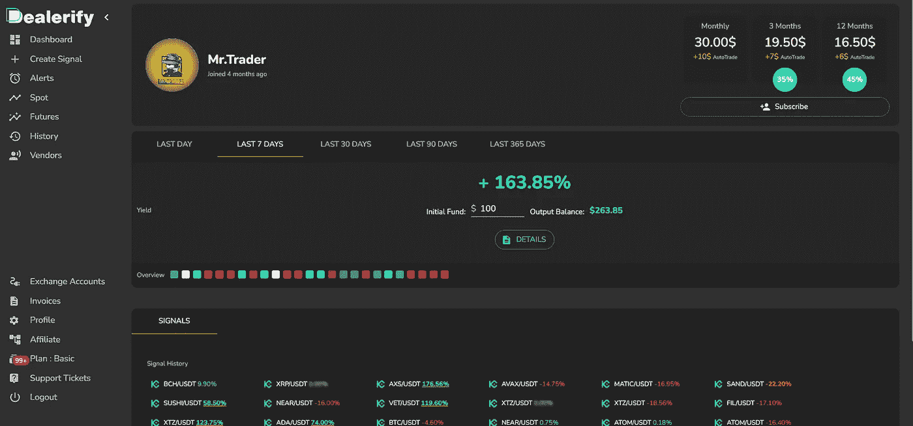
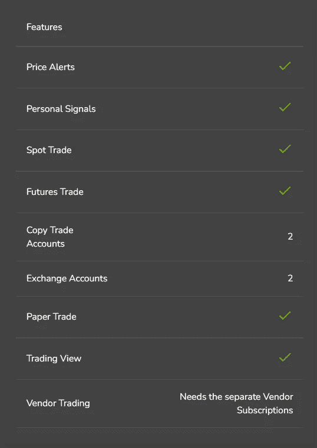
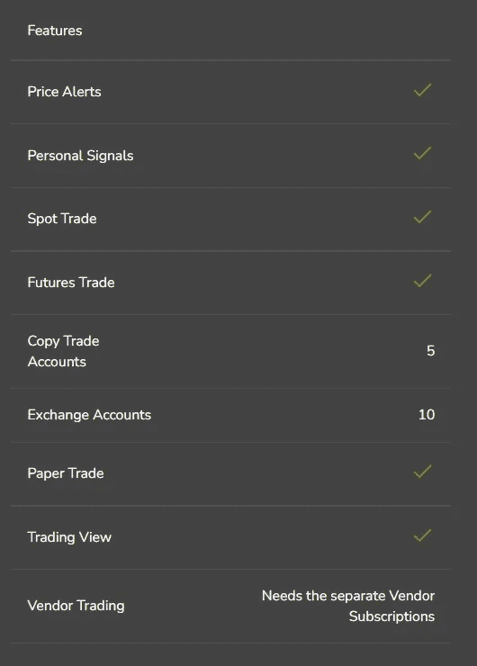

# 取消交易平台审核

> 原文：<https://medium.com/coinmonks/dealerify-review-9b45808fbc63?source=collection_archive---------41----------------------->

# 取消副本验证-交易平台审查

*是一个专业的交易、复制交易、自动交易平台。这个平台上有许多不同的重要服务，对每个级别的交易都有用。Dealerify 希望让加密货币世界中的交易变得愉快，并让各个层次的所有人和交易者都能获利。*

*Dealerify 在进入该平台之初为其所有用户提供了 7 天的免费设施，以便他们可以免费熟悉平台条件及其功能和优势。*

*为了它的用户的安全和方便，这个平台没有访问你的交易所账户或者钱包的权限，你只把你的交易所 API 连接到平台上，你就可以安全的交易，确保你的资金在交易所是安全的。*

*这里我将介绍一个最好的复制交易平台，Dealerify:*

***解除验证平台的特性:***

## *[取消验证功能](https://dealerify.io/blog/dealerify-features/):*

*Dealerify 是一个专业而简单的交易平台，用于发展加密货币交易行业，旨在通过提供该领域各种有吸引力的服务来帮助加密货币领域的所有交易者。在这一部分，我们将介绍 Dealerify 交易平台的特点。这些功能包括以下内容:*

*–Dealerify 的一个重要特点是，它将整个充满数字的交易空间转化为一个协调的空间。您可以在页面上查看您的头寸，并尽快为每个头寸做出您想要的任何决定。*

**

*–Dealerify 在进入该平台之初为其所有用户提供了 7 天的免费设施，因此他们可以免费了解平台的情况及其特性和优势。你可以很容易地测试这个平台，它将帮助你做出最佳选择。*

*–自动化交易是该平台的有用工具和功能之一，适合初学者。使用这个工具，你可以很容易地使用在 Dealerify 中被称为“卖方”的专业交易者的信号和策略。*

**

*–对于专业交易者来说，Dealerify 的最佳功能之一是能够在一个非常简单实用的空间内同时交易和管理 20 个用户账户，只需访问一个账户，而不是几个账户。对于想要管理多个账户的人来说，这其实是一个非常有用的功能。*

*–根据您在 Dealerify 中的计划，您可以将另一个帐户连接到您的帐户并管理它们。在基本计划中，您可以将 2 个帐户连接到您的帐户。在 Pro Plan 中，您最多可以添加 10 个帐户，而在 Portfolio Plan 中，您最多可以连接 20 个帐户。*

**

*–为了其用户的安全和方便，该平台无法访问您的交易所账户或钱包，您只需将您的交易所 API 连接到该平台，因此您可以安全地进行交易，并确保您的资金在交易所中是安全的。*

*–Dealerify 的另一个重要功能是，您可以设置每个头寸的最小和最大投资资本。这是一个优势，让你更灵活地管理你的资产。*

**

*-警觉有助于你在市场中保持敏锐。在交易的世界里，你必须不断地监控市场，这样你才能有好的货币和合理的进场价格。但这并不总是可能的，而且从长远来看，你不可能检查你脑海中的所有加密货币，很明显这非常耗时。但在 Dealerify 中，您可以在提醒功能的帮助下输入所需的配对及其价格条件，一旦达到这些条件，Dealerify 智能平台就会通知您。*

*–您可以在 Dealerify 平台上查看所有更新的 exchange 帐户余额。连接到平台的所有帐户都可以访问。您的现货和期货账户余额会被单独和连续更新。*

## *取消验证的优点:*

*   *简化的用户体验*
*   *来自专业供应商的信号*
*   *全面详细的贸易分析*
*   *市场价格预警*
*   *简化的 P&L 计算*
*   *透明的供应商报告*
*   *设置订单而不冻结资产*
*   *保护期货头寸免受清算*
*   *熊市中的应急提取能力*
*   *管理多个账户和交易所*
*   *交易不会向您收取额外费用*
*   *高安全性&不需要提款许可*
*   *你不会因为资本的多少而支付更高的费用*
*   *能够确定复制交易中使用的资本量*
*   *24 小时支持和响应*

## *取消认证的缺点:*

*   *交换数量有限(仅支持币安、库币和比特)*

## *取消验证计划:*

*Dealerify 为其用户提供了 3 组计划，为他们提供不同层次的服务。您可以在您的 Dealerify 账户中的 [***计划部分***](https://dealerify.io/platform/#/subscriptionplans) 完整详细地看到上述计划的所有功能和规格，并了解每个计划的费用，根据您的需要选择计划。所有计划按月、按季度和按年提供。*

**

*   *基本计划:*

*这个计划适合个人交易和学习。所有个人交易功能，最多 2 个交易账户和 2 个复制交易账户。*

**

*   *专业计划:*

*专业计划非常适合专业交易者。包含所有基本帐户功能，最多可用于 10 个交易帐户和 5 个复制交易帐户。*

**

*   *投资组合管理计划:*

*这个计划适合个人交易和学习。所有基本帐户功能加上 20 个交易帐户限制和 20 个复制交易帐户。*

**

## *取消用户验证:*

**

*1-新手:*

*无论你是交易界的新手，还是没有时间和耐心去交易，你都可以订阅我们的专业厂商，让他们用他们的“策略”和他们的“信号”来指导你。想要更容易吗？激活自动交易模式，坐收渔利。*

*2-交易商:*

*如果你被交易所的多样性分散了注意力，或者你的订单在不同的交易所丢失了，如果你的资产被你的交易所设置的限价单冻结了，那么你应该看看 Dealerify 的可能性。*

*3-供应商:*

*如果你是一个经验丰富的可靠的交易者，甚至在交易中给别人提建议，也许你有一些学生，自己管理一家企业，那么你可以加入我们的专家供应商俱乐部，带领别人赚更多的钱。*