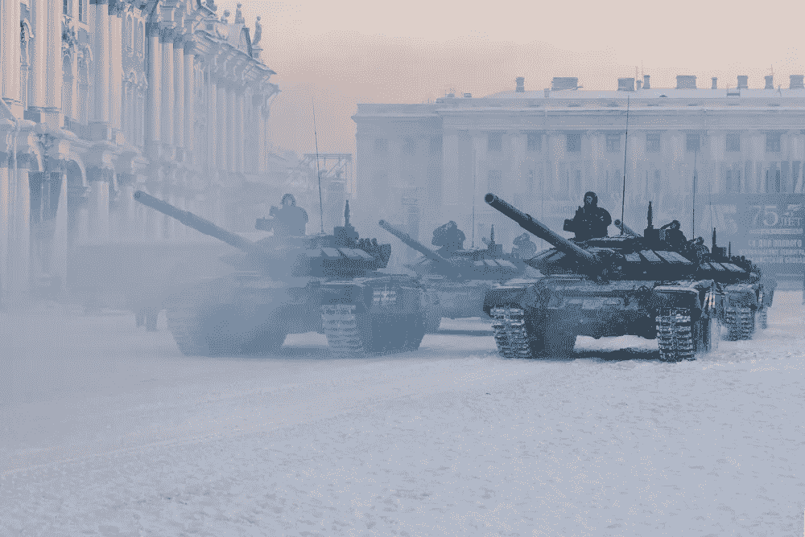

# 亲爱的乌克兰朋友们

> 原文：<https://medium.com/coinmonks/dear-friends-in-the-ukraine-81166da704bf?source=collection_archive---------10----------------------->

*全球社区支持你，而政府却让你失望*

好了，我们开始吧。

战争。有坦克和大炮。又来了。

尽管我们作为一个民族已经取得了很大的进步，但我们似乎无法解开那种为了一些过时的边界争端观点而杀人的强烈欲望。看起来如此愚蠢和穴居。

也像是希特勒入侵捷克斯洛伐克的翻版。那是 80 多年前的事了，如果一个屁股上有根汗毛的人有能力做点什么的话，我们以为我们在二战中为之奋斗的一切，以及我们在全球支持系统上的所有投资都毫无意义。

真的是时候质疑我们的整个存在了。或者说，我们的生存方式。

注意今天早上全球市场的底部下跌。所有这些都通过一个松散的国家利益联盟联系在一起，旨在避免这种事情的发生。但是，从来没有。

这些都没有简单的答案。但是贯穿历史上所有战争的共同主线是与中央控制相关的疯狂。一个人挑起战争。一个怪人。

乔治国王，拿破仑，林肯，戴维斯，希特勒，布什，本·拉登，等等…

普京。

每场战争都有一张面孔。这个是普京。一个人。又来了。

我想正常人已经受够了这种废话。

我们不知道 Web3 是什么意思。但去中心化的网络、货币和权力结构的承诺之一是，没有一个人。

共识模式取代了极权主义。

谁会投票支持去乌克兰打仗？没人。

有一个人会。

罗斯·佩罗多年前设想的那种全民公决模式现在已经成为可能。

问题和障碍在于中央集权必须将权力交还给人民。权力不喜欢这样做。问问加拿大。和美国。

我的公司在乌克兰有商业伙伴。我们送上我们的爱。但是面对进入他们国家的军事力量，爱情还有什么机会。

这是一个梦。也许这很疯狂。也许对大多数人来说这有点太约翰·列侬了，但是…

想象一下…..

想象一下一个没有边界的社区。

想象一种没有联邦银行为这些似是而非的战争印钞的货币。

想象一个通过共同利益和国家利益联系在一起的民族。

想象一下，畅通无阻的沟通渠道将世界各地的人们联系在一起。

想象一下 Web3。

和平。

> *加入 Coinmonks* [*电报频道*](https://t.me/coincodecap) *和* [*Youtube 频道*](https://www.youtube.com/c/coinmonks/videos) *了解加密交易和投资*

# 另外，阅读

*   [3 商业评论](/coinmonks/3commas-review-an-excellent-crypto-trading-bot-2020-1313a58bec92) | [Pionex 评论](https://coincodecap.com/pionex-review-exchange-with-crypto-trading-bot) | [Coinrule 评论](/coinmonks/coinrule-review-2021-a-beginner-friendly-crypto-trading-bot-daf0504848ba)
*   [莱杰 vs n rave](/coinmonks/ledger-vs-ngrave-zero-7e40f0c1d694)|[莱杰 nano s vs x](/coinmonks/ledger-nano-s-vs-x-battery-hardware-price-storage-59a6663fe3b0) | [币安评论](/coinmonks/binance-review-ee10d3bf3b6e)
*   [Bybit Exchange 审查](/coinmonks/bybit-exchange-review-dbd570019b71) | [Bityard 审查](https://coincodecap.com/bityard-reivew) | [Jet-Bot 审查](https://coincodecap.com/jet-bot-review)
*   [3 commas vs crypto hopper](/coinmonks/3commas-vs-pionex-vs-cryptohopper-best-crypto-bot-6a98d2baa203)|[赚取加密利息](/coinmonks/earn-crypto-interest-b10b810fdda3)
*   最好的比特币[硬件钱包](/coinmonks/hardware-wallets-dfa1211730c6) | [BitBox02 回顾](/coinmonks/bitbox02-review-your-swiss-bitcoin-hardware-wallet-c36c88fff29)
*   [BlockFi vs 摄氏度](/coinmonks/blockfi-vs-celsius-vs-hodlnaut-8a1cc8c26630) | [Hodlnaut 审核](/coinmonks/hodlnaut-review-best-way-to-hodl-is-to-earn-interest-on-your-bitcoin-6658a8c19edf) | [KuCoin 审核](https://coincodecap.com/kucoin-review)