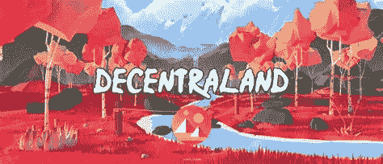

# 分散的土地:元宇宙之旅

> 原文：<https://medium.com/coinmonks/decentraland-a-journey-into-the-metaverse-3da842242b43?source=collection_archive---------53----------------------->

分散的土地是一个分散的元宇宙，由它的用户建造、开发和拥有。让我们来看看它是如何工作的。

在元宇宙，玩家可以购买土地，创建独特的建筑，并随心所欲地与其他用户互动。

界定它的界限并不容易，因为像这样的虚拟世界不能被简化为一个游戏赚钱的视频类别…