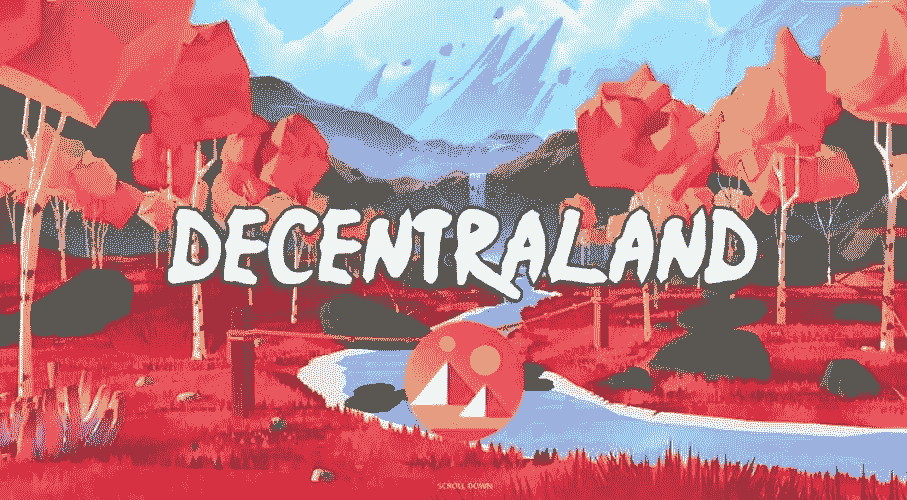

# 分散土地(MANA)价格预测 2022–2025

> 原文：<https://medium.com/coinmonks/decentraland-mana-price-prediction-2022-2025-7698b75562c4?source=collection_archive---------14----------------------->

Source photo [Decentraland (MANA) — Bing images](https://www.bing.com/images/search?view=detailV2&ccid=KAWrBwwr&id=B6FB3C1D64A28CD0010B427C57A7AECE0E806219&thid=OIP.KAWrBwwrqQyP0SBt1bRKLwHaEF&mediaurl=https%3a%2f%2fwww.comocompraracciones.es%2fwp-content%2fuploads%2f2021%2f05%2fInvertir-en-Decentraland-MANA-Todo-lo-que-necesita-saber.jpg&cdnurl=https%3a%2f%2fth.bing.com%2fth%2fid%2fR.2805ab070c2ba90c8fd1206dd5b44a2f%3frik%3dGWKADs6up1d8Qg%26pid%3dImgRaw%26r%3d0&exph=500&expw=907&q=Decentraland+(MANA)&simid=608035780254376198&FORM=IRPRST&ck=27D5C6598DDA8F3343B1BC177E445372&selectedIndex=2&ajaxhist=0&ajaxserp=0)

## 什么是分权制？

使用区块链技术，分散土地是一个虚拟现实平台。这是一个类似电影《创》和《玩家一号》中的虚拟世界，但它是基于现实的。魔法令牌在分散土地市场上被接受，可以用来购买和出售虚拟商品和服务。在加密货币世界中，不可替代的令牌(NFT)…