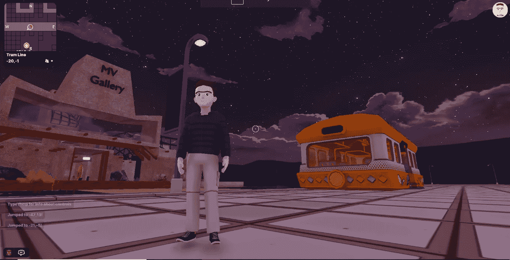
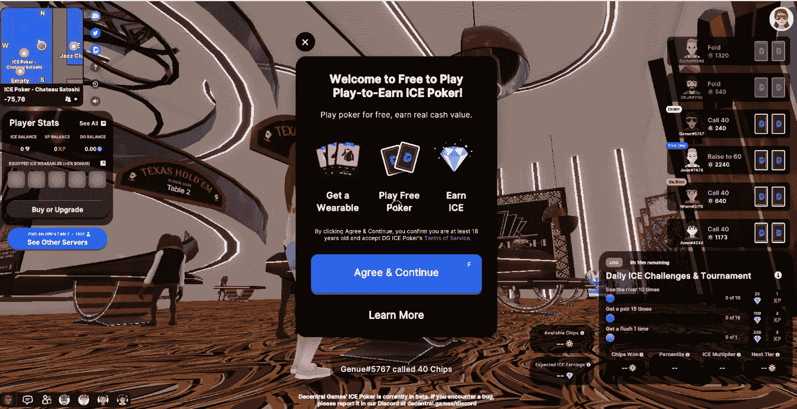

# 分散之地的元宇宙很无聊，功能空虚，让你晕车

> 原文：<https://medium.com/coinmonks/decentralands-metaverse-is-boring-functionally-empty-and-gives-you-motion-sickness-dbda7e42a51f?source=collection_archive---------7----------------------->

Decentraland, a lonely place to be.

我们已经收到了一封电子邮件，其中包含了 843342639 美元的临时订单。尽管如此，我们的实习仍然是在商品市场进行的。

未来我们可能会在元宇宙玩耍、社交、工作和发展，但不是今天。

两周前，当我第一次在分散土地上设计我的虚拟形象时，我以为我的生活将不再一样。我认为 Web3 会让最疯狂的技术奇迹变成现实——我几乎抱有希望。

对我和所有其他人来说，最受欢迎的分散式元宇宙仍然是空洞、无聊的，与青少年会扔掉的另一款网络游戏没有太大区别。

# 大肆宣传

在一份题为“元宇宙的机遇”的报告中，摩根大通声称，元宇宙“可能会在未来几年以某种方式渗透到每个行业，市场机会估计超过 1 万亿美元的年收入。”报告发布后，分散土地的土地权当天飙升了 8%以上。

JP 摩根是银行业中第一家进入元宇宙的公司。该银行已经建立了“Onyx”休息室，该休息室以该银行在分散地的 Metajuku Mall (94，21)现有的一套基于以太坊的服务命名。

在脸书宣布将更名为 Meta 后，与元宇宙相关的加密货币出现了两位数的增长。分散之地的货币法力在 24 小时内以 44.6%的涨幅领先。

终于感觉真实了。这是我决定探索梦幻世界的时候。

我大错特错了。

# 统计数据

分散地每月活跃用户群约 30 万人，日活用户 18000 人。根据 nft-stats.com 的数据，在过去的 7 天里，分散式非功能性食物被卖出了 110 次。分散土地的总销售额为 286 万美元。分散土地 NFT 的平均价格为 2.6 万美元。有 6，789 个分散的土地所有者，总共拥有 97，328 个代币。

截至发稿时，分散的加密货币 MANA 的 LTP 为 2.43 美元，分散的市值为 44.5 亿美元。

# 分散的土地基本上是空的

分散土地上的每块土地长 16 米，宽 16 米，代表一个 NFT。分散区域被划分为网格，创世纪广场位于网格的中心(0，0)。所有的化身在每一个阶段都从创世纪广场开始。

用户可以通过交互式 2D 地图从一个地方跳到另一个地方。在地图中可以看到，大多数空间是空的，中间几乎没有分布的命名空间。

地图还用红点显示了用户的集中程度。每次，我都注意到，最高的，也许是唯一的，流量是在赌场和一个叫 Wondermine Crafting Game 的地方。这两个空间吸引最多用户是有原因的。分散地的赌场是赌博空间，人们用加密货币和筹码赌博，希望赢得更多的加密货币。与此同时，Wondermine Crafting 游戏允许用户在开采每隔几秒钟从天空落下的小行星后制造可穿戴的 NFT。

除了这些地方，如果你跳到任何其他地方，迎接你的将是死寂，看不到其他用户。

这是一个诡异的地方。

# 元宇宙的居民，Metazens，不太喜欢社交

关于元宇宙的谈话涉及到人们如何在没有物理障碍的情况下认识其他人。分散地在屏幕的左下角也有一个聊天窗口，目的相同。然而，这里很少出现的文本经常是难以理解的，跑题的，垃圾的，偶尔还有嘿和嗨。

我试着和我所到之处看到的用户交朋友。新手似乎急于问我从平台上赚钱的最快方法，而看似有经验的玩家(穿着怪异、闪亮的可穿戴设备的人)不接受好友请求。

如果他们这样做了，他们会要求你在 Twitter 上关注他们，并标记朋友，以获得 NFT 赠品的资格。

# 没有很多事情可做

在这一点上，分权一点也不好玩。除了赌博和在小行星上采矿以获得 NFT 奖(我已经连续两个星期每天都在采矿)，没有其他事情可做。

我四处冒险，偶尔偶然发现 NFT 的展览和博物馆，它们只伴随着另一个用户的缺席。

# 平台的生存依赖于一场更大的赌博——平台本身

就像我已经提到的，最高的流量出现在赌场，用户不顾一切地想要实现伟大的加密和 NFT 梦。然而，分散式赌场的运作原则与现实生活中的赌场相同:赌场的胜算更大。

如果你来分散地的唯一目的是在赌场赌博，那就在真正的赌博网站上用真钱赌博。平台是一样的，如果不是因为操纵你的角色的困难而变得更糟的话。

The footer says that Decentraland’s ICE Poker is still in its beta and bugs may appear.

# 图像太烂了

我还尝试过另一种“玩即赚”的游戏。它被称为荒野，位于(-45，107)。你射击蝾螈或另一个“邪恶的”玩家，他们向你射击以赚取硬币，然后这些硬币将为你购买 NFT。

画面很普通，玩 3 分钟以上是个挑战。如果你没有晕车，你应该感到幸运。

我不知道这是否是因为我们仍然处于我们想象的新虚拟空间的早期版本，但该平台在用户界面和体验方面并没有感到非常特别。如果这是我们以真实、生动的物理世界为代价得到的虚拟世界，我不想生活在其中。

# 最后的话

在分散化的土地上，每个人都在竞相推广他们的非功能性食物，赢得更多的非功能性食物，并迅速致富。

我觉得元宇宙的用户还没有找到一个更稳定的虚拟空间使用案例。发明加密货币是为了让它们成为一种交换媒介，而不是用资产换取资本收益。类似地，元宇宙被认为是一个更好的向分散生态系统的飞跃，而不是一个渴望 NFT 的僵尸的主要场所。

作为一个真诚希望元宇宙更好的人，我觉得现在卖掉我在现实世界中最喜欢的篮球鞋，购买运动鞋 NFT 与 sumomo#8a8c 进行虚拟一对一比赛还为时过早。