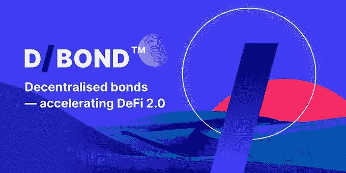

# 分散债券:D/债券在平台发布前启动社区空投活动

> 原文：<https://medium.com/coinmonks/decentralised-bonds-d-bond-kicks-off-community-airdrop-campaign-ahead-of-platform-launch-b1f1f00f13ad?source=collection_archive---------9----------------------->

*空投活动将标志着 D/Bond 分散债券流程的开始，并将本土资产 DBIT 引入流通领域*

**法国巴黎——2022 年 6 月 13 日**——[D/Bond](http://debond.org)，一家寻求通过开创性的 [ERC-3475](https://eips.ethereum.org/EIPS/eip-3475) 令牌标准将分散债券带给用户的创新型 DeFi 初创公司宣布开始空投活动，以奖励忠诚的社区成员。

该活动于 6 月 13 日(星期一)开始，将持续到 2022 年 8 月 8 日，将奖励老 D/Bond 社区成员和新 D/Bond 社区成员，他们的钱包中有高达 35 DBits 的协议原生资产，用于完成一些简单的社交媒体任务。

一些任务包括在推特上关注 D/Bond；喜欢和转发竞选标签:# DeBondAirdrop 在分享转发时至少标记三个朋友，订阅 D/Bond 的时事通讯。其他的是在[介质](https://debond-protocol.medium.com/)上跟随 D/Bond，在 Discord 和[电报](https://t.me/debond_protocol)上加入 D/Bond，推荐三个朋友到 D/Bond 的社区。

用户还可以为他们推荐的每个朋友以及在 LinkedIn 上关注的 D/Bond 获得额外的 5 DBits。他们还可以通过在电报上更改自己的姓名和个人资料图片来反映 D/Bond，从而获得 15 DBits。

DBit(或分散债券指数令牌)是 D/Bond 平台上所有交易的结算货币，包括交易分散债券和赚取投资利息。DBit 的价值从每令牌 1 美元开始，并与 D/Bond 的多层池挂钩。

负责人前往[debond.org/airdrop](https://debond.org/airdrop)参加。

“我们很高兴开始空投活动，因为它是我们计划的一个重要组成部分，让每个人都有机会根据自己的选择进行交易、投资、借贷，”D/Bond 首席执行官 Yunan Liu 表示。“空投启动了让更多人通过我们去中心化的、不涉及大银行的点对点平台进入债券市场的实际过程。这场运动也有助于将 DBit 投入流通。”

除了 airdrop 之外，D/Bond 还发布了[款独特的 D/NFT](https://debond.org/nft)，每款都展示了原创和精心制作的艺术品，并在做市商平台上有可靠的用例。这些艺术品的灵感来自于 D/Bond 的身份和开创性的使命，经典的科幻电影“2001:太空漫游”，以及当代的[“大地艺术”运动](https://en.wikipedia.org/wiki/Land_art)。

**关于 D/Bond**

D/Bond 使用户能够为 DeFi 的全球财务自由使命做出贡献。它的平台被用来设计和发行分散债券和其他衍生品，以便在二级市场上交易。用户还可以根据自己的偏好拆分或捆绑投资工具，因为 D/Bond 为风险偏好较低的用户投资 DeFi 提供了一种全新的、更稳定、更可靠的方式。

> 加入 Coinmonks [电报频道](https://t.me/coincodecap)和 [Youtube 频道](https://www.youtube.com/c/coinmonks/videos)了解加密交易和投资

# 另外，阅读

*   [在美国如何使用 BitMEX？](https://coincodecap.com/use-bitmex-in-usa) | [BitMEX 审查](https://coincodecap.com/bitmex-review)
*   [最佳期货交易信号](https://coincodecap.com/futures-trading-signals) | [流动性交易所评论](https://coincodecap.com/liquid-exchange-review)
*   [南非的加密交易所](https://coincodecap.com/crypto-exchanges-in-south-africa) | [BitMEX 加密信号](https://coincodecap.com/bitmex-crypto-signals)
*   [MoonXBT 副本交易](https://coincodecap.com/moonxbt-copy-trading) | [阿联酋的加密钱包](https://coincodecap.com/crypto-wallets-in-uae)
*   [雷米塔诺评论](https://coincodecap.com/remitano-review)|[1 英寸协议指南](https://coincodecap.com/1inch) | [购买 Floki](https://coincodecap.com/buy-floki-inu-token)
*   [MoonXBT vs Bybit vs 币安](https://coincodecap.com/bybit-binance-moonxbt) | [Arbitrum:第二层解决方案](https://coincodecap.com/arbitrum)