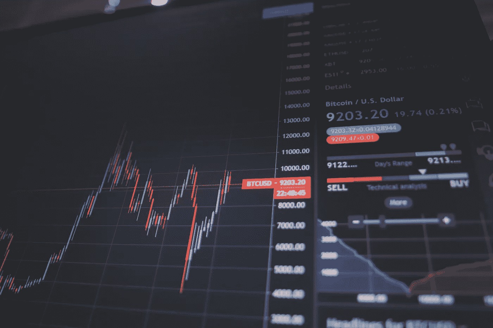
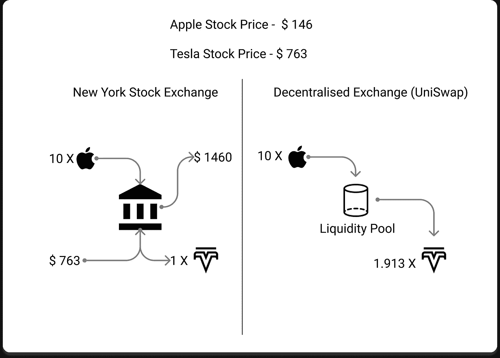
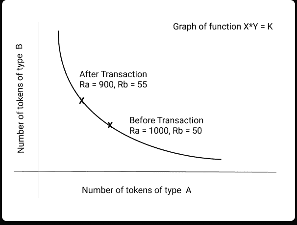

# 分散交换第 2 部分:Uniswap

> 原文：<https://medium.com/coinmonks/decentralised-exchange-part-2-uniswap-3d1b8aca5787?source=collection_archive---------11----------------------->

在[上一篇文章](/@vsurya.ayyagari/decentralised-exchange-part-1-centralised-exchanges-16e503f351d3)中，我们确定了交易所是买家和卖家见面的地方——通过查看资产买卖的价格，我们可以决定资产的“市场价格”(市场根据需求和供应给资产的价格)。

既然我们已经花了整整一篇文章来讨论[集中式交换](/@vsurya.ayyagari/decentralised-exchange-part-1-centralised-exchanges-16e503f351d3)，那么让我们来讨论一下分散式交换与集中式交换有何不同:

1.  传统的交易所被认为是集中的，因为交易所的规则是由政府指定的实体制定和执行的。UniSwap 是一个分散的交易所，这一事实并不意味着没有任何实体控制其运作规则。在 UniSwap 中，所有与治理相关的决定都是通过投票程序做出的。
2.  虽然传统的交换只在工作日的特定时间运行，但 UniSwap 等分散式交换是全天候运行的。
3.  严格来说，UniSwap 的核心功能不是一个**【交易所】**的功能，而是一个做市商的功能(我们在[上一篇文章](/@vsurya.ayyagari/decentralised-exchange-part-1-centralised-exchanges-16e503f351d3)中简要谈到了做市商)。虽然传统交易所遵循“订单簿”风格，但 UniSwap 等分散式交易所使用“自动做市商”或“恒定功能做市商”——本文稍后将详细介绍。
4.  在 UniSwap 中，我们不是真正的“买”或“卖”，而是从本质上用一个令牌交换另一个令牌。现在你知道 UniSwap 的名字是怎么来的了。

买卖和互换有什么区别？假设你在纽约证券交易所，想卖出我的 10 只苹果股票，买入特斯拉股票。在写这篇文章的时候，1 股苹果股票价值 146 美元。我正在出售我的十只股票，这将给我 1460 美元。1 股特斯拉股票 763 美元。我可以在交易所购买 1 股特斯拉股票，剩下 679 美元。然而，假设纽约证券交易所像一个分散的交易所那样运作。那样的话，我可以给交易所 10 股苹果股票，得到 1.913 股特斯拉股票。我们会把一只股票换成另一只。

我喜欢把自动做市商(AMM)想象成一个机器人，带着一个装满硬币的桶。我们都可以去 AMM 给他一个信物；它会把我们给的代币扔进桶里，给你一定数量你想要的代币作为交换。现在，如果我带着一个 eth 去 UniSwap AMM 办事处索要比特币，UniSwap 将如何决定用多少比特币来换取一个 eth？

# 流动性池:

流动性池是我们 AMM 机器人的水桶。在 UniSwap 中，一个流动性池或“桶”只能有两个令牌。你给这个池一个代币，AMM 决定你得到的另一个代币的数量。这些代币只能是一种特定类型的代币，称为 ERC 20 代币(我们将很快写一篇关于以太坊代币类型的文章)。现在，知道 ERC-20 是一种可以在以太坊区块链上创建和交易的代币就足够了。这也意味着 UniSwap 只能在以太坊区块链和其中的代币上运行。

# 恒定功能做市商:

恒定函数做市商是使用数学函数来确定用多少代币来换取另一代币的做市商。

既然我们已经有了这些定义，让我们来谈谈 UniSwap 是如何工作的。UniSwap 使用数学来确定如何交换令牌。

现在，我们希望确保经济学的基本供求规则成立——我们将使用数学来确定价格，而不是由一个中央实体根据它获得的买入或卖出订单的数量来确定价格。因此，如果我们有两个代币的流动性池，其中一个代币的需求高于另一个，我们希望交易者为需求高的代币支付高价。

在本文的其余部分，我们将尝试解释互换背后的数学原理

# 简单的解释是:

假设有一个流动性池，其中有两个代币 A 和 B。我去了一个流动性池，其中有代币 A 和 B，我们想用一些 A 交换 B。AMM 使用以下公式计算出要给我多少代币 B

`Ra X Rb = k (Constant)`

这里，

*   Ra —是流动性池中礼物的代币数量。
*   Rb——流动性池中存在的 B 的代币数量
*   k 是一个常数值

该公式本质上表明，无论发生什么情况，流动性池中 A 的令牌数和 B 的令牌数的乘积应该保持不变。

让我们假设当前的流动性池有 1000 个 A 的令牌和 50 个 B 的令牌，我们想用 5 个 B 的令牌交换 A。我们去流动性池，给它 5 个 B 的令牌。AMM 将通过满足一个条件来确定我们应该获得多少个 A 的令牌。流动性池中代币 A 和 B 数量的乘积应保持不变。

由于流动性池有 1000 个 A 的代币和 50 个 B 的代币，我们有(1000 / 50) 20 个 A 的代币，所以对于 5 个 B 的代币，我们将得到 5 X 20 = 100 个 A 的代币。

在我们交易之后，A 和 B 的流动性池中 A 和 B 的代币数量会发生变化。现在，因为 A 的 100 个代币被用来交换 B 的 5 个代币

*   `Ra = 900`和
*   下次有人来我们的交易所进行交易时，我们会用`(900 / 55) 16.36 tokens of A`换`each token of B`，而不是 20。

我们可以绘制一张图表，显示由于我们的交易，两种代币的互换价格是如何变化的:

从上图中可以看出，如果对代币 A 的需求增加，流动性池中代币 A 的数量会减少，因为更多的交易者愿意用代币 B 交换代币 A。随着池中代币 A 的数量减少，代币 A 的成本会增加；也就是说，你必须支付更多的 B 的代币来获得 A 的代币——因此，经济学的基本供求规则得到了遵守。仅此而已。这就是臭名昭著的常数函数做市商函数(注意，在上面的例子中，我们使用的数学函数是一个乘积函数，所以我们的常数函数做市商是常数乘积做市商)，它用于提供流动性，使您能够在以太坊区块链上用一个代币交换另一个代币。然而，为了便于理解，我们上面解释的是该函数的一个极其简化的版本。如果你不是真的对数学感兴趣，你可以就此打住，但是如果你想深入研究，请继续读下去

事实上，你仍然在阅读这意味着你不满意上面的解释。你懂数学，你可能指出了上面的致命缺陷——或者你只是对文章的其余部分感到好奇！

在上述情况下:交易前代币数量的乘积

`Ra X Rb = (1000 X 50) 50,000`。

但是交易之后

`Ra X Rb = (900 X 55) 49,500`。

刚刚发生了什么？为什么常数乘积函数的乘积不是常数？事实证明。恒积函数比`Ra X Rb`稍微复杂一点。如果你对数学感兴趣，我们将在下一篇文章中尝试解释恒定产品市场的创造者是如何工作的。

此外，UniSwap 将发布一个新版本——V3，在之前版本的基础上进行了修改，并对我们在本文中讨论的内容进行了一些改进。我们没有深入研究 V3，因为本文的目的是帮助您了解分散式交换是如何工作的，而不是端到端地解释 UniSwap。如果你想了解更多关于 UniSwap 新版本的信息，请查看这篇文章[。](https://uniswap.org/blog/uniswap-v3/)

本文原载于博客 blockchainiseasy . in .[https://blockchainiseasy.in/decentralised-exchange-part-2/](https://blockchainiseasy.in/decentralised-exchange-part-2/)

> 加入 Coinmonks [电报频道](https://t.me/coincodecap)和 [Youtube 频道](https://www.youtube.com/c/coinmonks/videos)了解加密交易和投资

## 另外，阅读

*   最佳[区块链分析](https://bitquery.io/blog/best-blockchain-analysis-tools-and-software)工具| [赚比特币](/coinmonks/earn-bitcoin-6e8bd3c592d9)
*   [加密套利](/coinmonks/crypto-arbitrage-guide-how-to-make-money-as-a-beginner-62bfe5c868f6)指南| [如何做空比特币](/coinmonks/how-to-short-bitcoin-568a2d0b4ae5)
*   [比特币基地 vs 瓦济克斯](https://blog.coincodecap.com/coinbase-vs-wazirx) | [比特鲁点评](https://blog.coincodecap.com/bitrue-review) | [波洛涅克斯 vs 比特鲁](https://blog.coincodecap.com/poloniex-vs-bittrex)
*   [德国最佳加密交易所](https://blog.coincodecap.com/crypto-exchanges-in-germany) | [Arbitrum:第二层解决方案](https://blog.coincodecap.com/arbitrum)
*   [币安交易机器人](/coinmonks/binance-trading-bots-d0d57bb62c4c) | [OKEx 评论](/coinmonks/okex-review-6b369304110f) | [阿塔尼评论](https://blog.coincodecap.com/atani-review)
*   [最佳加密交易信号电报](/coinmonks/best-crypto-signals-telegram-5785cdbc4b2b) | [MoonXBT 评论](/coinmonks/moonxbt-review-6e4ab26d037)
*   如何在 Bitbns 上购买柴犬(SHIB)币？ | [买弗洛基](https://blog.coincodecap.com/buy-floki-inu-token)
*   [CoinFLEX 评论](https://blog.coincodecap.com/coinflex-review) | [AEX 交易所评论](https://blog.coincodecap.com/aex-exchange-review) | [UPbit 评论](https://blog.coincodecap.com/upbit-review)
*   [十大最佳加密货币博客](https://blog.coincodecap.com/best-cryptocurrency-blogs) | [YouHodler 评论](https://blog.coincodecap.com/youhodler-review)