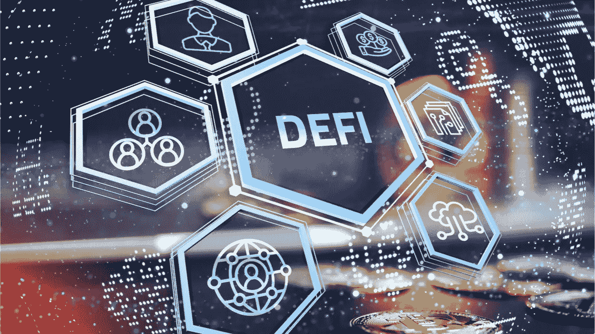

# 透过传统金融的视角看去中心化金融。🔭

> 原文：<https://medium.com/coinmonks/decentralised-finance-defi-through-the-lens-of-traditional-finance-2dc91b34ae3c?source=collection_archive---------15----------------------->

最近，有很多关于去中心化金融(DeFi)的讨论，认为它将是下一个蚕食传统金融(TradFi)的大事件。虽然很难客观地说这是不是真的，但我可以理解为什么 DeFi 社区会有这种感觉。

我决定用传统金融 的语言简要地写一下 DeFi ***，来讨论一下:***

1.  定义的含义和本质
2.  DeFi 如何创造价值
3.  DeFi 入门
4.  探索定义

最后，我将分享我对 DeFi 和金融未来的看法。

# 定义的含义和本质

分散金融是建立在安全、分布式分类账系统上的金融产品和服务的集合，因此理论上它的运作不需要传统的、集中的中介机构，如银行。
DeFi 让个人获得传统金融的所有服务(投资、保险、交换、借贷)，但不需要金融机构或中介。

DeFi 与区块链(比特币所基于的去中心化、不可改变的公共账本)有着密切的联系，这使得网络上的所有计算机(或节点)都可以保存交易历史的副本。这个想法是，没有一个单独的实体能够控制或改变交易的分类账。

在任何传统金融体系中，借款人、贷款人和投资者交换流动资金为项目融资，用于消费或生产性投资，并追求其金融资产的回报。金融体系还包括一系列规则和惯例，借款人和贷款人利用这些规则和惯例来决定哪些项目获得融资，谁为项目融资，以及金融交易的条款。传统的金融体系充满了第三方，他们帮助资金在各方之间流动，每一方都为使用他们的服务收取费用。

一个传统的金融体系至少需要三个组成部分才能发挥作用；**基础设施**运作于*(中央、存款&投资银行、资产管理者)*，**机构**指导运作&保护参与者*(政府&监管者)*，以及**交易手段**衡量价值*(法定货币如美元)*。

分散金融必须具备这三个要素才能发挥作用。
现在，DeFi 拥有其中的一些组件，但方式与您想象的大不相同。

## DeFi 基础设施

大多数可以定义为 DeFi 的金融服务可以在第二大加密货币市场以太坊网络上找到，该网络也是一个平台，允许其他区块链应用程序建立在其上(以太坊的加密货币以太用于支付交易成本)。通过利用去中心化应用程序(dApps)，两方或多方可以直接使用区块链技术和智能合约进行交换、借贷和交易，而无需中间人的参与和成本。

以太坊是一个编写去中心化程序的平台。通过以太坊，我们能够创建智能合同——可用于管理金融服务的自动化代码。通过智能合约，您可以为金融服务的工作方式建立一套规则，并将这些规则部署到以太坊。智能合约一旦部署，就不能更改。

## DeFi 机构

DeFi 没有传统的监管机构或 SRO(自律组织),如 SEC、IIROC 或 FCA。去中心化的金融不能夸耀任何真正无党派、完全独立的监管机构。

## 分散自治组织

然而，在 DeFi 中，存在着 DAO(分散自治组织)的概念。DAO 是一个没有中央领导的成员拥有的社区，在这里志同道合的参与者可以安全地协作完成共同的任务。

一个道就像一个完全由其成员拥有和管理的公共有限公司。它们有内置的金库，未经集团批准，任何人都无权动用。决策由提案和投票管理，以确保组织中的每个人都有发言权。投票基于对"一体行动"的所有权，因此对"一体行动"拥有更多所有权的参与者拥有更高的投票权。一个 DAO 是完全在线的，并且在一开始就使用硬编码到区块链代码中的规则和目标进行操作。

就像传统机构一样，市场参与者可以在 DAO 中寻求基于令牌或基于股份的会员资格。
基于代币的会员资格通常完全不需要许可，代币可以直接从分散的交易所购买，也可以通过向代币提供流动性来获得。
基于股份的会员资格通常是允许的，要求潜在会员提交提议，以金钱/代币或工作/汗水的形式提供价值。

DAO 是 DeFi 拥有的最接近传统监管机构的结构。DAO 可以保护其参与者的权利和利益，但不能保护一般市场的利益，例如 SEC 或 FCA。

# DeFi 如何创造价值

简而言之，价值是由佣金和利息创造的，而佣金和利息由需求和供给决定，并以技术进步为动力。

这是新古典增长理论的一种形式，于 1956 年首次提出。该理论认为经济增长是三个因素的结果——劳动力、资本和技术。从广义上讲，DeFi 的价值创造也受这三个因素的影响；劳动、资本、技术，从中提取佣金和利息。

**在 DeFi 中有两种形式的退货:**

1.  **资本收益**:这是指由于估值和市场情绪的提高，NFT、代币和加密货币等 Web3 人工制品的价格升值。
2.  **赌注奖励**:这是 DeFi 的主要卖点。参与者可以获得赌注奖励，作为在 DeFi 项目的流动性池中提供其加密货币&代币的补偿。
    就像在传统的金融体系中一样，企业发行债券来筹集资金，以促进扩张、资助基础设施建设或满足流动性需求，然后用息票作为利息支付来奖励债券的购买者。
    在 DeFi 中，您可以将分散钱包中的代币直接提供给需要流动性的公司和项目，并获得由当前市场条件决定的 APY/APR(年度百分比收益率/回报率)。
    每当流动性池发生交易时，项目通过各种 dEx 收取交易佣金来产生这一回报。
    赌注奖励以 DEx(分散兑换)代币、项目代币或加密货币的形式提供。

## 概括起来

分散金融是一种新的金融分配，具有分散的基础设施和更大的透明度，赋予参与者权力，减少第三方把关。

任何金融体系都有各种各样有流动性需求的参与者。参与者可以是需要各种金融服务的机构或个人，如借款(用于杠杆、项目开发、资本/基础设施投资、公司扩张)、贷款、交易或做市。

在去中心化金融中，你拥有自己的银行，因此，你可以直接向那些参与者提供流动性，而不需要集中的第三方。这大大降低了交易成本，消除了中间商佣金，提高了透明度。

缺点之一是，每个参与者都有责任对每个市场参与者进行充分的尽职调查，以核实其合法性。

# 分散化金融入门

在 DeFi 开始的第一步是得到一个好的分散钱包。分散式钱包让您可以访问 dApps(分散式应用程序)和 dEx(分散式交换)。

DeFi 钱包必须具备以下特征才能真正去中心化:

*   **非托管** —用户可以发送和转移资金，因为他们知道自己是唯一有权访问这些资金的人
*   **基于钥匙的** —所有 DeFi 钱包都有一个独特的钥匙对。这不同于集中式钱包，因为用户负责保管他们的私钥，通常通过 12 个词的种子短语引入。
*   **可访问** —几乎所有的非托管钱包都可以处理一套资产，以太坊专用的 DeFi 钱包允许用户将 ETH 与 stablecoins 放在一起。DeFi 钱包应提供对区块链上各种网络和令牌的访问。
*   **兼容** —几乎所有的 DeFi 钱包都可以通过连接 web3 钱包来访问。移动钱包已经开始集成 dApps 浏览器，以便在不离开应用程序的情况下轻松连接 DeFi 应用程序。

**一些结实的 DeFi 钱包有:**

1.  [**MetaMask**](http://metamask.io) (个人最爱):MetaMask 主要用作 Chrome web 浏览器的扩展，因此几乎可以在不离开浏览器的情况下访问任何 dApp & Web3 应用。还有一个带二维码功能的手机 app。MetaMask 支持多个钱包帐户，并且可以轻松地与多个网络、NFT 和令牌集成。
2.  [**比特币基地钱包**](https://www.coinbase.com/wallet) :比特币基地钱包只有一个手机应用版本，但它拥有像 MetaMask 一样的 DeFi 钱包的全部功能。它还通过与[复合](https://compound.finance)和 [dy/dx](https://dydx.exchange) 等平台集成，支持应用内借贷。
3.  [**账本纳米钱包**](https://www.ledger.com) (硬件):硬件钱包是保证你资产安全的最佳方式。分类帐钱包可以通过 DeFisaver 用作 DeFi 钱包。您还可以使用 Ledger wallet + Metamask 的智能组合来访问和使用所有 DeFi 应用程序。
4.  [**Argent**](https://www.argent.xyz):Argent 是一款手机钱包，支持 iOS 和 Android。这个钱包的美妙之处在于，它不需要你保存私人钥匙。它使用一种叫做守护者的概念来保护你的钱包。

# 探索定义

就像传统金融一样，DeFi 也有一套类似的金融产品和服务，通过这些产品和服务来创造和提取价值。DeFi 钱包让您进入 Web3 的世界。你可以为你最喜欢的项目提供流动资金，铸造和交易 NFT，在元宇宙购买土地和公寓，利用杠杆贷款，储蓄稳定的硬币，或者借出你的闲钱

Web3 & DeFi 中的一些主要类别包括:

1.  **信贷(lending &借款)** : DeFi 提供了一个以加密或稳定硬币贷款的机会，使用 NFT 和代币作为抵押品。您也可以提供您的备用密码/令牌作为贷款协议的流动性，并获得贷款 APY。一些扎实的借贷&借贷协议有: [AAVE](https://aave.com/) ，[庄家](https://makerdao.com/)。
2.  **元宇宙，AR/VR** : DeFi 钱包提供在元宇宙购买、铸造和交易 NFT&资产的途径。一些元宇宙协议是[狂野世界](https://www.wilderworld.com/)、[乌班图兰](https://africarare.io/ubuntuland)、[沙盒](https://www.sandbox.game/en/)、[分散地](https://decentraland.org/)、 [OVR](https://www.ovr.ai/) 。
3.  **Web3 基础设施:**这些是项目&平台，处于构建和开发 Web3 的最前沿，Web3 是互联网的未来。一些有趣的项目有[多边形](https://polygon.technology/)、[扇形](https://fantom.foundation/)、[雪崩](https://www.avax.network/)。
4.  DeFi 为你提供进入铸币厂和交易你自己的不可替代代币以及 NFT 项目和 dEx 的代币的机会。一些有趣的项目有[looks are](https://looksrare.org/)、 [OpenSea](https://opensea.io/) 、 [Wilderworld](https://www.wilderworld.com/) 。
5.  **金融、资产管理&交易**:从资产管理到保险和稳定的收入，DeFi 让你接触到一系列金融服务。一些扎实的项目&平台有[平衡器](https://balancer.fi/)、 [Bancor](https://www.bancor.network/) 、[酵素](https://enzyme.finance/)、[复合](https://compound.finance/)、 [Terra](https://www.terra.money/) 、 [Insurace](https://www.insurace.io/) 。
6.  **衍生品&杠杆交易**:部分提供融资融券的 DeFi 项目有[支点](https://fulcrum.trade/)、 [dy/dx](https://dydx.exchange/) 、[合成](https://synthetix.io/)、
7.  **交易所**:分散式交易所，也称为 dEx，允许你在整个 DeFi 生态系统中进行互换、交易、搭桥、联营、经营和赚取代币。一些可靠的 dEx 有[寿司](https://app.sushi.com/swap)、 [Uniswap](https://app.uniswap.org/#/swap?chain=mainnet) 、[渴望金融](https://yearn.finance/#/vaults)、[曲线](https://curve.fi/)、[斯布克斯瓦普](https://spookyswap.finance/)。
8.  **即玩即赚游戏**:即玩即赚游戏是任何利用区块链奖励玩家具有现实世界和虚拟世界价值的东西的游戏。作为这些游戏的一部分，奖励往往是 NFT 或项目代币。一些有趣的游戏赚取平台有[轴有限](https://axieinfinity.com/)，[塔纳雷纳](https://thetanarena.com/)，[夹板王国](https://splinterlands.com/)，[defi defions](https://defikingdoms.com/)。

# 最后

虽然我肯定属于传统金融阵营，是 CFA 候选人，目前在一家传统资产管理公司担任产品经理，但我非常清楚 DeFi 的价值主张及其通过区块链促进金融服务快速扩展的能力。我有兴趣看到这在未来几年内如何发展，更重要的是，我目前正在探索我们可以利用区块链、Web3 和 DeFi 的力量来解决非洲问题的方法。