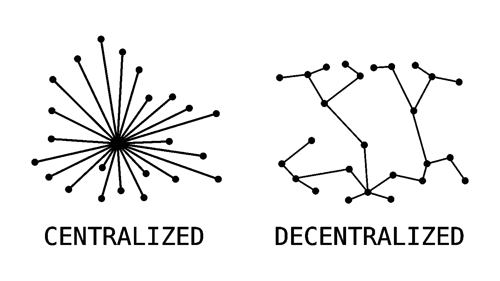
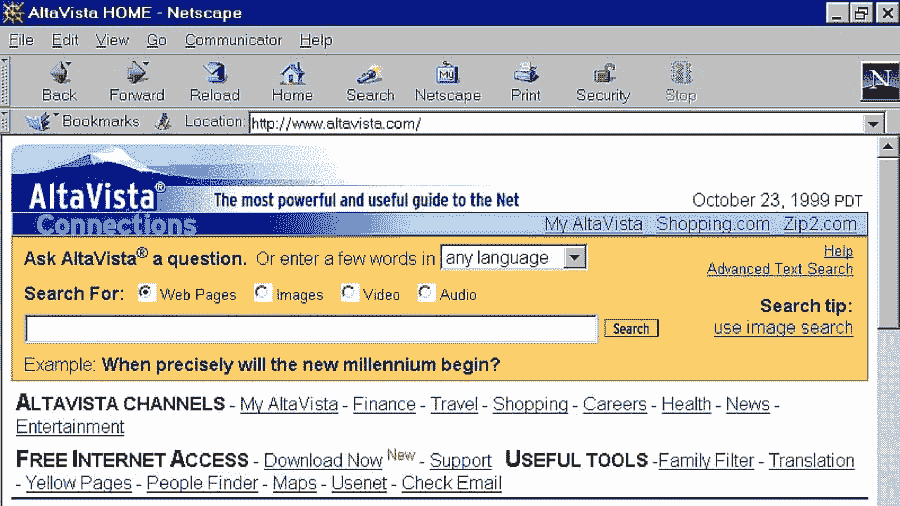
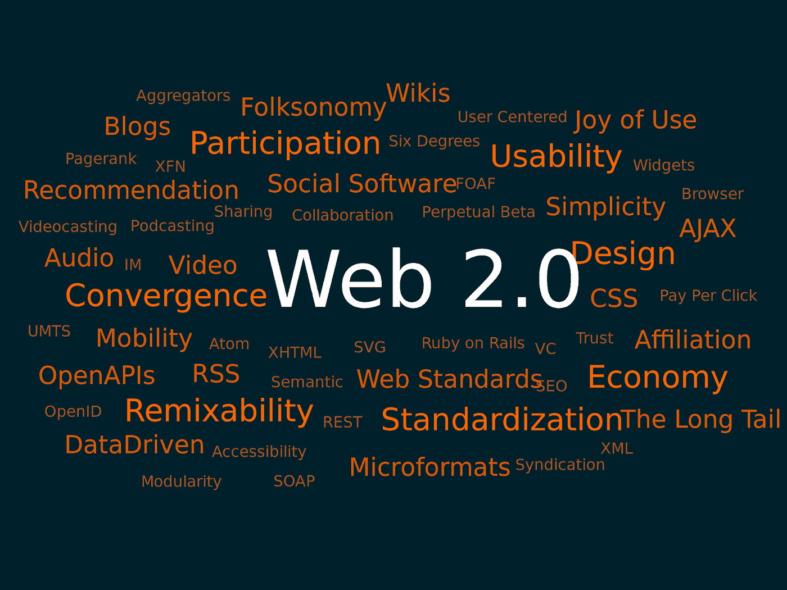
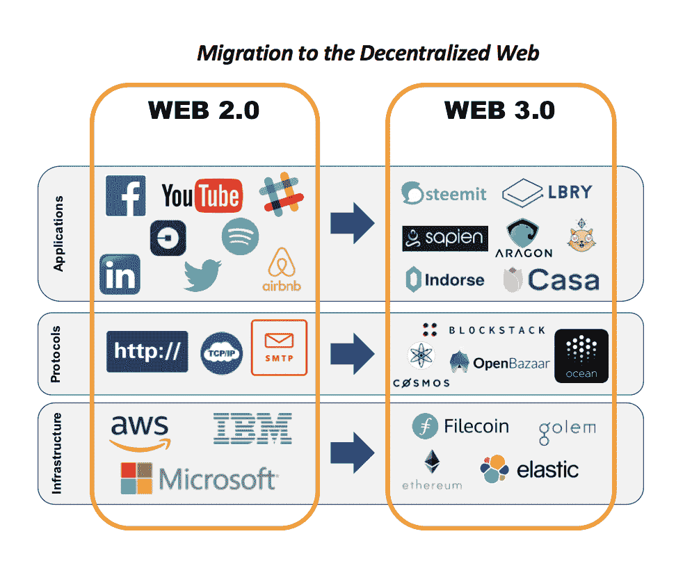
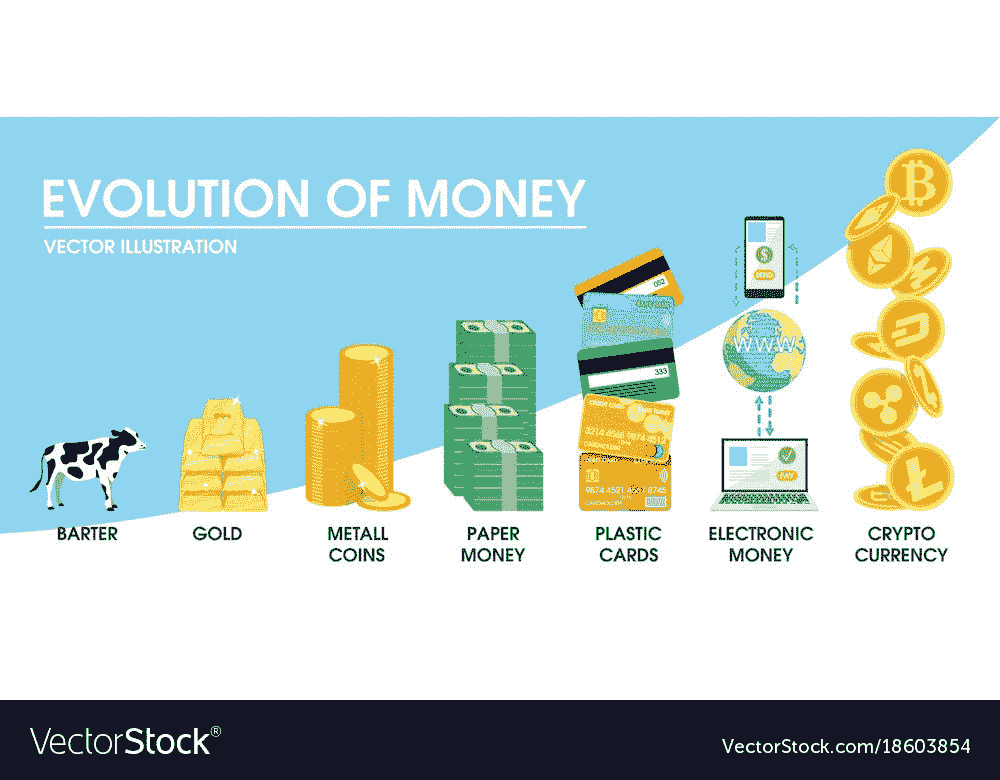
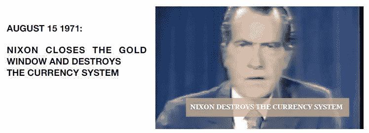
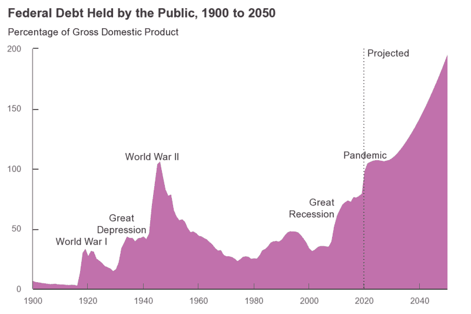
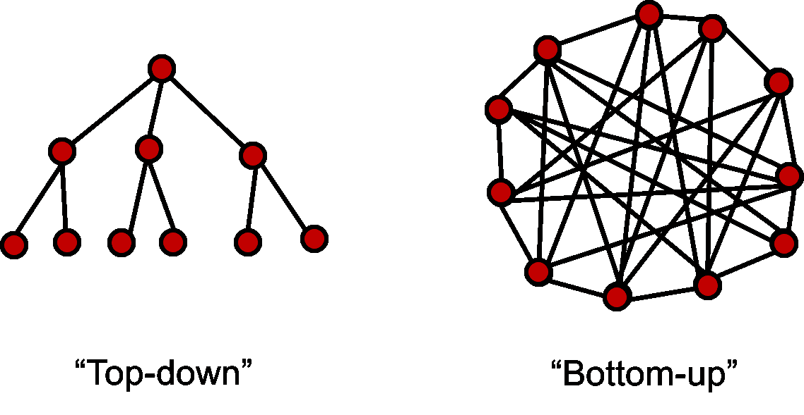

# 分散

> 原文：<https://medium.com/coinmonks/decentralization-3bfd12636933?source=collection_archive---------18----------------------->

*用* [和*写成【舒瓦姆拉纳】*](https://medium.com/u/a156fb3a8cab?source=post_page-----3bfd12636933--------------------------------) *和* [*维什瓦纳*](https://medium.com/u/f9b78244e733?source=post_page-----3bfd12636933--------------------------------)

集权指的是一小群人(代表)做出影响公司或地理上的其他人的决策。

# 集权的起源

在我们谈论权力下放作为前进的道路之前，让我们回到我们现有结构的起源，并探索认为它们是必要的前提。这些前提今天仍然有效吗？

**10-20 万年前:**解剖学上现代智人似乎进化了

活动:采集水果、植物、幼虫、狩猎

使用的工具:石斧、矛、刮刀、针、弓箭、乐器

**10000-12000 年前:**早期农业革命

活动:人类变得不那么活动，犁地、除草、灌溉和收割。

使用的工具:犁、镰刀、铁锹、竹筛、斧头。

直到这一时期，人们在很大程度上以小团体的形式为自己奋斗，交易是简单和有限的，并且没有一个集中的权威来支配个人。

**公元前 4000 年以后:**城镇和城市开始在农业国家周围形成，产生了更复杂的互动和治理。这导致了等级制度和中央集权结构，但大多局限于城市/城镇治理活动。当食物生产过剩时，战争和军队在这些政府的领导下出现来保卫领土。在同一时期，工匠们使用他们的肌肉和技能，以小组形式工作，通常包括家庭成员和几个学徒。

**工业革命(1760-1850):**工业革命将集权和等级制度与产品一起带到了世界各地。装配线是按劳动分工设计的，这些工人由所有者或负责监督的特定个人监督。现代公司是工业革命略微复杂的延伸。

随着我们从 40 人的狩猎采集部落发展到农业、贸易和工业定居点周围成千上万的公民和“雇员”,中央集权结构在我们的社会中出现有多种因素。一些原因是，需要 1。领导力 2。武装保护 3。技巧四。对权力的贪婪。一个关键原因是缺乏人类协调的技术。想象一下在传播信息、教育人们以及为公司或政府的决策采纳他们的教育投入中所涉及的物流。

# 互联网的去中心化

那么，什么是去中心化？据 [Feross](https://twitter.com/feross) (创始人， [WebTorrent](https://webtorrent.io/) )“分散式网络是一个由互联的、独立的、私有的计算机组成的系统，这些计算机协同工作，提供私有的、安全的、不受审查的信息和服务。”

**来源:** [分散系统](https://en.wikipedia.org/wiki/Decentralised_system#/media/File:Decentralization_diagram.svg)

去中心化意味着从收集、收集和出售用户数据的大型集中组织中脱离出来。互联网和万维网是人类可用的最强大的去中心化框架。因为在一个开放的组织中有大量的设备连接在一起，没有一个人可以拥有它、控制它或为每个人关闭它。它提供了一个系统，通过用户驱动的技术提供通信、银行、出版、社交网络、研究和存档等服务。

在这个系统中，大公司的中间商被淘汰了。[智能合同](https://www.investopedia.com/terms/s/smart-contracts.asp)在用户和他们偏好的广告客户之间直接签署，使得用户信息对选定的零售商可用。通过最大限度地减少不相关和昂贵的广告，这为零售商和消费者都节省了资金。

**互联网的演进:**

**1991–2004:**Web 1.0 是 Web 的第一代；这是一个时代的开始，当时互联网仍被称为纯文本网络，用户只能访问文本、图片和音频材料。在此期间，雅虎、谷歌、亚马逊、脸书、LinkedIn 和 YouTube 等主要网站相继推出。网站提供静态信息而不是动态 HTML，交互性很低。用户无法与数据和内容交互，因为数据和内容是通过静态文件系统而不是数据库提供的。Web 1.0 的一些特性是页面是静态的，服务器的文件系统用于提供内容，页面上的元素使用框架和表格来定位和对齐。

[**AltaVista**](https://en.wikipedia.org/wiki/AltaVista) ，网络搜索引擎(1995)

2000 年至今: Web 2.0 于 1999 年由[达西·迪努奇](https://www.linkedin.com/in/darcydinucci)创造，然后在 2004 年的一次会议上由[蒂姆·奥赖利](https://en.wikipedia.org/wiki/Tim_O%27Reilly)和[戴尔·道特里](https://en.wikipedia.org/wiki/Dale_Dougherty)推广开来。它代表了互联网的现状，为最终用户提供了更多用户生成的内容和可用性。鼓励用户提供内容，而不仅仅是观看。人们现在可以写文章和评论，在不同的网站上注册用户档案变得更加容易。Web 2.0 还催生了网络应用、WordPress 等自发布平台和社交网站。它包括其他一些被称为 SLATES 的特性和方法，这个概念是由 Andrew McAfee 引入的。SLATES 代表搜索、到其他网站的链接、创作、标签、扩展和信号。**搜索**是指使用关键词检索信息，而**链接到其他网站**是指使用 Web 架构连接信息源。**创作**指的是人们将他们的作品整合在一起的协作方式。**标签**是对信息的分类，有助于搜索某些关键字来查找信息。**扩展**用于使 Web 成为一个应用平台。最后，**信号**指的是扩展技术的使用，比如 RSS 提要。

Web 2.0 的一些例子是博客、社交书签、社交网络、播客和社交媒体。

**来源:** [维基百科](https://en.wikipedia.org/wiki/Web_2.0)

即将到来:Web 3.0 最初被万维网的发明者蒂姆·伯纳斯·李称之为语义网，旨在成为一个更加自主、智能和开放的互联网。它是第三代互联网，网站和 app 使用机器学习(ML)、大数据和[去中心化账本技术](https://hedera.com/learning/what-are-distributed-ledger-technologies-dlts) (DLT)等技术，以智能的类似人类的方式处理信息。

Web3 是互联网的升级版，由区块链驱动，具有去中心化的环境。它使用户无需中央数据存储就能进行交互。

**web 3 的特性:**

*   开放源码
*   用代币进行价值核算和转移
*   分布式网络和寄存器的使用:区块链。
*   增强隐私、匿名和安全性
*   社区所有权，
*   dApps 和分权组织
*   零广告预算
*   语义万维网
*   3D 图形，游戏化的网络体验(元宇宙)
*   人工智能
*   支持网状网络

**来源:** [中](/omers-ventures/towards-a-decentralized-web-built-on-blockchain-fd42394d05d8)

**去中心化的优势:**

1.  用户不需要信任中央机构
2.  出现单点故障的可能性更小
3.  抵制审查
4.  数据所有权
5.  开放发展

# 货币的分散化

在这一部分，我们将探索一些关于货币的历史，以及货币是如何在现代成为货币的？为什么当今的生态系统需要分散的资金？

任何具有以下特征的东西都可以被视为货币:限量供应、可分性、可替代性、可接受性、耐久性和可携带性。纵观历史，许多物品被我们的祖先用作货币:从公元前 900 年到公元前 6000 年的牛，公元前 1200 年非洲和中国的贝壳，以及一些其他形式的谷物、象牙、皮革和鱼。第一批金属货币和硬币于公元前 1000 年出现。

**来源:**[VectorStocks.com](https://www.vectorstock.com/royalty-free-vector/evolution-of-money-concept-vector-18603854)

在 16 世纪，国际商人认识到一个人的债务是有价值的，它可以作为借条(我欠你的)进行交易或转让，当这些借条来自一个有信誉的来源时，它们可以被用作货币！这种纸币不是基于硬商品或金属，而是基于某人的“支付承诺”。16 世纪意大利的美第奇商人家族充当了这些借据的票据交换所。与此同时，该地区的金匠甚至开始发行纸质借条作为货币，这些金匠注意到他们金库里的黄金正在吞噬灰尘，所以他们看到了机会，并开始在公开市场上出借相同的黄金(双倍支出！！).在那些国家相互交战的时候，一年的所得税无法支付战争的费用，国王和王后不得不用未来的税收来借钱，他们需要开创性的金融创新，以政府债券的形式出现，最初的贷款来自富裕的商人家庭和金匠。主权债务和赤字由此产生。

战争和国际贸易催生了银行体系，这是 14 世纪意大利商人家族开创的。英格兰中央银行的建立只是为了资助对法国的战争。托马斯·杰斐逊(Thomas Jefferson)认为，“银行机构比常备军更危险”。让我们通过研究美国美联储银行来探讨最后一句话。1933 年，大萧条对货币政策产生了巨大影响，为了防止对经济缺乏信心的消费者挤兑银行，并阻止囤积黄金(美国当时使用金本位制作为其货币)，当时的罗斯福总统通过了一项有争议的法案，要求“所有公民以固定利率将黄金存入银行，否则就要坐牢！”在美国，更好的交易提供给其他国家来存放他们的黄金以换取美元。

二战后，联合国于 1944 年在新罕布什尔州布雷顿森林召开会议(货币金融会议)。所有国家都同意用美元交易，基本上是美元与黄金挂钩。第二次世界大战摧毁了世界上所有的主要经济体，但它并没有影响到美国，因为它控制了世界的货币供应。在 20 世纪 60 年代末，美国资助了越南战争，也愉快地资助了太空任务，还能够毫无困难地支付国家的账单，这确实让一些国家产生了怀疑，他们发现这个大家伙印的钱比它金库里的黄金所能支持的还要多。然后包括法国在内的主要国家开始要求归还他们的黄金，而美国无法偿还它所欠的黄金。因此，美国在 1971 年提出了另一项历史性的有争议的政策，由尼克松总统提出，该政策停止了美元与黄金或其他资产的兑换，从那时起，美元现在只由美国政府的完全信任和信用支持。美国政府 1971 年的这一法案催生了我们现在所知的法定货币，这种货币除了得到发行国政府的信任支持之外，没有任何内在价值。

【goldbroker.com】来源:

**来源:** [维基百科](https://en.wikipedia.org/wiki/History_of_the_United_States_public_debt#/media/File:US_Federal_Debt_Held_By_Public_as_of_Sep._2020.png)

这导致了通货膨胀，降低了将毕生积蓄存在银行账户中的人们的购买力。考虑到货币的历史，需要一些可信的商品来取代现有的政府控制的法定货币系统，在这种系统中，个人不会为少数政客或官僚的错误付出代价。由于过去几个世纪国际贸易的巨大发展以及开采和储存的生态成本，黄金不是一种可行的替代品。

2008 年金融危机后不久，一个或一群化名为 Satoshi Nakomoto 的个人发布了一份数字货币白皮书，这种货币不需要可信的中介或中央机构来发行货币或监管供应。尽管此前对数字货币进行了多次尝试(B-Money、hash cash、Digi cash、Digi gold)，但没有一个解决了重复消费问题——一种确保所有者不会两次消费同一单位货币的机制。比特币解决了所有这些问题，不需要在可信的中介上花费。

# 治理的权力下放

分散治理指的是这样一种治理结构，其中每个人都可以

1.  为整个组织提出一项变革或倡议
2.  访问每个新提案的完整信息，并可以在提案投票前在平台上讨论/分享意见
3.  在每个决定中都有投票权

流动民主是一种分权治理的形式，在这种形式下，个人可以选择直接投票，或者动态地将他/她的投票委托给代表(管理人)来处理每项提案。

分散的自治组织是一群人，他们通过分散的治理结构朝着一个使命努力。这些可能成为取代政府和公司结构的新模式。

**如今，分散治理成为可能，因为:**

1.  大多数人口采用互联网
2.  加密货币资助的开源软件的可持续经济模式
3.  记录交易的区块链公共分类账，向世界上任何人开放供审计
4.  数字身份(分散标识符/did)和带有分析功能的 Sybil 保护可以标记欺诈性投票

**分权治理的优势:**

1.  更高的透明度，更低的信息不对称
2.  生态系统中更高的所有权和参与度
3.  降低公司的管理费用
4.  降低政府的选举后勤费用----让全体人民参与决策的能力，这种情况目前只发生在少数几个小国
5.  二次投票和二次融资等机制正在使分散治理变得有效

分权治理是建设公平和公正社会的前进方向。这适用于任何人群:非营利组织、营利组织甚至政府。

# 人类协作的分散化(公司)

在过去，大约 5000 年前，一群人生活在一起，每个人都认识其他人，因为这个群体的规模很小(人脑最多可以清楚地记住 150 个人)。他们唯一的生存活动是狩猎和采集，因此群体中的每个成员都是平等的，没有人比其他人更有权力，每个人都协调活动，过着幸福的生活，这在农业发明时发生了变化，社会权力慢慢从分散走向集中。农业革命后的所有人类历史都受到少数人或一群人手中权力集中的影响。随着这种称为区块链的革命性新技术的发明，世界各地的人们有机会走到一起，协调并努力实现一个共同的目标。

目前，世界上的每一个组织都有一个集中的等级结构，权力集中在最高层，每一个重要的决策都由最高管理层决定，通常不会采纳来自最底层的一致意见。由于这种自上而下的管理方式，产生了委托代理问题，这里委托人是组织，代理人是组织雇用的雇员。委托代理问题是指资产所有者和资产控制委托人之间的优先权冲突。因此，下一句话在当今的环境下对任何组织都是正确的，“雇主支付的工资足以让员工不辞职，员工努力工作也不会被解雇”。这是真正的纳什均衡，在这种状态下，玩家、雇主和雇员都没有动力偏离这种状态。有了这种结构，员工或组织的真正潜力就永远无法发挥。

**来源:**【organizationalphysics.com】T2

要理解人类协调的去中心化，我们需要理解协调是如何在道中实现的，去中心化自治组织是由编码为透明计算机程序的规则表示的组织，由组织成员控制，不受中央集权的影响，换句话说，它们是成员拥有的社区，没有中央集权的领导。DAO 中的人类协作是使用授予投票权的令牌或 NFT 来实现的。进入 DAO 仅限于已经确认拥有加密货币钱包中的这些治理令牌的人，并且成员资格可以交换。简而言之，道中的人类协调是以这样一种方式建模的:“人类行为受到激励，只要他们的行动导致实现特定道的集体目标的价值增加”。在这里，任何治理决策都是通过成员在区块链上投票来执行的，通常，一个人拥有的治理令牌越多，其投票权就越大。

区块链的架构允许来自世界不同地区的成员协作和协调以实现共同的目标，其中一个成员不需要信任生态系统中的其他成员，信任因素由区块链技术提供。在自上而下的层级系统中，所创造价值的最大份额被吸收到最高管理层，其余的则在层级的底层之间分配。而在分散型组织中，创造的价值被向下推向组织层的边缘，这直接解决了集中型组织中的委托代理问题，在这里，个人根据他对生态系统的贡献获得全部报酬。此外，由于中间人(在这种情况下是一个集中的权力机构)是多余的，人们将获得更多的分散设置相同的工作报酬。

**分权组织结构的优势:**

1.下属的 x:因为决策权是分散的，这意味着更好的工作满意度和员工士气，尤其是在低层经理中。

2.减少高层管理人员的负担:由于决策权是分散的，高层管理人员可以更少地关注日常活动，而更多地关注组织的长期战略决策。由于越来越多的人参与到重要的组织过程中，如资本筹集、雇佣、扩张和发展，这将导致这些过程更有效、更快速地进行。

3.权力下放增加了系统中的问责制和透明度:较低层次的管理阶层，如当地经理或雇员，随着责任的增加，被激励承担更多的所有权。权力下放可以发现组织内部需要改进的地方，因此系统的透明度也增加了。

4.培养更多领导者的机会:为潜在员工提供成为组织内未来领导者的机会。

5.快速决策:分散化允许现场的员工采取必要的行动，这导致快速决策，因为决策需要通过层级审查。

6.解决委托代理困境的方法:一个正确执行的分权平台将激励所有利益相关者，包括创始人、中层管理者、最终用户和普通社区，协调并实现分权组织的集体目标。

# 参考资料:

1.  [https://bitcoin.org/bitcoin.pdf](https://bitcoin.org/bitcoin.pdf)
2.  https://ncert.nic.in/textbook/pdf/keec101.pdf
3.  [https://www . researchgate . net/publication/273257207 _ 传统 _ 农业 _ 工具 _ 使用 _ 部落 _ 农民 _ 东部 _ 印度](https://www.researchgate.net/publication/273257207_Traditional_Agricultural_Tools_used_by_Tribal_Farmers_in_Eastern_India)
4.  [https://www . Britannica . com/topic/history-of-work-organization-648000/Division-of-labor-in-the-workplace](https://www.britannica.com/topic/history-of-work-organization-648000/Division-of-labour-in-the-workplace)
5.  [https://www . national geographic . org/article/key-components-civilization/](https://www.nationalgeographic.org/article/key-components-civilization/)
6.  [https://www . sage pub . com/sites/default/files/upm-binaries/43186 _ 1 _ Work _ Before _ industrialization . pdf](https://www.sagepub.com/sites/default/files/upm-binaries/43186_1_Work_Before_Industrialization.pdf)
7.  [https://en.wikipedia.org/wiki/Web_2.0](https://en.wikipedia.org/wiki/Web_2.0)
8.  [https://www.youtube.com/watch?v=NJd6RKsY5H4&t = 10s](https://www.youtube.com/watch?v=NJd6RKsY5H4&t=10s)
9.  [https://www.youtube.com/watch?v=BFKZoq2z39s](https://www.youtube.com/watch?v=BFKZoq2z39s)

> 加入 Coinmonks [电报频道](https://t.me/coincodecap)和 [Youtube 频道](https://www.youtube.com/c/coinmonks/videos)了解加密交易和投资

# 另外，阅读

*   [如何购买 Monero](https://coincodecap.com/buy-monero) | [IDEX 评论](https://coincodecap.com/idex-review) | [BitKan 交易机器人](https://coincodecap.com/bitkan-trading-bot)
*   [CoinDCX 评论](/coinmonks/coindcx-review-8444db3621a2) | [加密保证金交易交易所](https://coincodecap.com/crypto-margin-trading-exchanges)
*   [红狗赌场评论](https://coincodecap.com/red-dog-casino-review) | [Swyftx 评论](https://coincodecap.com/swyftx-review) | [CoinGate 评论](https://coincodecap.com/coingate-review)
*   [Bookmap 点评](https://coincodecap.com/bookmap-review-2021-best-trading-software) | [美国 5 大最佳加密交易所](https://coincodecap.com/crypto-exchange-usa)
*   [如何在 FTX 交易所交易期货](https://coincodecap.com/ftx-futures-trading) | [OKEx vs 币安](https://coincodecap.com/okex-vs-binance)
*   [CoinLoan 审查](https://coincodecap.com/coinloan-review) | [YouHodler 审查](/coinmonks/youhodler-4-easy-ways-to-make-money-98969b9689f2) | [BlockFi 审查](https://coincodecap.com/blockfi-review)
*   [XT.COM 评论](https://coincodecap.com/profittradingapp-for-binance)币安评论 |