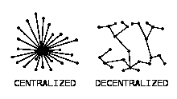

# 分权:虚张声势还是未来

> 原文：<https://medium.com/coinmonks/decentralization-bluff-or-the-future-14371bfb1fd5?source=collection_archive---------37----------------------->

6 月 1 日，我做了一个关于加密货币的讲座，以及它们将对未来的科技、去中心化和金融产生什么影响。会议进行得很顺利，直到有人要求发言，我同意了。接下来对话如下:

个人:如果股份证明(pos)区块链由验证者运行，并且这些验证者对网络事务做出决策，那么即使验证者充当权威，仍然说区块链股份证明是分散的是正确的吗？

Me:拥有一个验证器并不妨碍去中心化，因为需要验证器来保护网络和创建新的块，这是运行区块链所必需的。

个体:那么当这些验证器决定停止验证链上的新块和事务时会发生什么呢？区块链能够自己处理事务和创建新区块吗？

我:POS 区块链需要一个验证器。根据区块链共识，在主要的区块链，单个验证者*退出*几乎是不切实际的，因为有成千上万的验证者在运行节点并验证来自世界各地的交易。而其他一些区块链是 DAO run，任何修改或变更都需要社区投票并同意。这是一个比你从当地金融机构得到的更好的方法。

*嗯，看起来我为这个年轻人找到了答案，但事实是，正如我们所知，权力下放有许多不同的方面，你应该理解。*

会议结束后几个小时，传来了索拉纳停止区块链的消息，如果早些时候发生的话，有人在讲座上问及此事，我怀疑我是否能立即找到一个合适的答案，而不是把索拉纳拖进泥淖，反正它也不应该得到它。自索拉纳诞生以来，这已经是第八次了，但人们仍然相信区块链的潜力，并坚持不懈。现在 Solana 是区块链的一个项目，类似于更流行的以太坊，只是它比以太坊更便宜更快。

image sourced from coinbench

我所知道的另一个在危机时刻被其开发者关闭的区块链是 Terra(Luna ),我们都知道故事是如何发展的。有些人认为，区块链的股权证明是中央集权的，而区块链的股权证明则被视为权力下放的摇篮。既然工作共识证明被认为更加分散，为什么不呢？

6 月 3 日星期五，纽约的立法者通过了一项法案，禁止在该州开采比特币，理由是担心开采比特币和其他基于加密货币的工作证明所产生的碳排放。因此，有了利害关系的证明，争论就在于权力下放不够，还有工作、电力消耗和气候问题的证明。当谈到气候问题时，我不理解对比特币采矿的全面打击，因为还有其他行业使用碳基能源，向大气中排放的碳比比特币生产排放的碳多，而且受到的关注或批评较少，因为焦点似乎是在打击加密。

以太坊正在采取行动，从工作证明过渡到利益一致证明，根据加密社区的一部分，这将使以太坊更加集中，但利益证明并不一定意味着集中，因为任何人而不仅仅是一群人可以在网络上投资他们的资产。

目前，美国证券交易委员会(SEC)并不认为以太坊是安全的，因为它的分散性质，以及它为建筑商和程序员提供了一个创建 Dapps 的框架，但最重要的是它的工作证明框架，这意味着来自世界任何地方的任何人都可以设置一台计算机，并开始验证以太坊网络上的交易(采矿)。

根据美国法律，如果一项资产是对一个普通企业的资金投资，并期望通过该企业的努力获得利润，则该资产符合证券的定义。

利益证明机制涉及个人投入一些资产(赌注)，以便保护和验证网络上的交易，并赚取部分交易费作为奖励。像比特币这样完全去中心化的网络不被 SEC 视为安全，因为没有任何形式的中央机构或团体控制其区块链网络的活动。以太坊也是如此，或者至少过去是如此，因为我们离从 pow 到 pos 的转换越来越近了。现在，这是一个复杂的问题，以太坊网络有时几乎无法使用，因为拥塞和非常高的交易费用，因此是升级到 pos 机制的许多原因之一。想象一下，为 20 美元的交易支付 30 美元的费用，这是不可想象的，也毫无意义。因此，虽然切换到 POS 机制对于解决这些潜在问题至关重要，但它也潜在地将以太坊置于一种被视为安全的地位，因为投资者期望从在网络上押注以太坊中获得利益。

多年来，也有关于以太坊网络上的一些应用程序的类型和用途的问题。SEC 主席加里·詹斯勒(Gary Gensler)表示，他认为以太坊 Defi 空间(p2p 借贷和交易)中的数千种加密货币正在作为未注册证券进行操作。

尽管分散化金融体系的承诺听起来不错，但保护用户及其资金至关重要。加密市场不能再承受另一个跆拳道或任何其他的失误了。虽然在这个领域有复杂的感觉，但我很乐观，我相信升级完成后以太坊的表现将决定它是否仍然有足够的分散性来被认为是非安全资产。

从好的方面来看，以太坊、Tron 和 BSC 等加密货币的智能合约功能为在区块链上执行协议或任务时的完全透明和问责提供了空间。这些区块链可以应用到生活的各个领域，目的是促进全球技术进步、和平与进步。

> 加入 Coinmonks [Telegram group](https://t.me/joinchat/Trz8jaxd6xEsBI4p) 并了解加密交易和投资

然后在 NFT 镇有新的嗡嗡声。这项技术旨在将有价值的硬件资产数字化到区块链中，在那里它是安全的，并且坚不可摧。这是另一集的主题。请按照预期点击订阅按钮。

