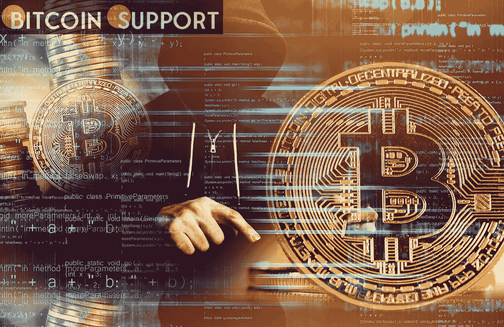

# 权力下放对于加密资本市场的发展“极其重要”

> 原文：<https://medium.com/coinmonks/decentralization-is-extremely-necessary-for-the-development-of-crypto-capital-markets-122f30dc1af7?source=collection_archive---------75----------------------->

**Visit our website for full blog:-** [**https://bitcoinsupports.com/decentralization-is-extremely-necessary-for-the-development-of-crypto-capital-markets/**](https://bitcoinsupports.com/decentralization-is-extremely-necessary-for-the-development-of-crypto-capital-markets/)

Sang Lee 认为，虽然区块链技术的进步已经将传统银行甩在了身后，但由于诸多因素的影响，采用率仍然相对较低。一位业内人士认为，如果秘密资本市场要成为制度现实，去中心化将是一个关键因素。

资本市场将供应商和寻求资本的人联系起来，以促进表面上高效的交易。通常，投资或储蓄是在银行等资金提供者和企业、政府和个人等资金需求者之间进行的。

加密金融服务提供商 VegaX Holdings 的联合创始人 Sang Lee 今天告诉记者，老牌金融机构已经被加密行业的快速增长甩在了后面。VegaX Holdings 正在开发一套基于加密货币的金融服务。其 VegaX 分散金融(DeFi)平台支持赌注，而其 Konstellation 网络是基于 Cosmos 的 DeFi 环境(ATOM)。Lee 认为，去中心化可能是帮助 crypto 进入资本市场的最关键因素。权力下放意味着消除决策和交易执行中的低效中介。Lee 哀叹集中支付平台的现状，他说，“你不能在周末转账，这太糟糕了。”当你购买一只股票时，它转手的频率令人震惊。他继续说:

**“我们已经充分发展到不再需要人类中间体的地步。这在以前是必要的，但现在不再是了。"**

中介机构频繁提高完成一项投资所需的费用和时间，降低了潜在回报。通过分散化来消除它们可能是提高市场效率和帮助投资者获得更高回报的现实策略。Lee 还认为稳定的资本市场对于发展 crypto 的资本市场至关重要。根据他的说法，稳定币具有超越其他数字资产甚至法定货币的最大潜力，因为大多数稳定币，如和戴，仍然以美元计价。

他强调了这样一个事实，即稳定的账户为投资者提供了一个进行交易的全球账户单位。更重要的是，稳定的硬币是每个人都会使用的东西，因为它们提供了一种稳定感，这在市场出现泡沫时尤为重要。正如李开复所说:

**“随着经济变得越来越不透明、越来越难以追踪，稳定的货币有助于公平竞争。"**

全球市值第二的稳定币在新合作伙伴贝莱德的支持下，Circle 的美元币(USDC)已经开始进军金融市场。李开复认为，最终，钱、人和事物的流动将从传统的金融世界流向区块链，而不是相反。正如他所说的那样，Crypto 肯定会拒绝加入现有阵营。链外发生的事情会在链内发生，但不会反过来。然而，他认为“DeFi 和加密市场需要显著提高效率”，以便随着技术的进步加速应用。根据他的说法，大量的低效率源于旨在帮助无技能消费者将资产转移到 crypto 的“无用”网站。他接着说:

**“人们正在回避历史上表现最好的资产类别，因为不可能获得它。如果平台对普通大众来说更容易接近，采用率会比现在高得多。令牌桥被要求将项目连接到区块链并转换成密码，Vitalik Buterin 在一月初对此表示了关注。此外，它们在 2022 年成为许多安全漏洞的目标，总计损失近 10 亿美元。

无论如何，李开复都把它们视为资本市场基础设施的关键组成部分我们需要桥梁来扩大资本市场，”他解释道，“但问题是大多数桥梁都是伪集权的。"

**访问我们的网站获取完整博客:-**[**https://bitcoinsupports . com/decentralization-is-extremely-needly-for-the-development-of-crypto-capital-markets/**](https://bitcoinsupports.com/decentralization-is-extremely-necessary-for-the-development-of-crypto-capital-markets/)

**免责声明:这些是作者的观点，不应被视为投资建议。读者应该自己做研究。****

> 加入 Coinmonks [电报频道](https://t.me/coincodecap)和 [Youtube 频道](https://www.youtube.com/c/coinmonks/videos)了解加密交易和投资

# 另外，阅读

*   【Capital.com】|[港加密借贷平台](https://coincodecap.com/crypto-lending-hong-kong)
*   [如何在 Uniswap 上交换加密？](https://coincodecap.com/swap-crypto-on-uniswap) | [A-Ads 评论](https://coincodecap.com/a-ads-review)
*   [WazirX vs CoinDCX vs bit bns](/coinmonks/wazirx-vs-coindcx-vs-bitbns-149f4f19a2f1)|[block fi vs coin loan vs Nexo](/coinmonks/blockfi-vs-coinloan-vs-nexo-cb624635230d)
*   [本地比特币审核](/coinmonks/localbitcoins-review-6cc001c6ed56) | [加密货币储蓄账户](https://coincodecap.com/cryptocurrency-savings-accounts)
*   [什么是保证金交易](https://coincodecap.com/margin-trading) | [美元成本平均法](https://coincodecap.com/dca)