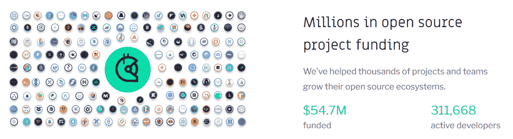
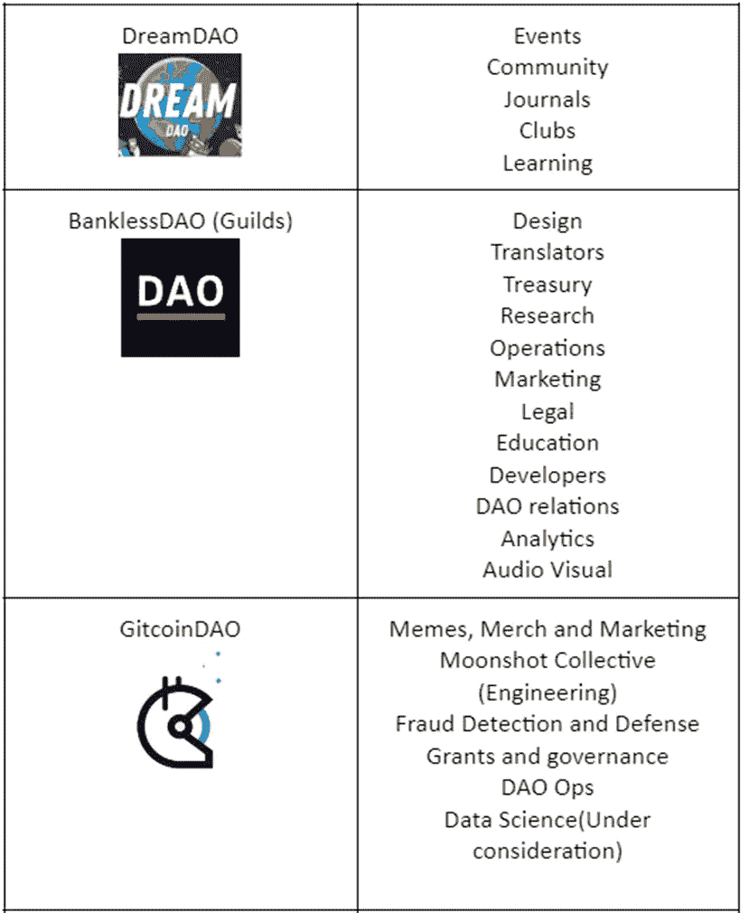

# 分散自治组织(DAOs)-第 1/2 部分

> 原文：<https://medium.com/coinmonks/decentralized-autonomous-organizations-daos-part-1-2-3b24f2c567ac?source=collection_archive---------9----------------------->

**简介**

“公司”说到底是一群为问题提供解决方案的人。十年来，它们的结构和政策没有发生重大变化。贝恩的一篇[文章](https://www.bain.com/insights/3000-years-of-business-history-in-two-minutes-video/)总结了公司和企业在过去 3000 年中的演变。

公元前 800 年——可以签订合同和拥有财产的早期组织

公元 960 年——合伙企业和股份公司

公元 1500 年——政府支持的公司在交易所发行股票和债券

公元 1790 年——大规模生产

1830 年，管理层被引入

公元 1870 年——创始人领导信托和垄断

公元 1920 年——散户投资者拥有公司

公元 1970 年——杠杆收购

从历史上看，我们看到每 40-50 年就会出现新的商业模式。我们很幸运正处于另一个过渡时期。分散的自治组织正在从根本上重塑人们协调和交付问题解决方案的方式。虽然许多公司已经忘记了我们首先是人，他们是为了使命而成立的，但 Dao 正在回归首要原则，将人和使命放在核心位置，并为这些人建立协调机制。截至 2022 年 3 月 19 日，我们拥有超过 216 个 Dao，累计估值接近 100 亿美元。

**来源:** [深道](https://deepdao.io/organizations)

分散自治组织是这样的组织

1.  设计一个真正扁平的结构——没有老板，没有经理
2.  允许每个人通过治理流程和投票参与组织范围的决策
3.  分散了所有权
4.  是开源的

Dao 类似于合作团体，但在协议和工具方面更有效。Dao 不需要管理者或层级——每个成员都有发言权，通过协议、论坛讨论和代币投票来影响组织的决策。工作流中的小决策可以在没有所有人参与的情况下做出，这使得 Dao 既敏捷又分散。由于规则嵌入到代码中，不需要经理，因此消除了任何官僚主义或等级障碍。大多数 Dao 的工作流程都建立在不和谐的公开渠道上的概念和办公室讨论之上。虽然分散的结构带来了贡献者更高的所有权，但消除官僚主义和管理减少了管理费用，使 Dao 更有效率。由于是开源的，Dao 具有更高的可伸缩性，对贡献者来说没有任何障碍。

# 道的历史

“分散式自治组织”一词是由德国计算机科学教授 Werner Dilger 于 1997 年提出的，他发表了一篇题为“根据免疫系统原理的智能家庭的分散式自治组织”的论文。继[比特币](https://www.investopedia.com/terms/b/bitcoin.asp)推出后，去中心化自治公司(DAC)这个词再次被提及。

第一把真正的刀于 2016 年由德国一家名为 [Slock.it](https://www.blockchains.com/) 的初创公司在以太坊街区 [#1428757](https://etherscan.io/block/1428757) 推出，被称为**创世纪刀**或' **刀**。它被认为是一项革命性的举措，在瑞士联邦理工学院筹集了 1.5 亿美元，是区块链联邦理工学院最初的众筹努力和高调项目之一。DAO 是一个旨在自动化决策和促进加密货币交易的组织。它吸引了迄今发行的所有以太代币的近 14%。

然而，2016 年 6 月 17 日，DAO 因发现编码中的漏洞而被[黑客攻击](https://www.coindesk.com/learn/2016/06/25/understanding-the-dao-attack/)，该漏洞允许黑客抽走价值 7000 万美元的资金。以太坊区块链那时还相当新(大约 1 年)。).在这个漏洞中，攻击者能够在智能契约更新其余额之前多次“要求”智能契约(DAO)归还以太。

以太坊很快通过一种被称为硬分叉的方法追回了资金，以太坊从以太坊经典中分离出来，以恢复被盗资金，这些资金被返还给投资者。

# Dao 的类型

*   **AMM 道斯**

自动做市商 DAOs 使用智能合约向用户提供去中心化的金融服务。

[MakerDao](https://makerdao.com/en/) 是一个分散金融(DeFi)项目，允许用户利用资产来生成 Dai。

*   **社交俱乐部 DAOs:**

社交 Dao 旨在将志同道合的人聚集在网络社区中，围绕一个令牌进行协调。

[利益之友](https://www.fwb.help/)是一个由艺术家、创造者、思想家和引领 web3 变革的人们组成的社区。

*   **创业道:**

这个 DAO 提供分散的风险投资基金，任何人都可以加入。每个人都有投票权来决定如何使用资金。

克劳斯之家是一群狂热的篮球迷，他们疯狂到足以买下一支 NBA 球队

*   **授予 DAOs:**

社区向奖助金池捐赠资金，并集体投票决定资金的分配和分发。

GitcoinDAO 是一个资助数字公共产品的 grants DAO。公共产品是指每个人无论其经济地位如何都有权获得的产品。

1.  **DeFi DAOs:**

[Aave 协议](https://aave.com/)是最著名的 DeFi DAOs 之一

*   **媒体 DAOs:**

Media DAO 提供由社区驱动的内容，在原生令牌中奖励内容创建者，并将广告商从等式中移除。

[BanklessDAO](https://www.bankless.community/) 是一个社区驱动的时事通讯，用于教育和引导人们使用 web3

# 道景观

**来源:** [合作警察](https://twitter.com/Cooopahtroopa)

# 管理

# 道中的治理是什么:

DAO 中的治理是关于 DAO/DAO 成员如何运作的规则被硬编码并在区块链上发布的地方。决策框架随着时间的推移而发展，以确保 DAO 得到有效治理，并在经济上激励网络参与者参与进来，从而使 DAO 得以发展。代码以这样的方式编写，即当 DAO 生态系统的成员为 DAO 生态系统增加价值时，他们通常会受到激励，而如果他们违背 DAO 的集体目标，则会受到惩罚。

通常，治理提案是影响全部或大部分 DAO 的决策。大多数治理决定是为了(一)将资金从"一体行动"金库中转出，包括工作流预算(二)改变"一体行动"的结构/参数(三)政策决定:所有其他决定都是在工作流中做出的，不需要成为治理的一部分。

治理可以从两个方面来看。首先，决策功能视图将治理视为功能 f(x1，x2…xn)→y，其中输入是 DAO 的各种合法利益相关方的愿望，输出是决策。

第二个是治理的协调模型，其中协调机构创建关于个人应该如何以及何时行动以实现最佳协调行为的焦点。一般来说，这里设定的规则受到博弈论概念的影响，如[囚徒困境](https://www.investopedia.com/terms/p/prisoners-dilemma.asp)，其中一个人从像其他人一样做出相同的举动中受益匪浅。

# 治理是如何实现的？

通常，治理是通过象征性投票实现的。

1.  链上:在这里，每一张选票都被记录在区块链上。投票需要油费。
2.  **链外**:投票在快照等工具上完成，投票不需要加油费，但是投票不在区块链上注册。投票者有资格按照代币的比例投票，并使用他们的钱包在交易上“签名”。选票被保存在分散的存储系统中，如 IPFS，以避免篡改。这样做是为了避免低风险决策的油费。

任何持有特定 DAO 原生令牌的 DAO 成员都有资格投票支持这些提案。你拥有的代币越多，意味着你比别人拥有更多的投票权。二次投票有时被用来阻止大量囤积代币的隐鲸影响结果。二次投票是一种集体决策的方法，参与者不仅投票支持或反对某个问题，还表达他们对该问题的强烈感受。它有助于保护那些深切关注特定问题的选民小团体的利益。例如:如果一个人用价值 25 美元的代币参与投票，那么投票总数将等于 25 的平方根，即 5 票。在 DAO 中，令牌持有者将他们的投票“委托”给一个管理者或 DAO 成员，然后由他们代表这些令牌持有者投票也很常见。

# 治理建议

让我们看看治理在多个 Dao 中是如何工作的。在转向 DAOs 之前，我们先来看看比特币软件升级的决策是如何制定的。比特币在协议中内置了升级机制。任何人都可以发布协议的新版本。矿工通过选择他们开采的区块的版本来投票。每个区块都有一个指定版本的标签，该标签被计为投票。在使用新版本挖掘了 90%的块之后，实现了软分支，这使得新版本成为默认版本，同时与较旧的块和操作较旧版本的节点兼容。激活软叉后，少数民族矿工在旧版本中开采的矿块将被拒绝，矿工将失去他们的费用，迫使他们升级。

# 继续看 DAOs:

## [Uniswap](https://uniswap.org/) :

1.  在提案讨论部分提交一份关于联合国系统工程应用方案治理的提案。
2.  与 Uniswap Discord Admins 取得联系，在社区电话和 Twitter 空间上讨论您的提案。
3.  在温度检查部分创建另一个论坛帖子，并发布一个快照(温度检查)投票，投票时间为 2-5 天。此操作需要至少 1K 个委托或自行委托的 UNI 令牌。为了使快照有效，该提案应获得至少 25k 张“是”票。
4.  如果提案通过了温度检查，请根据机构群体的反馈更新温度检查帖子。
5.  发布快照(共识检查)，共识检查的目的是围绕潜在提案建立正式讨论。快照提案将被视为有效，如果它得到至少 50，000 联合“是”票。
6.  为您的提案编写代码(由专业审计员审计的代码)，并将提案升级为链上投票。要求至少有 250 万 UNI 委派到您的地址来做这件事。一旦提议函数被调用，七天的投票期将开始。正在进行的讨论可以在 gov.uniswap.org 论坛进行。如果提议成功通过，在执行提议的代码之前，将有两天的时间锁定。

## [去中心化](https://decentraland.org/)

分散的土地遵循完全分散的治理。提交提案至少需要 100 票。1 法力= 1 投票权；1 块土地或 1 块地产= 2000 投票权。提案分为 5 大类:

【https://governance.decentraland.org/submit/】来源:

**提案渠道:**提案在治理论坛提交。**提案步骤**

1.  提交的提案
2.  **过滤阶段:**这是一个过滤社区感兴趣的提案的投票。在每个阶段，提案都有一个最低的“参与”总票数阈值(占可用投票总数的百分比)和一个“支持”阈值(占提案赞成票的百分比)。
3.  **安全阶段:**安全顾问委员会( [SAB](https://cybersecurity.osu.edu/cybersecurity-ohio-state/information-security-groups/security-advisory-board) )审查通过过滤阶段的提议。SAB 由 5 名成员组成，由机构群体投票选出。理事会有 24 小时的时间拒绝或延迟提案，否则提案将进入下一阶段。这是为了避免恶意的提议。
4.  **机构群体投票:**此处，提案需要更高的参与度和支持度才能生效。

**资料来源:** [分散社区投票](https://docs.decentraland.org/decentraland/community-voting/)

## [GitcoinDAO](https://gitcoin.co/dao)

**提案渠道:**所有的治理讨论都将在 Gitcoin 的一个论坛中进行，以便机构群体拥有所有的背景和信息来做出决策。**提案步骤:**

1.  提案首先发布在论坛的“提案讨论”部分。一旦发布，提案将至少有 5 天的时间可供审查，并需要收到至少 5 名干事的意见。
2.  一旦提案被讨论并收到至少 5 名干事的回复，如果他们符合格式标准，他们将被转移到投票。投票可以是链上投票，也可以是链下投票。
3.  链上-只有从 DAO 资金中流出的资金才在链上投票。所有工作流预算请求都在链上投票。计数用于链上投票
4.  对快照进行链外默认投票。

投票可以是直接投票，也可以是委托投票。任何持有 Gitcoin 的人都可以将他们的选票委托给一个管理员。管理员是由社区选出的——任何人都可以通过陈述他们的意图来申请成为管理员。Gitcoin 将其治理称为“流动”民主，因为授权者可以随时撤回授权并进行变更。大多数提案分为 4 类:

1.  **资助提案**:资助团队/工作流
2.  **批准提案:**这是由机构群体或任何工作流批准的普通投票
3.  **治理提议:**这是对治理过程的更新
4.  **道建议:**改变道结构的建议
5.  **最低参与人数(法定人数):**提案生效至少需要 250 万(总供应量的 2.5%，当前供应量的 15%)票。然而，如果票数之间的差异使得获胜的一票不能随着最低票数而改变，则该提案被接受。

## 提案将按照以下指导原则发布在标准模板中:

*   **标题** —张贴每份提案，并附上围绕其目标的清晰标题。这将如下所示:[建议] — XXXXXX
*   **订购** —请不要为您的 GCP 分配号码。提案的排序将由社区版主指定。
*   **细节** —虽然我们鼓励每个人都参与进来，但请尽量考虑所有观点，并提供关于提案想法的深层信息或细节。
*   **投票**——并不是每个提案都会被批准。关于什么样的提议有资格被实施，并没有硬性的标准，尽管一个很好的经验法则是参与度越高，就越有可能被采纳。
*   **精神气质** —治理的目标是为所有利益相关者创建一个更具包容性和授权的系统。我们鼓励提案创建者围绕提案如何帮助 Gitcoin 用户、合作伙伴和团队成员更好地相互互动，以及这些变化如何为所有与协议互动的人创建更流畅的生态系统，来集中他们的想法。

准备提交提案时，请尽可能遵循此格式。

# GCP 格式:

1.  总结——用 2 到 3 句话来说明提案是什么以及建议进行哪些更改，但不要深入细节。
2.  摘要—介绍提案、提案所包含的内容以及提案实施后将会发生哪些变化的详细信息的扩展摘要。
3.  动机——描述提案背后的动机、它解决的问题以及它增加的价值。这是你展示为什么这个提议是必要的，以及如果实施的话，这些改变将如何使 Gitcoin 受益的机会。
4.  规格—描述提案的“要点”。深入探讨技术和社会层面将会发生的变化。越详细越好。
5.  益处—指出建议实施的核心益处以及它将如何影响系统。
6.  缺点—强调实施提案的任何缺点以及升级时要考虑的要点。
7.  投票——清楚地概述投票“是”和“否”意味着什么。请链接到 Snapshot 27 或直接在论坛上包括一个论坛投票，以在设置>建立投票投票下进行温度检查。

## [克利马道](https://www.klimadao.finance/)

**求婚渠道**

非正式渠道:非正式渠道对于贡献者来说是理想的，他们可以先试探一下，测试一下对他们想法的反应，然后在正式渠道上提出来之前进行微调。KlimaDAO 有两个非正式渠道:

1.  不和谐:活跃的讨论发生在多个不和谐渠道中，社区成员和 DAO 贡献者都参与其中。有一个由贡献者监控的问题频道。虽然可以从任何渠道寻求反馈，但治理和政策论坛渠道是发起提案的最佳途径。
2.  主办的活动:KlimaDAO 主办办公时间，政策聊天，和 AMA 会议每周不和谐。在这些电话会议中，任何人都可以自由加入并提出问题或建议。

正式:https://forum.klimadao.finance/的[是发起提案的正式论坛。论坛有两个部分——讨论和建议。任何人都可以登录论坛并开始讨论。](https://forum.klimadao.finance/)

**来源:**[https://forum.klimadao.finance/](https://forum.klimadao.finance/)

**来源*:****[https://forum.klimadao.finance/](https://forum.klimadao.finance/)*

***提案步骤***

*Klima 的提案流程分为三个阶段:*

1.  ***征求意见(RFC)** :不和谐地或在 AMAs 中讨论——收集对你的想法的反馈。在普通论坛的“讨论”中发布提议。如果需要，添加投票。*
2.  ***Klima 改进提案(KIP):** 一旦在普通论坛上讨论，政策团队将根据其内部标准和提案模板[https://forum . Klima Dao . finance/d/1-Proposal-rules-and-guidelines](https://forum.klimadao.finance/d/1-proposal-rules-and-guidelines)内的“提案”论坛中的帖子挑选相关讨论，帖子将包括一个“KIP”编号(Klima 改进提案)，这是一个投票选项。投票至少一天，并收到至少 5 个不同成员的回应。这是一次非正式投票，以评估最终提案中需要进行的任何更改。发布提案的人将负责在论坛中和不一致的情况下与机构群体成员接触并回答他们的问题。*
3.  ***快照投票:**最终正式投票在[快照工具](https://snapshot.org/#/klimadao.eth/)中完成。每个投票人的钱包里都有一张 Klima 的票。除杠杆代币外，所有形式的代币，包括有桩代币和包装代币，都有资格投票。*

****

*[*提案的最终票数*](https://snapshot.org/#/klimadao.eth/proposal/0xc8e25eb8aa499b343c521c3ff339923f7743cc76a9b08ca14568c89feab3fff9)*

***未来***

*Klima DAO 旨在通过研究最佳实践和寻求社区意见，在未来分散 KIP 出版物。Klima 正在探索的一个解决方案是“管理”模式，即由社区投票选出有权发布快照提案的代表。*

## *[稀有协议](https://rarible.org/about/)*

***提案渠道:**论坛*

***提案步骤***

1.  *在论坛上撰写并提交提案*
2.  *在每周提案审查电话会议中批准团队审查。*
3.  *资助团队在论坛或不和谐中提交反馈。在某些情况下，提议者被要求以一个小的推销来介绍这个想法。*
4.  *如果该提议被接受，则将其移至快照进行进一步投票，或者在此阶段被拒绝。投票由赠款工作组进行。*

*任何有兴趣在 Rarible 工作的人都需要至少有一个提议被接受。Rarible foundation 是完全集中的，grants 团队是半集中的，运营是完全分散的。*

**

****出处:*** [*稀有说法页*](https://rarible-protocol.notion.site/DAO-Litepaper-v2-c9e1b35eca9d4e2d8c8eb3d114e049e9)*

## *[复合](https://compound.finance/)*

*从提议是可执行代码而不是书面建议的意义上来说，复合是独特的。*

*复合治理通过 COMP 治理令牌(ERC-20)、Bravo 治理模块(基于投票的调控器智能合约)和 Timelock(用于锁定令牌直到投票完成的智能合约)运行。*

***提案渠道:** Bravo 治理模块*

***提案步骤:***

1.  *提案提交:*

*发送者必须获得 1%的总红利代币授权或锁定 100 红利，提交提案并等待 1%的红利授权，提案提交才能成功。*

*函数 propose(地址[]内存目标，uint[]内存值，字符串[]内存签名，字节[]内存调用数据，字符串内存描述)返回(uint)*

***坚固度:***

*GovernorBravo gov = GovernorBravo(0x 123…)；//合同地址*

*uint proposalId = gov.propose(目标、值、签名、调用数据、描述)；*

1.  *投票:投票持续 3 天，需要最低法定人数和支持*
2.  *队列:如果提议成功，它将被移动到一个 2 天队列，令牌被锁定。*
3.  *执行*

**

***来源:** [复合治理](https://compound.finance/docs/governance#introduction)*

***工作流/功能***

******

***来源:**入职页面，各 Dao 的不和谐渠道*

# *Dao 现在是如何使用的？*

*Dao 只是一群没有国界的人，装备 web 3 聚在一起解决一个问题。他们非常类似于一个合作的社会，但由于 web 3，他们可以通过设计实现更多。如今，大多数 Dao 都处于 DeFi、Play to Earn、grants、tooling、marketplaces 和 web 3 生态系统开发领域。旨在解决社会问题和实现可持续发展的 Dao 正在迅速涌现。DreamDAO 和 Civics 不插电 DAO 培训全世界的青少年和 GenZs 成为明天的变革者。KlimaDAO 是环境保护主义者对抗气候变化的一个途径，它有一个锁定碳补偿的协议。一些 NFT 项目也通过向持有者发放治理令牌来过渡到 DAO 模型。mirror.xyz、Aragon 等平台没有构建任何代码工具来发布 DAOs。*

# *DAOs vs 公司*

****

*Dao 本质上比公司更有效，原因如下:*

1.  *因为不需要管理，所以开销较低*
2.  *更高的治理透明度*
3.  *更高的所有权，因为道成员和贡献者更多的是传教士*
4.  *一个更快乐的工作场所*

# *DAO 当前面临的挑战和潜在的解决方案*

***分权治理:***

*我们如何实现分布式治理，这对于管理基于区块链的业务是理想的？*

*首先，分散的组织(或 Dao)需要接管以前需要分级治理的职能。这就提出了如何组织这些组织的问题。传统企业的组织是由集中的等级制度指导的；由于区块链缺乏集中控制，分散治理需要不同的规则。*

## *潜在解决方案:*

*已经提出了几种类型的分权组织，每种都提供不同的好处:DSO(分权自组织系统)、区块链合作社、DAC(分权自治公司)以及 Dao。这些建议大多涉及一个象征性的激励计划，鼓励参与治理；它们的主要区别在于如何选择代理人和如何激励参与。对于许多分散组织模型来说，如何选择代理人仍然是一个重要的未解决的问题。*

***黑客风险:***

*这种依赖带来了风险。漏洞或恶意攻击会破坏协议的安全性。*

*对以太坊区块链的攻击:*

**

*【https://unsplash.com/s/photos/hacker】来源:*

*2016 年，以太坊因其主要交易处理组件 Geth 受到 DDoS 攻击而暂时宕机。除了这些技术挑战，治理本身也会变得有问题。智能合约可能会受到攻击:例如，区块链平台需要考虑它们对 51%攻击的敏感性，这些攻击允许攻击者挖掘比其公平份额更多的令牌。外部攻击和黑客是对 Dao 的合法威胁。*

## *潜在解决方案:*

**所有 Dao 都有漏洞奖金，为发现漏洞提供奖励。**

***责任限制:***

*道组织缺乏任何正式的法律承认，这给道组织成员带来了潜在的责任。在会员需要法律辩护或希望使用传统途径解决争议的情况下，这可能会有问题。这些问题可能会导致其他"道"成员对另一成员的作为或不作为承担个人责任。由于这些责任，各种 Dao 的一些成员已经开始考虑建立一个内部监管框架，以保护自己在运营出现问题时免受任何潜在责任的影响。*

*一般来说，当两个或两个以上的人或实体建立一个组织来开展业务时，就形成了普通合伙企业。每个成员平等分享他们经营的利润和亏损。普通合伙企业不对其成员提供责任保护，并可能导致任何成员因法律问题或与其他合伙人的纠纷而承担个人责任。这种责任保护的缺乏使得普通合伙在大多数情况下不受欢迎，然而，由于它们在成员参与方面的灵活性，它们仍然被用作发起新业务的工具。*

*虽然目前没有正式承认分散自治组织的传统法律实体类型，但州法律已经在努力使传统商业实体适应 Dao。具体来说，特拉华州已经制定了新的立法，称为特拉华方式，允许公司通过代码而不是纸质文件注册成立。这个合并框架是为许多新兴技术提供法律地位的重要一步，例如基于区块链的系统和其他类型的分布式系统，如 DAOs。*

## *潜在解决方案:*

*道的成员教育他们的立法者制定道的规则。a16z 写下了广泛的 [*政策建议*](https://a16z.com/wp-content/uploads/2022/01/WEB3-Policy-Handbook-PxP.pdf.pdf) *其中包括释放 DAOs 潜力的建议。在我们有 DAO 友好的法规之前，限制责任的解决方案可能是在 DAO 友好的地理区域注册 DAO。**

***投票权不平等:***

*当今道的大多数投票是通过代币投票进行的，这里任何持有特定道的代币的人都可以参与道的治理，通常你拥有的代币越多，你对其他人的投票权就越大。一般来说，代币的分配是这样的，10%到 30%的代币由创始人、风投和创始团队成员留存。此外，存在持有大量代币的加密鲸，这两个事实使 Dao 更加“集中”，因为决策权集中在少数富有的钱包地址手中。*

## *值得注意的例子:*

1.  *曲线金融:前 20 名钱包持有 89%的代币。*
2.  *Uniswap:前 20 名钱包持有 48%的代币。*

## *潜在解决方案:*

**二次投票，信誉评分，信念投票。二次投票是一个简单的数学公式，减少了鲸鱼在投票中的权重。信誉分数是在一段时间内获得的参与分数，其给予游戏中皮肤相对于所持代币的权重。* [*信念投票*](/giveth/conviction-voting-a-novel-continuous-decision-making-alternative-to-governance-aa746cfb9475) *允许多项提案进行投票，并通过计算一项提案的投票时间来增加一个时间变量。**

***无最低参与者规则:***

*在任何完善的协议(DAOs)中，没有参与者的最小数量作为提交提案进行在线投票的先决条件；相反，大多数法定人数的先决条件将是令牌的最小数量/百分比。因此，与 DAO 的平均活跃成员相比，在创始人、VC 和 Crypto whales 持有不成比例数量的令牌的协议中，无法实现真正的去中心化。*

***值得注意的例子:***

1.  *Unisawp:对于一个要在链上部署提议的用户，他需要至少有 250 万个 UNI 令牌被委派到他的地址。*
2.  *复合:在这里，用户需要将 1%的补偿令牌委派到他的地址来提交提案。*

## *潜在解决方案:*

**Dao 还处于早期阶段，预计会有更多的分散化和更高的采用率。一旦代币持有分散化，最低参与法定人数将有效。一些协议也有一个液体民主，其中令牌可以被委托给管理者投票。每个理事都比个人有更高的投票权。**

***错位激励:***

*小代币持有者将 DAO 平台的代币视为收益或投资，而不是投票权，因此他的决定总是会增加代币的价值，即使这是以牺牲 DAO 的使命为代价。因此，普通选民通常不太了解该提案，投票率总是很小，通常不到代币持有者总数的 5%。*

## *潜在解决方案:*

*[*【参与证明】*](https://www.coindesk.com/learn/poaps-what-is-a-proof-of-attendance-protocol/) *用于鼓励参与"一体行动"活动，从而调整激励措施。**

***文化障碍:***

*一般来说，成为任何 DAO 治理的一部分没有任何限制，来自世界各地的人都有望成为特定 DAO 协议的一部分。在这里，文化和工作方式的差异会成为 DAO 协调工作中的一个障碍。此外，要成为任何一个 DAO 的一员，都必须掌握相当多的英语，所以存在语言障碍。*

## *潜在解决方案:*

*Dao 在办公时间主持工作，AMAs(呼吁不和)打破僵局。一些 DAO 工作组聚集在 google meet，discord group 并开展工作' jams'。乘务员在打破障碍和帮助人们通过方面起着至关重要的作用。协调游戏和角色扮演也很常见。DAO 贡献者可以使用多种语言渠道来贡献任何语言。*

***无监督协调:***

*在缺乏监督的情况下，Dao 需要强大的流程和协议。今天的大多数 Dao 都是非常新的(不到 2 岁),并且正在解决这个问题。*

## *潜在解决方案:*

**流程和工作流是 Dao 的支柱。**

# *DAOs 的未来*

*我们预计 Dao 将在以下领域发展:*

1.  *P2P: B2C 平台和业务可能会变成 P2P(点对点)Dao。预计优步、亚马逊和 Airbnb 等市场将被 DAOs 颠覆。在工业革命之前，工匠、技术人员和服务提供商的工作行会是事实上的运营模式，随着 Dao 和平台的出现，这种模式可能会复兴。*
2.  *社会原因:为社会原因工作，这一直是一个周末活动或 CSR 合规交易，支付公司利润的一小部分，有可能随着 DAOs 和 web 3.0 协议成为主流。*
3.  *环境和公民科学项目:食物、水、物种和影响我们的各种其他参数的分散数据收集。*
4.  *生态系统构建:开发者 Dao、艺术家 Dao、Dao 使社会边缘群体能够为第 1 层协议构建生态系统。有了元宇宙和 NFTs，设计师就是新的建设者。预计会有很多 Dao 来教育人们，并让他们登上元宇宙——记住，web 3 的采用率仍占世界人口的 4%,发展中国家近一半的人口仍没有互联网和银行账户。*
5.  *P2E 博彩社区:P2E 和博彩集团是紧密联系的社区。这是 Dao 最受欢迎的领域之一。*
6.  *企业:Dao 形式的大型和小型企业协作*
7.  *投资和资助: [IndiDAO](https://twitter.com/IndiDao) 就是这样一个投资 DAO，由 Shardeum 联合创始人 Nischal Shetty 共同创立。*
8.  *NFTs:预计很多 NFT 项目会过渡到 DAOs。NFT 藏家也可以以道的形式合作投资多个 NFT 项目。*
9.  *DeFi:DeFi 仍处于早期阶段。通过在贷款、借款、保险、资产令牌化、流动性池、股票和证券令牌化方面的更多创新，DeFi 有可能解决世界的“货币”问题。*
10.  *工具和平台:像[https://dune.xyz/](https://dune.xyz/)这样的平台使开发者/分析师和消费者对分析的访问民主化。期待更多这样的消除技术壁垒的平台。*

*这是几个世纪以来我们从未见过的有意识和可持续发展的十年。这是道斯的十年。*

***参考文献:***

1.  *【https://ethereum.org/en/dao/ *
2.  *[https://en . Wikipedia . org/wiki/The _ DAO _(organization)# History](https://en.wikipedia.org/wiki/The_DAO_(organization)#History)*
3.  *[https://vitalik.ca/general/2017/12/17/voting.html](https://vitalik.ca/general/2017/12/17/voting.html)*
4.  *[https://future.a16z.com/dao-canon/](https://future.a16z.com/dao-canon/)*
5.  *[https://www.reddit.com/r/dao/](https://www.reddit.com/r/dao/)*
6.  *[https://daowiki.xyz/](https://daowiki.xyz/)*
7.  *[https://deepdao.io/organizations](https://deepdao.io/organizations)*
8.  *[https://coinmarketcap.com/view/dao/](https://coinmarketcap.com/view/dao/)*
9.  *[https://daolist.fyi/](https://daolist.fyi/)*
10.  *[https://www . Reddit . com/r/Dao/comments/phw 9 zi/key _ skills _ for _ Dao _ development/](https://www.reddit.com/r/dao/comments/phw9zi/key_skills_for_dao_development/)*
11.  *[https://vitalik.ca/general/2021/08/16/voting3.html](https://vitalik.ca/general/2021/08/16/voting3.html)*
12.  *[https://static 1 . squarespace . com/static/5966 EB 2 ff 7 E0 ab 3d 29 b 6b 55d/t/5f 989987 fc 086 a 1d 8482 AE 70/1603837124500/defi _ governance _ paper . pdf](https://static1.squarespace.com/static/5966eb2ff7e0ab3d29b6b55d/t/5f989987fc086a1d8482ae70/1603837124500/defi_governance_paper.pdf)*

*与 [Shuwam Rana](https://medium.com/u/a156fb3a8cab?source=post_page-----3b24f2c567ac--------------------------------) 和 [Vishwanath Holin](https://medium.com/u/f9b78244e733?source=post_page-----3b24f2c567ac--------------------------------) 合作撰写*

> *加入 Coinmonks [电报频道](https://t.me/coincodecap)和 [Youtube 频道](https://www.youtube.com/c/coinmonks/videos)了解加密交易和投资*

# *另外，阅读*

*   *[如何匿名购买比特币](https://coincodecap.com/buy-bitcoin-anonymously) | [比特币现金钱包](https://coincodecap.com/bitcoin-cash-wallets)*
*   *[币安 vs FTX](https://coincodecap.com/binance-vs-ftx) | [最佳(SOL)索拉纳钱包](https://coincodecap.com/solana-wallets)*
*   *[比诺莫评论](https://coincodecap.com/binomo-review) | [斯多葛派 vs 3Commas vs TradeSanta](https://coincodecap.com/stoic-vs-3commas-vs-tradesanta)*
*   *[Capital.com 评论](https://coincodecap.com/capital-com-review) | [香港的加密借贷平台](https://coincodecap.com/crypto-lending-hong-kong)*
*   *如何在 Uniswap 上交换加密？ | [A-Ads 评论](https://coincodecap.com/a-ads-review)*