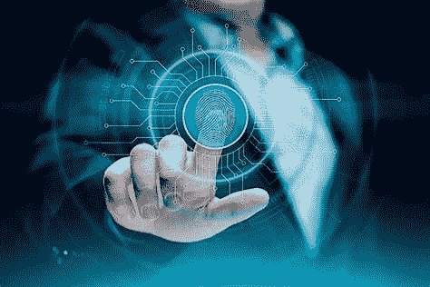

# 分散式数字身份

> 原文：<https://medium.com/coinmonks/decentralized-digital-identity-3b4bdaa84157?source=collection_archive---------13----------------------->

答几乎我们所有的数字身份都通过设备、应用和服务联系在一起。服务提供商控制这些数字身份以及与该数字身份相关联的它们各自的消费数据。

KYC(了解您的客户)是一种信息请求格式，用于管理管理第三方资金的公司，然后存储个人客户信息。正因为如此，用户目前经历了个人数据的不良使用和数据泄露，影响了他们的社交、财务和职业生活。隐私和安全受到侵犯。*①*

此外，从不同的应用程序向多个第三方或服务提供商授予访问权限会使用户难以管理其个人数据和撤销对其信息的访问。

用户应该拥有和控制他们的数字身份，以解决这些问题，最好从一个单一的来源。

集中式系统导致用户的身份数据极易受到网络攻击和隐私侵犯。但是，分散式身份解决方案提供了一个新的视野，允许用户和服务提供商更好地管理他们的身份和个人数据。

# 一个去中心化的身份是怎样的？

分散式身份认证是基于身份管理缺乏信任的框架。它允许用户生成和控制他们自己的数字身份，而不依赖于特定的服务提供商。

例如，数字身份可以获得雇主、政府或大学等多个发行方的批准，并存储在一个称为“身份钱包”的数字钱包中。使用身份钱包，用户(即身份的所有者)可以向任何第三方提供身份的证明。电子钱包帮助用户从单一来源授予和撤销对身份信息的访问权限，这使访问变得更加容易。

根据 [Forrester](https://www.forrester.com/report/Prepare-For-Decentralized-Digital-Identity-Security-SWOT/RES159143) 的说法，“去中心化的数字身份(DId)不仅仅是一个技术上的时尚词汇:它承诺对目前集中在去中心化和民主化架构中的物理和数字身份生态系统进行彻底的重组。”

# 区块链中的去中心化身份

区块链去中心化身份的配置一般由以下要素组成:

*   身份钱包:一个应用程序，允许用户创建他们的分散身份并管理他们对服务提供商的访问。
    身份所有者:使用身份钱包创建分散身份的用户。
*   发布者/验证者:发布和验证身份信息的人。他们用自己的私钥签署交易。
*   服务提供商:接受使用分散身份认证的应用程序，并访问区块链/分布式图书以查找用户共享的 DId。
*   区块链/分布式大账本:一个去中心化、分布式的账本，为 DIds 及其运行提供机制和功能。
*   DId(分散标识符):一个惟一的标识符，包含诸如公钥、验证信息、服务端点等细节。

在分散式身份表单中，应用程序(身份钱包)允许用户创建自己的数字身份。在创建身份之后，生成相应的密钥、公钥和私钥(秘密)。

身份钱包将带有公钥的有效载荷发送到区块链，后者会为您的钱包生成一个唯一的标识符。私钥保留在用户的身份设备/钱包中，并在身份验证过程中使用。

同样，政府、大学和金融机构等发行者验证各自的身份信息，并将其添加到数字身份数据中，其过程类似于证书的发行。这些过程，例如用户身份的验证和新证书的颁发，要求发射者用他们的私人钥匙签名。

身份钱包包含经过验证的用户身份详细信息，如姓名、年龄、地址、教育程度、就业详细信息和财务信息。这些信息有助于建立信任，并使用户有资格执行身份验证。

去中心化的身份机制获取与私钥相关联的公钥，并将其发布在作为区块链分发的主要账本中。

用户与服务提供商共享该 DId 用于认证。服务提供商寻找在分布式主要分类帐中共享的 Did。如果找到它，分布式主要分类帐将发送与应用程序匹配的数据。用户用私钥签署该交易以完成认证。服务提供商的应用程序确认认证成功，并允许用户执行操作。

# 当我们完全采用分散的身份识别过程时会发生什么？

假设一个在线购物场景，其中所需的数据将从与分散身份相关联的钱包中转。这个场景中的钱包包含经过验证的身份、地址和财务数据。

用户通过发送身份钱包的所需信息来共享身份数据以登录网站。他们向网站认证，而不共享实际数据。同样的场景也适用于支付过程；用户可以使用已经在 it 身份钱包上验证的地址和支付来源下订单。

因此，用户可以在不与电子商务网站的所有者共享地址或财务数据的情况下经历安全且无故障的在线购买体验。

## 区块链的好处

*   可靠:区块链技术使用共识方法，通过几个节点测试数据的真实性，并作为可信来源来验证用户的身份。除了数据之外，每个数据块还包含一个哈希，如果有人修改了数据，这个哈希就会发生变化。这些块是分布在网络中的所有节点之间的高度加密的事务或共享条目列表。
*   数据的完整性:基于区块链的数据存储机制是不可变的和永久的，因此，不可能修改或消除它。分散式身份系统使用这种机制让任何外部实体操作或修改数据。
*   安全性:在分布式身份系统中利用区块链的另一个基本原因是为了提供可靠的安全性。区块链系统通过保持数据高度加密而具有固有的设计。区块链还处理数字签名、一致算法和散列加密函数，以保护用户的身份免受侵害和盗窃。
*   隐私:利用区块链和伪匿名(分散标识符)标识符的分散身份系统有助于减轻身份所有者对隐私的担忧。
*   简单:身份发布者利用数字身份的连续发布过程。身份验证者可以有效地合并新用户并执行信息验证过程。身份所有者可以在身份钱包中存储和轻松管理他们的身份。

# 结论

用区块链去中心化的身份，完全可以改造数字身份的全景。它将使数字身份的管理分散和透明，因为没有特定的组织将控制用户的数据。

更重要的是，用户可以轻松地进行身份验证，而无需与第三方共享他们的机密个人信息。

传统上，用户的身份管理是从第三方进行的:一个应用程序，一项服务，一家公司，它允许你创建一个特定的身份，成为你的用户名，并允许你识别你。显然，由第三方管理的这种身份存在许多问题，从滥用基于使用与该身份相关联的个人数据，到在提供商遭受入侵的情况下的安全问题。

分散式数字身份(DId)是 web call 3 概念的基础之一:在一个环境中，它依赖于外部存储库，每个存储库管理自己的数据。

基本上，DId 不仅允许您拥有一个可靠的系统，还允许您拥有一个完整的(存储在区块链中且不可修改)、安全的、私有的和简单的使用，而无需任何组织来管理用户的数据。

开始理解这种类型的概念并熟悉它们，这是理解经历网络的转变的关键之一。

*(1)* [KYC，一种大众监控仪器](/coinmonks/kyc-a-mass-surveillance-instrument-305ffe9b3bd6?source=your_stories_page----------------------------------------)

【liberlion.com 

> 加入 Coinmonks [电报频道](https://t.me/coincodecap)和 [Youtube 频道](https://www.youtube.com/c/coinmonks/videos)了解加密交易和投资

# 另外，阅读

*   [Bookmap 评论](https://coincodecap.com/bookmap-review-2021-best-trading-software) | [美国 5 大最佳加密交易所](https://coincodecap.com/crypto-exchange-usa)
*   最佳加密[硬件钱包](/coinmonks/hardware-wallets-dfa1211730c6) | [Bitbns 评论](/coinmonks/bitbns-review-38256a07e161)
*   [新加坡十大最佳加密交易所](https://coincodecap.com/crypto-exchange-in-singapore) | [购买 AXS](https://coincodecap.com/buy-axs-token)
*   [红狗赌场评论](https://coincodecap.com/red-dog-casino-review) | [Swyftx 评论](https://coincodecap.com/swyftx-review) | [CoinGate 评论](https://coincodecap.com/coingate-review)
*   [投资印度的最佳密码](https://coincodecap.com/best-crypto-to-invest-in-india-in-2021)|[WazirX P2P](https://coincodecap.com/wazirx-p2p)|[Hi Dollar Review](https://coincodecap.com/hi-dollar-review)