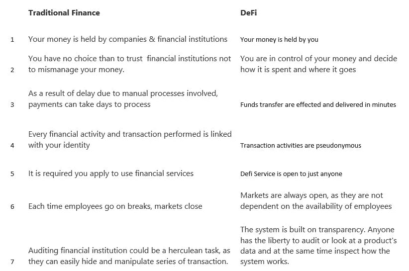

# 分散融资

> 原文：<https://medium.com/coinmonks/decentralized-finance-defi-650c2d0dd9a9?source=collection_archive---------60----------------------->

为了更好地理解什么是分散金融，快速谈论一下传统银行体系/传统金融是很重要的。在分散金融出现之前，曾经有传统金融，这是由金融机构处理金融交易的旧方式。在这个时代，个人把钱存在银行，但必须控制这笔钱，决定如何使用这笔钱，把钱借给谁。事实上，撤回他们的资金可能会遇到一些瓶颈。除此之外，金融机构不向客户提供任何资金投资回报(金融机构)，尽管事实上他们用存放在他们那里的资金进行交易并获利。

然而，随着基于区块链技术的加密货币的出现，分散金融(Defi)的概念已被引入并逐渐获得牵引力。分散金融建立在以太网的基础上，提供分散化的好处。

在金融界，分散化是指消除银行和金融机构对货币、金融产品和其他金融服务的控制。重要的是要说明，这个概念正在出现，随着它在技术爱好者中变得越来越受欢迎并获得牵引力，它很容易进行调整和改进。

**DeFi 有哪些应用？** 就像在传统的银行业一样，法定货币可以用于投资，从一个人转移到另一个人，并且不能被借走。这同样适用于 DeFi，因为它在**出借加密、发送加密或投资加密**领域非常有用。然而，这里的显著区别是 DeFi 的发生没有一个中央控制机构，没有银行或其他传统金融组织的参与，因此它被称为“分散的”

**DeFi 的好处:** 透明:交易透明。实时交易:交易实时发生。
用户控制:用户可以决定通过使用非托管加密钱包或基于智能合同的托管来保留对其资产的托管。
无国界:DeFi 是包容性的和无权限的，因为它对许多愿意输入和采用区块链技术的人开放

**分散财务如何运作？
这是通过利用使用高级软件、连接、安全协议和硬件的点对点金融网络实现的。**

加密货币的颠覆使得 DeFi 的概念成为可能。正如你所知，加密货币是建立在区块链技术之上的。然而，需要说明的是，并非所有的加密货币都采用 DeFi 协议。例如，比特币是一种像法定货币一样的价值储存货币，但没有被 DeFi 采用，但以太坊是一种为用户提供创建智能合同的方法的加密技术，现已成为 DeFi 应用的主要区块链。

**DeFi 应用**
DeFi 应用是基于区块链技术的金融应用，使多方之间的数字交易成为可能。
常见的 DeFi 应用/硬币包括但不限于以下列表:

**CoinMarketCap 排名前 9 位的 DeFi 项目/代币看点** #1。Colony Lab:这是雪崩区块链上最好的 De-Fi 项目。
#2。Aave:这是一个显示流动性协议的分散式金融平台。
#3。Fantom:这是对数字资产、dApps、&智能合约的定义。
#4。PancakeSwap:这是最流行的去中心化平台。
#5。幸运块:这被吹捧为 2022 年购买的最好的 DeFi 硬币。
#6。Uniswap:这无疑是一个顶级的去中心化交易所，拥有领先的 Defi Coin。
#7。Terra:持续跑赢市场的领先 Defi 币。
#8。曲线金融。
#9。渴望金融。

**如何投资 Defi** 1。获取加密钱包。您的加密钱包是一个数字实体，您可以在其中存储用于参与 DeFi 协议的加密硬币。

2.购买参与 Defi 协议所需的加密硬币，如 BNB (BSC)、ETH 等

3.使用任何 Defi 协议平台(如 pancakeswap)开始使用协议

4.跟踪您的 DeFi 投资，以及您的整个投资组合

警告:
加密货币市场需要流动性。流动性是与项目相关的给定交易平台上可用的加密资产或资金(市值)的数量。市场资本越多，投资该项目就越安全，市场资本越少，投资该令牌的风险就越大。在你投资任何硬币/代币/项目之前，了解你感兴趣的硬币/项目的代币经济学是很重要的，这样你就不会投资于一个死项目或一个容易出问题的项目。

DeFi 是一个用来描述金融产品和服务的术语，这些产品和服务可以被任何有互联网连接的人和能够使用以太坊的人访问，因为 DeFi 是建立在以太坊区块链之上的。有了 DeFi，市场是开放的，对任何人都没有任何形式的限制，没有中央控制机构来拒绝访问协议提供的每样东西或阻止支付。有趣的是，以前缓慢的服务存在人为错误的风险，现在是自动的和更安全的。它们由任何人都可以审计的计算机代码处理。

加密货币经济使得用户可以购买、转移、持有、短期或长期借款，同时赚取利息。在这一领域知识渊博的人正在利用这一数字经济尽可能多地赚钱，轻松地接受和偿还贷款，而企业组织现在利用这一点实时无缝地支付员工工资。

欢迎来到分散金融的世界。

如需进一步查询、澄清或专业聘用/合同
联系人:【akanfeoluwagbemiga@gmail.com】邮件:
Whatsapp: [点击此处](https://wa.me/message/2OTJVOE7654RC1)

> 加入 Coinmonks [电报频道](https://t.me/coincodecap)和 [Youtube 频道](https://www.youtube.com/c/coinmonks/videos)了解加密交易和投资

# 另外，阅读

*   [Bookmap 评论](https://coincodecap.com/bookmap-review-2021-best-trading-software) | [美国 5 大最佳加密交易所](https://coincodecap.com/crypto-exchange-usa)
*   最佳加密[硬件钱包](/coinmonks/hardware-wallets-dfa1211730c6) | [Bitbns 评论](/coinmonks/bitbns-review-38256a07e161)
*   [新加坡十大最佳加密交易所](https://coincodecap.com/crypto-exchange-in-singapore) | [购买 AXS](https://coincodecap.com/buy-axs-token)
*   [红狗赌场评论](https://coincodecap.com/red-dog-casino-review) | [Swyftx 评论](https://coincodecap.com/swyftx-review) | [CoinGate 评论](https://coincodecap.com/coingate-review)
*   [投资印度的最佳密码](https://coincodecap.com/best-crypto-to-invest-in-india-in-2021)|[WazirX P2P](https://coincodecap.com/wazirx-p2p)|[Hi Dollar Review](https://coincodecap.com/hi-dollar-review)